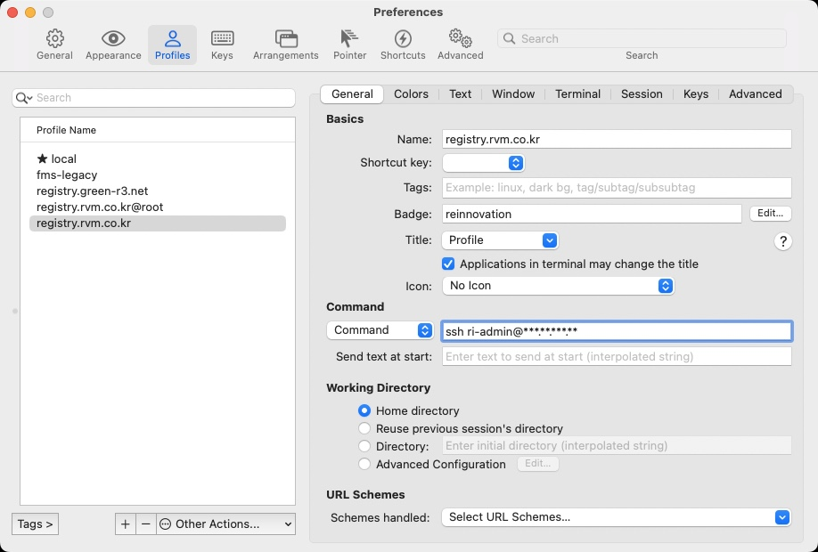
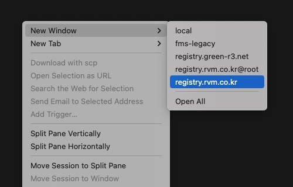

SSH 접속을 하려면 다음 절차를 진행해야 합니다.

1. `ssh` 명령어로 접속 정보를 입력한다.
2. 비밀번호를 입력한다.

```shell{promptUser: user}{promptHost: localhost}
ssh root@111.23.456.789
root@111.23.456.789's password:
```

간단해 보이지만 알고 보면 가혹한 절차입니다. 매번 서버 접속 정보가 적힌 문서를 확인해야 하거나 우리의 기억력을 외우는 데 사용해야 하거든요. 다행히 iTerm2 앱에서 접속 정보를 저장하고 관리하는 방법이 있습니다.





iTerm2 SSH 접속 정보 설정을 마쳤으면 터미널에서 `ssh-copy-id` 명령어를 사용해 비밀번호를 설정해 주세요. 이제 iTerm2 앱에서 클릭 한 번으로 서버에 접속할 수 있습니다.

```shell{promptUser: user}{promptHost: localhost}
ssh-copy-id root@111.23.456.789
/usr/bin/ssh-copy-id: INFO: Source of key(s) to be installed: "/Users/sally/.ssh/id_ed25519.pub"
/usr/bin/ssh-copy-id: INFO: attempting to log in with the new key(s), to filter out any that are already installed
/usr/bin/ssh-copy-id: INFO: 1 key(s) remain to be installed -- if you are prompted now it is to install the new keys
root@111.23.456.789's password:
```
