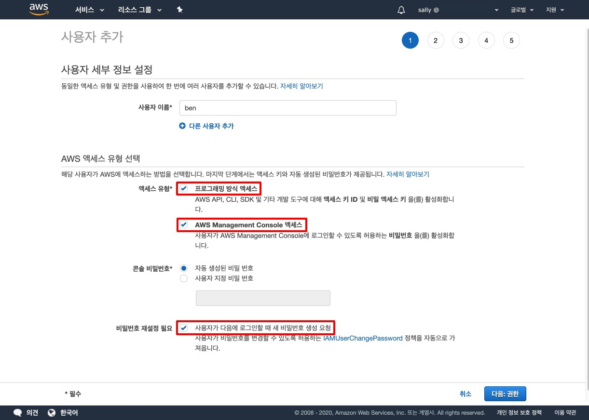
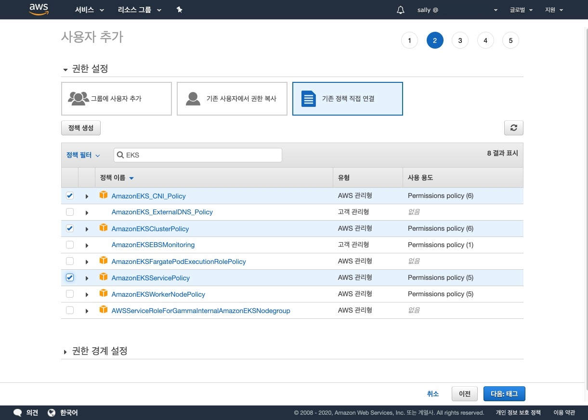
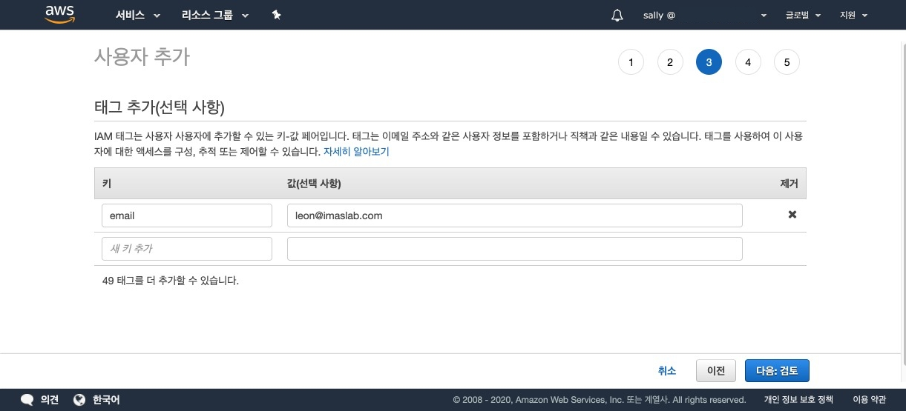
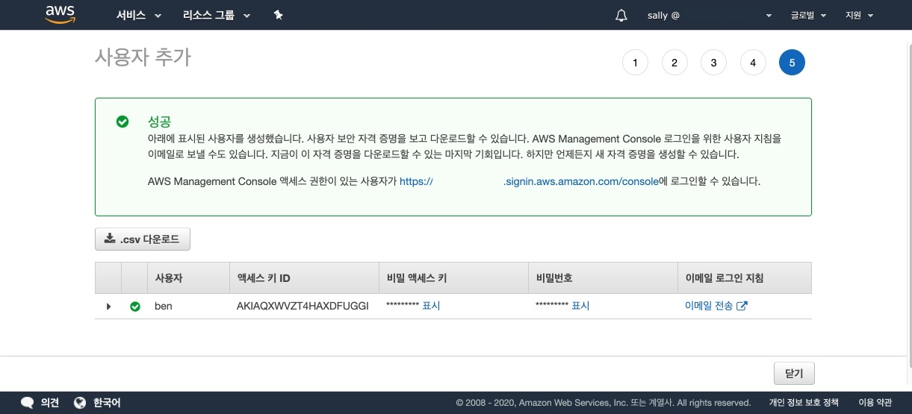
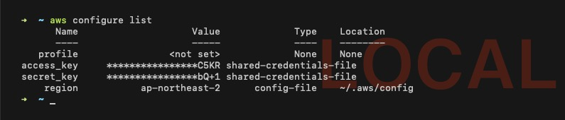
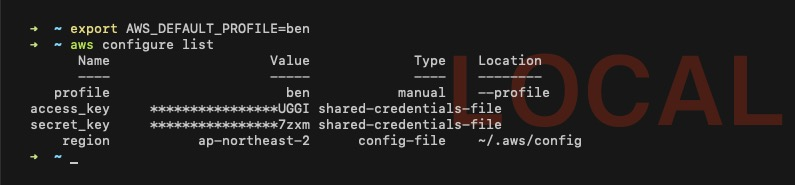

**[IAM](https://console.aws.amazon.com/iam/home)**(Identity and Access Management, 아이에이앰)은 AWS 서비스와 리소스에 대한 액세스를 안전하게 관리하는 기능입니다. AWS 계정에서 추가 비용 없이 제공합니다.

## 목차

1. [사용자 추가](#사용자-추가)
2. [정책 설정](#정책-설정)
3. [부가 정보 설정](#부가-정보-설정)
4. [자격 증명 저장](#자격-증명-저장)
5. [사용자 설정](#사용자-설정)

## 사용자 추가

IAM 사용자의 주된 용도는 대화형 작업을 위해 AWS Management 콘솔에 로그인하고 API 또는 CLI를 사용해 AWS 서비스로 프로그래밍 방식의 요청을 보내는 데 사용할 수 있는 능력을 사람들에게 제공하는 것입니다. 자세한 정보는 Amazon EKS 워크샵 문서의 [IAM 사용자 만들기](https://awskrug.github.io/eks-workshop/prerequisites/self_paced/account/) 내용을 참조하세요.

|종류|설명|
|:---:|---|
|루트 사용자|무제한 액세스 권한이 필요한 작업을 수행하는 계정 소유자|
|IAM 사용자|일일 작업을 수행하는 계정 내 사용자|

IAM - 사용자 - 사용자 추가 - 버튼을 클릭한 후 다음 표시한 항목에 모두 체크하세요.



## 정책 설정

**정책**(Policy)은 자격 증명이나 리소스를 연결할 때 해당 권한을 정의하는 AWS의 객체입니다. AWS는 IAM 보안 주체(사용자 또는 역할)가 요청을 보낼 때 이러한 정책을 평가합니다.

### EKS

EKS를 사용하는 경우 사용자에게 다음 정책을 추가합니다. 사용자가 여러 명인 경우 정책 그룹을 생성하여 공통된 정책을 적용하는 것이 좋습니다.

* AmazonEKSClusterPolicy
* AmazonEKSServicePolicy
* AmazonEKS_CNI_Policy



## 부가 정보 설정

IAM 태그에 이메일, 직책 등 사용자에 대한 부가 정보를 설정합니다. 추후 태그를 사용하여 사용자에 대한 액세스를 구성할 수 있습니다. 설정하지 않아도 무방합니다.



## 자격 증명 저장

사용자 추가를 완료하면 credentials 정보가 나옵니다. 해당 정보는 한 번 확인하면 새로 고침 시 재확인이 불가하기 때문에 꼭 파일로 저장해 두어야 합니다.



## 사용자 설정

다음 명령어를 입력합니다.

```shell{promptHost: localhost}
aws configure
```

여러 사용자로 관리가 필요한 경우 `--profile` 옵션으로 사용자 프로필을 설정합니다.

```shell{promptHost: localhost}
aws configure --profile <your-iam-user-name>
```

사용자 정보 입력 후 엔터를 계속 입력하여 설정을 완료합니다. 해당 설정은 `~/.aws/` 디렉터리에 파일로 저장됩니다.

```shell{promptHost: localhost}
AWS Access Key ID [None]: <AKI***>
AWS Secret Access Key [None]: <***>
Default region name [None]: ap-northeast-2
Default output format [None]:
```

설정을 확인합니다.

```shell{promptHost: localhost}
aws configure list
```



다음 명령어를 입력하면 사용자 프로필을 변경할 수 있습니다.

```shell{promptHost: localhost}
export AWS_DEFAULT_PROFILE=<your-iam-user-name>
aws configure list
```


