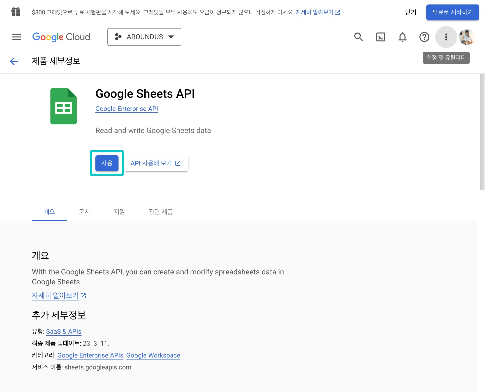

# Google Sheets API

**Google Sheets API는 무료로 사용할 수 있는 공유 서비스**로 스프레드시트의 데이터를 읽고 수정할 수 있는 RESTful 인터페이스입니다. 일반적인 용도는 다음과 같습니다.

* 스프레드시트 만들기
* 스프레드시트 셀 값 읽기 및 쓰기
* 스프레드시트 서식 업데이트
* 연결된 시트 관리

Google Sheets API는 할당량 요청 한도를 초과해도 추가 요금이 발생하지 않으며 분당 할당량을 지키면 하루에 전송할 수 있는 요청 수에 제한이 없습니다. 자세한 정보는 [사용 제한](https://developers.google.com/sheets/api/limits?hl=ko) 내용을 확인해 주세요.

## 검토하기

스프레드시트는 데이터베이스의 대안으로 사용할 수 있으나 Oracle, MySQL 등을 대체할 수는 없습니다. 다음은 여러분의 프로젝트에서 Google Sheets API를 사용해도 충분한지 살펴보기 위한 몇 가지 항목입니다.

1. Google Sheets API는 동시 접속자 수가 많은 상황에서 안전하지 않습니다.
2. Google Sheets API는 데이터를 선택적으로 조회할 수 없습니다. 예를 들어, SQL의 WHERE절과 같이 특정 기준을 충족하는 행들만 조회할 수 없습니다.
3. Google Sheets API는 몇 개의 행을 조회할 것인지(limit), 몇 번째 행부터 조회할 것인지(offset) 옵션만 설정할 수 있습니다.
4. Google Sheets API는 속도가 느립니다. 예를 들어, 3000개 행을 조회하는 데 3~4초가 걸립니다.

## 프로젝트 만들기

<https://console.cloud.google.com/project> 주소에 접속해서 [프로젝트 만들기]를 누르고 새 프로젝트를 만들어 주세요.


프로젝트 이름과 ID는 보통 동일하게 설정하지만 저처럼 다르게 설정해도 됩니다. 그리고 <mark>프로젝트 ID는 이후에 변경할 수 없으니</mark> 처음 만들 때 신중하게 만들어 주세요. 프로젝트를 만들면 다음 주소로 대시보드에 접속할 수 있습니다.

<https://console.cloud.google.com/welcome?project={your-project-id}>


## 사용자 인증 정보 만들기

API 및 서비스 - 라이브러리 - 'Google Sheets API' 검색 - [사용]을 눌러 주세요.



[사용자 인증 정보 만들기]를 눌러 주세요.


[애플리케이션 데이터]를 선택해 주세요.


내용을 입력한 다음 [만들고 계속하기]를 눌러 주세요.


프로젝트에 대한 액세스 권한을 부여해 주세요. <mark>데이터베이스를 조회만 한다면 **뷰어**, 삽입 및 수정까지 한다면 **편집자**</mark>로 설정해 주세요. 필자의 경우 데이터베이스에 데이터를 삽입할 수 있도록 편집자로 설정하였습니다.


## 비공개 키 만들기

> 여러분이 만든 서비스 계정 이메일을 잘 기억해 주세요. 스프레드시트를 만들고 공유할 때 필요합니다.

서비스 계정만 안다고 Google Sheets API 요청이 가능하다면 아마도 여기저기 보안 위험이 발생할 겁니다. 우리가 아이디만 안다고 로그인할 수 없듯이 비밀번호 즉 비공개 키를 만들어야 합니다.


키 - 키 추가 - [새 키 만들기]를 눌러 주세요.


'JSON'을 선택하고 [만들기]를 눌러 파일을 저장해 주세요. 혹시라도 파일을 분실했다면 모든 키 파일이 그렇듯이 복구할 수 있는 방법이 없기 때문에 다시 만들어야 합니다.


## 스프레드시트 공유하기

데이터베이스로 사용할 스프레드시트에서 [공유]를 누르고 여러분이 만든 <mark>Google Sheets API 서비스 계정을 추가</mark>해 주세요.


## 코드 작성하기

다운로드한 비공개 키 JSON 파일을 프로젝트에서 사용할 수 있도록 여러분이 원하는 장소에 위치시켜 주세요. 필자는 파일을 바로 참조할 수 있도록 프로젝트 안에 넣었습니다.


데이터를 조회하려면 스프레드시트 ID와 스프레드시트를 구성하는 시트 ID가 필요합니다. 다음과 같이 URL에서 ID를 추출해 주세요.


필자는 환경 변수로 저장하였습니다. CRA인 경우 변수명에 `REACT_APP_` 접두사를 붙이면 코드에서 참조할 수 있습니다. 여러분의 입맛에 맞게 저장해 주세요.

**.env**

```properties
REACT_APP_GOOGLE_SPREADSHEET_ID=15rVrvcWFPfuCo_LyCijib_sDscjUGdZQSuN0CnipghE
REACT_APP_GOOGLE_COMMUNITY_SHEET_ID=1557434590
```

**package.json**

```json
...
"dependencies": {
  "google-spreadsheet": "^3.2.0",
},
"devDependencies": {
  "@types/google-spreadsheet": "^3.2.0",
},
...
```

**message.ts**

```typescript
import { GoogleSpreadsheet } from 'google-spreadsheet';
import invert from 'lodash-es/invert';
import shuffle from 'lodash-es/shuffle';

import { SOURCE_TYPE } from '@/constants/message';
import credentials from '@/config/wadiz-good-wave.json';
import type { Message } from '@/types/message';

const SPREADSHEET_ID = process.env.REACT_APP_GOOGLE_SPREADSHEET_ID || '';
const COMMUNITY_SHEET_ID = process.env.REACT_APP_GOOGLE_COMMUNITY_SHEET_ID || '';

const getMessages = async (): Promise<Message[]> => {
  const doc = new GoogleSpreadsheet(SPREADSHEET_ID);
  await doc.useServiceAccountAuth(credentials);
  await doc.loadInfo();

  const rows = await doc.sheetsById[COMMUNITY_SHEET_ID].getRows({ limit: 100, offset: 0 });
  const messages = shuffle(
    (rows as unknown as Message[])
      .map(({ message, sourceType, registeredAt }) => ({
        message,
        sourceType: invert(SOURCE_TYPE)[sourceType] || 'UNKNOWN',
        registeredAt,
      })) as Message[],
  );

  return messages;
};
...
```

팀 굿 웨이브 1기는 2022년 6월, 긍정적인 메시지들을 공유하는 <mark>**굿 메시지**</mark> 프로젝트를 선보였습니다. 여기에서 사용하는 모든 데이터는 Google Sheets API를 사용하였습니다.


