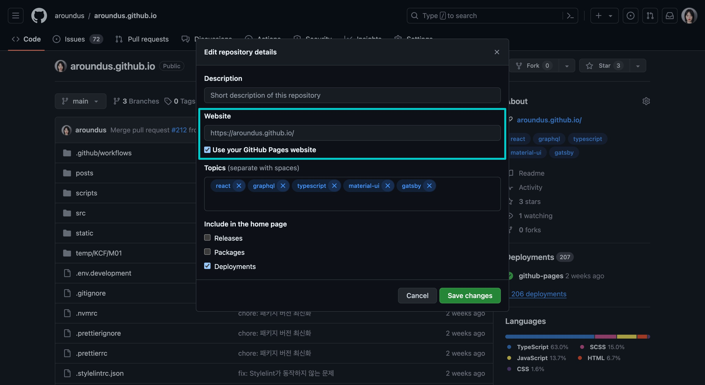

# 시작하기

<mark>**친절한** 프로젝트</mark>는 한 번만 훑어봐도 이해할 수 있습니다. 반대로 불친절한 프로젝트는 두 번, 세 번 생각하게 만듭니다. 사용하는 기술의 난이도 문제와 별개로 친절한 프로젝트를 구성하는 데 필요한 몇 가지 팁을 확인해 보세요.

## Git 사용자 이름을 한글로 설정합니다

```shell{promptUser: user}{promptHost: localhost}
git config --global user.name "김진국"
git config --global user.email "zingugi@wadiz.kr"
```

커밋 작성자 이름이 한글인 경우 커밋 메시지를 보고 <mark>누가 어떤 작업을 했는지 쉽게 파악</mark>할 수 있습니다. 반면에 영어인 경우 누군지 한 번 더 생각해야 하고, 면접의 경우 여러분이 작업하지 않은 영역까지 질문을 받을 확률이 높습니다.

## 컨벤션을 설정합니다

<mark>코드의 **일관성**을 유지</mark>하는 것은 매우 중요합니다. 이는 코드를 더 읽기 쉽고 유지 관리하기 쉽게 만들 뿐만 아니라 팀원 간의 협업을 원활하게 합니다.

- **ESLint**: 문법 규칙 유지 (예시: [**eslint.config.js**](https://github.com/aroundus/aroundus.github.io/blob/main/eslint.config.js))
- **Prettier**: 코드 형식 유지 (예시: [**.prettierrc**](https://github.com/aroundus/aroundus.github.io/blob/main/.prettierrc))
- **Stylelint**: 스타일 문법 규칙 유지 (예시: [**.stylelintrc**](https://github.com/aroundus/aroundus.github.io/blob/main/.stylelintrc.json))

## README.md 파일을 작성합니다

<mark>README.md 파일은 프로젝트의 **첫인상**을 결정</mark>합니다. '보기 좋은 떡이 먹기도 좋다'는 말처럼 상황에 따라 겉모양새를 꾸미는 작업이 필요합니다. 면접의 경우 첫인상만 좋아도 평가에서 높은 점수를 받을 수 있습니다.

기본 서식은 다음과 같습니다. 예시는 이 블로그의 [**README.md**](https://github.com/aroundus/aroundus.github.io) 파일을 참조해 주세요.

```markdown
# 프로젝트 제목


프로젝트 설명

## 목차

1. [소개](#소개)
2. [사용 기술](#사용-기술)
3. [설치 방법](#설치-방법)
4. [빌드 및 테스트](#빌드-및-테스트)
5. [기능](#기능)
6. [프로젝트 구조](#프로젝트-구조)
7. [배포](#배포)
8. [팀원](#팀원)

...
```

## 데모 사이트를 구성합니다

데모 사이트는 포트폴리오의 완성이자 <mark>여러분의 능력을 증명</mark>하는 효과적인 방법입니다. '백문이 불여일견'이라는 말처럼 코드를 100번 설명하는 것보다 실제로 동작하는 웹사이트를 1번 보여 주는 것이 더 좋습니다.


