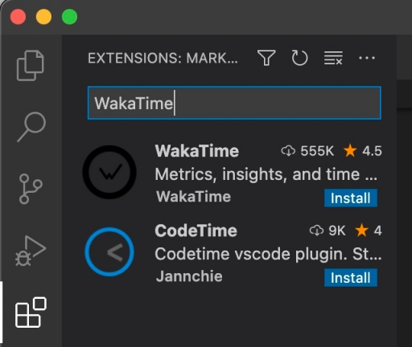
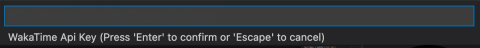
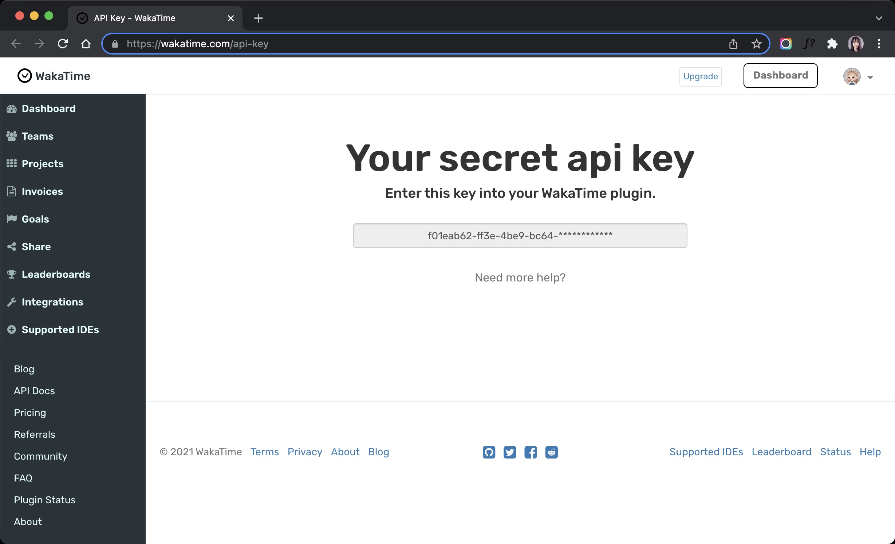
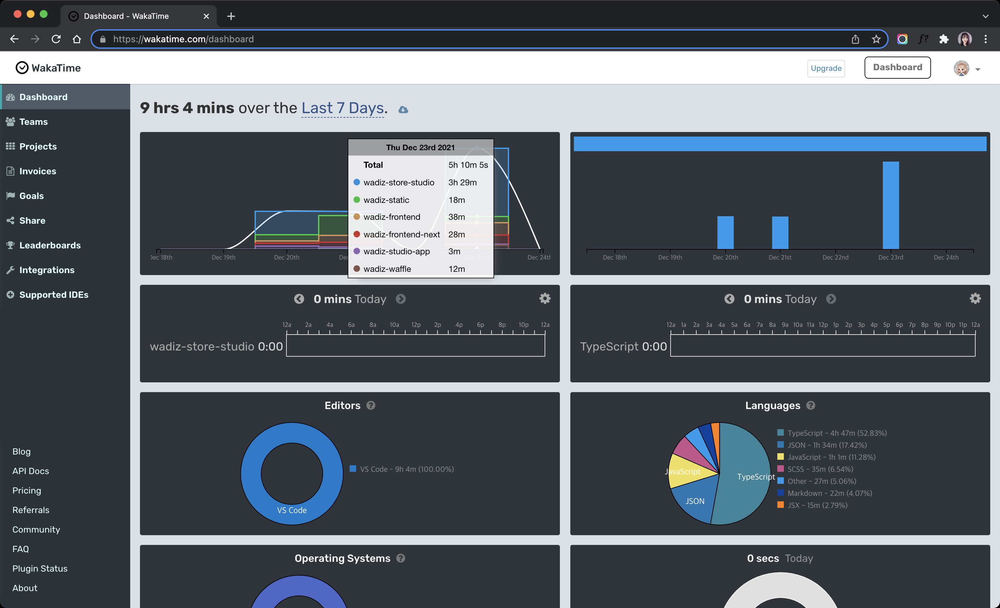
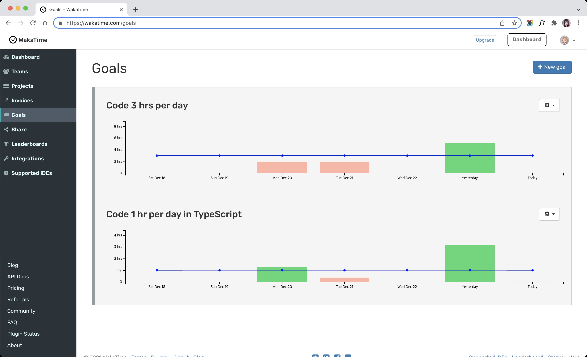
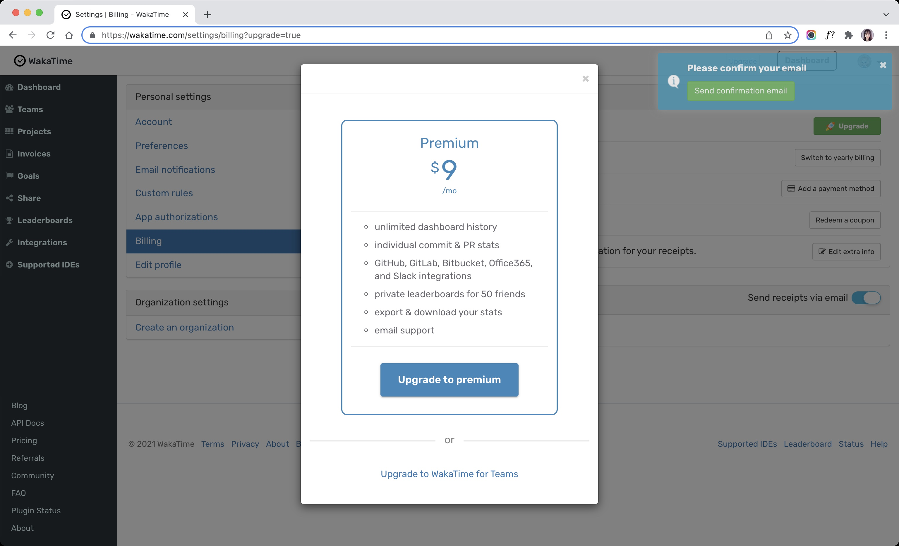
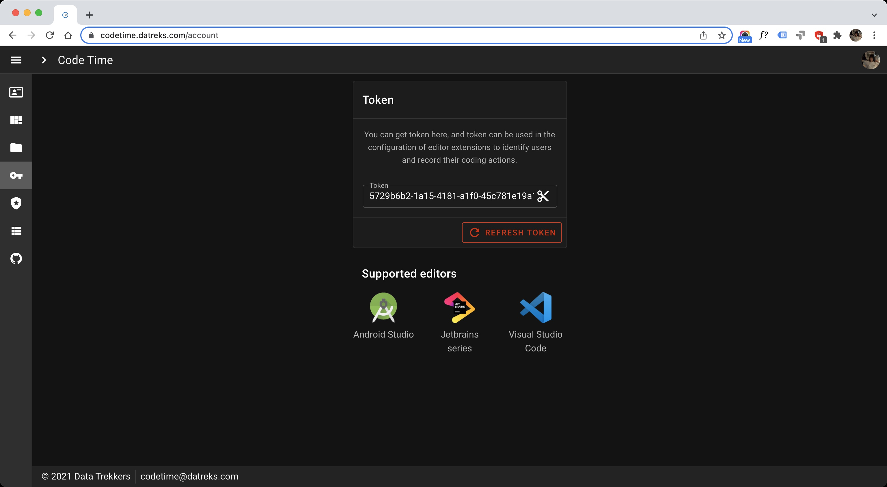
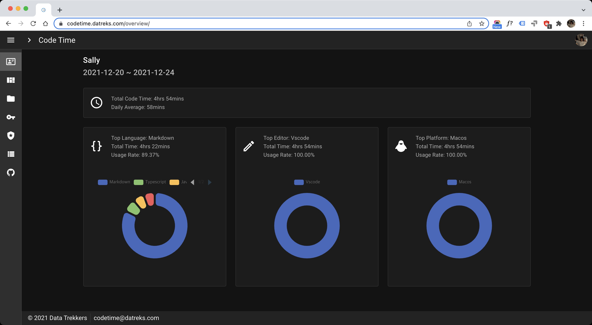
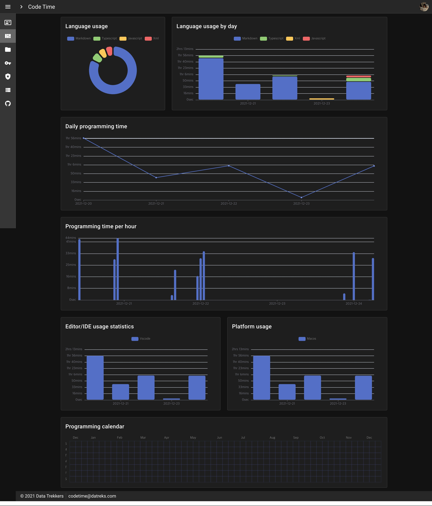

# 💻🗓 한 주 동안 무엇을 개발했어요?

정신없이 개발하느라 시간은 쏜살같이 지나간 것 같은데 갑자기 <mark>'한 주 동안 무엇을 개발했지?'</mark> 궁금해질 때가 있습니다. 프로젝트는 몇 개 작업했는지, 각 프로젝트마다 투자한 시간은 몇 분인지, 주로 작업한 파일은 무엇인지 등등...

커밋 이력으로는 부족합니다. 커밋하기 전 로컬 환경에서 이루어진 수많은 삽질의 시간까지는 알 수가 없으니까요. 여러분도 오롯이 개발에 투자한 시간 동안 무엇을 개발했는지 한 번쯤은 궁금하지 않을까요?

## WakaTime

며칠 전, 팀 동료가 슬랙으로 재밌는 플러그인을 공유했습니다. 그 이름은 바로 [WakaTime(와카타임)](https://github.com/wakatime/vscode-wakatime). 이 플러그인은 개발하는 동안 메트릭을 수집해서 대시보드로 통계를 내는 일을 합니다. (물론 그 대시보드는 여러분만 볼 수 있어요.) 너무나도 유명해서 대부분의 에디터에 플러그인을 지원한다고 하네요. 저는 VS Code에서 냉큼 검색해 봤습니다.

시간을 다루는 플러그인이라 아이콘이 🕙 시계 모양입니다. 아이콘 디자인에는 큰 에너지를 쏟지 않은 듯 합니다. 와카! 내 시간을 관리해 줘! 주문을 외우고 설치를 시작했습니다. <small>(wa로 시작해서 그런지 와디즈스러워서 정들었..)</small>

### API Key

설치를 마치면 **API Key**를 입력해야 하는데요, API Key는 <strong>[여기](https://wakatime.com/api-key)</strong>에서 만들면 됩니다. 보통 설치 직후 바로 API Key를 입력하라는 프롬프트가 뜨는데 그렇지 않을 경우 `⌘ + Shift + P` - WakaTime API Key 단어를 검색해 보세요.

### Dashboard

짝짝짝 👏👏👏 !!! 설정을 완료하였습니다. 이제 개발을 시작하세요. 대략 반나절 정도 지나면 대시보드에서 수집된 메트릭을 확인할 수 있습니다.

### Goals

대시보드만 확인하면 재미가 없겠죠? WakaTime의 치트 키! **목표**를 설정해 보세요. ① 총 개발 시간, ② 특정 프로젝트 개발 시간, ③ 특정 언어 개발 시간, ④ 특정 에디터 개발 시간 이렇게 4가지 기준으로 세분화해서 설정 가능합니다.

<iframe src="https://www.loom.com/embed/5850d8deddfd4d9ab730592a77191fe8" frameborder="0" webkitallowfullscreen mozallowfullscreen allowfullscreen style="position: absolute; top: 0; left: 0; width: 100%; height: 100%;"></iframe>

### Upgrade

Premium 버전으로 업그레이드하면 다음과 같이 확장된 서비스와 Teams 메뉴까지 사용할 수 있지만 개인적으로 사용할 때는 무료 버전만 사용해도 충분합니다.

## CodeTime

VS Code에서 검색하면 같이 나오는 후발 주자 플러그인으로 사용 방법은 WakaTime과 비슷합니다. CodeTime은 API Key 대신 **Token**이라는 용어를 사용합니다.

근데 보시다시피 지원하는 에디터가 많지 않습니다. 지원하는 에디터가 늘어나더라도 WakaTime이 지원하는 에디터가 압도적으로 많아서 이 부분은 WakaTime을 넘어설 수 없을 것 같아요.

### Overview

CodeTime은 총 개발 시간, 가장 많이 사용한 언어, 에디터, 플랫폼 등을 각 그래프 상단에 정리해서 보여주는 Overview 화면을 제공합니다.

### Dashboard

중간에 재밌는 그래프가 하나 있습니다. **Programming time per hour**, 1시간에 몇 분 집중하고 몇 분 쉬는지 알 수 있는 그래프입니다. 여러분의 개발 패턴을 고스란히 알 수 있으니 한번 살펴보세요.

## 결론

지원하는 에디터도 다양하고 목표도 설정할 수 있는 WakaTime을 사용해 보세요. CodeTime에 비해 업데이트 주기도 짧아서 안정성도 높고 새로운 기능 또한 빠르게 접할 수 있을 거예요.
