## 목차

1. [시작하기](#시작하기)
2. [Ruby Installer for Windows](#Ruby-Installer-for-Windows)
3. [Gem](#Gem)
4. [Bundler](#Bundler)
5. [Jekyll 사이트 만들기](#Jekyll-사이트-만들기)

## 시작하기

**Jekyll**(지킬)은 정적 웹 페이지를 만들기 위한 툴입니다. 정적 웹 페이지는 DB 통신 없이 웹 서버 내 저장된 파일을 그대로 출력하는 페이지를 의미합니다. 많은 기능을 필요로 하지 않는 개인 블로그나 간단한 사이트의 경우 어려운 데이터베이스를 다루지 않고 Jekyll과 [Markdown(마크다운)](https://gist.github.com/ihoneymon/652be052a0727ad59601) 언어를 사용하여 간단하게 페이지를 만들 수 있습니다.

Jekyll 템플릿을 만들고 규약에 따라 소스를 구성하면 Jekyll 엔진은 소스 파일들을 컴파일하여 HTML로 이루어진 정적 웹 페이지 파일들을 만들고 사용자가 정한 목적지 폴더(default: \_site)에 저장합니다.


**왜 Jekyll을 사용하는 걸까요?** HTML을 어느 정도 다룰 줄 안다면 *- CSS와 jQuery를 안다면 더 예쁘게 -* 지금 바로 정적인 웹 사이트를 만들 수 있습니다. 그리고 여러분이 어떤 페이지 하나를 소개 목적으로 만들고자 한다면 사실 Jekyll은 사용할 필요도 없습니다.

하지만 여러분이 **블로그**를 만든다면 상황이 달라집니다. 블로그의 콘텐츠를 구성하는 페이지는 모두 동일한 HTML 템플릿에 내용만 다른 것입니다. 블로그에 콘텐츠를 추가할 때마다 매번 HTML 파일을 수작업해야 한다고 가정해 봅시다. 만약 콘텐츠가 100개 *- 또는 그 이상 -* 정도 된다면 여러분은 어떻게 하시겠습니까?

내용만 쓰고 **알아서 HTML 태그로 변환하여 페이지를 구성하는 툴**이 있으면 좋겠다는 생각이 자연적으로 들 것입니다. **Jekyll**은 바로 그 툴을 의미합니다. 그리고 HTML 태그 없이 쉽게 내용을 작성할 수 있는 마크업 언어 Markdown을 사용합니다.

이것이 Jekyll을 사용하는 가장 큰 이유입니다. Jekyll은 일련의 반복적인 작업을 최소화하여 페이지를 구성하고 웹 서버에 게시할 수 있도록 도와 줍니다. Jekyll을 설치하고 샘플 페이지를 만들어 본다면 더 이해가 빠를 것입니다.

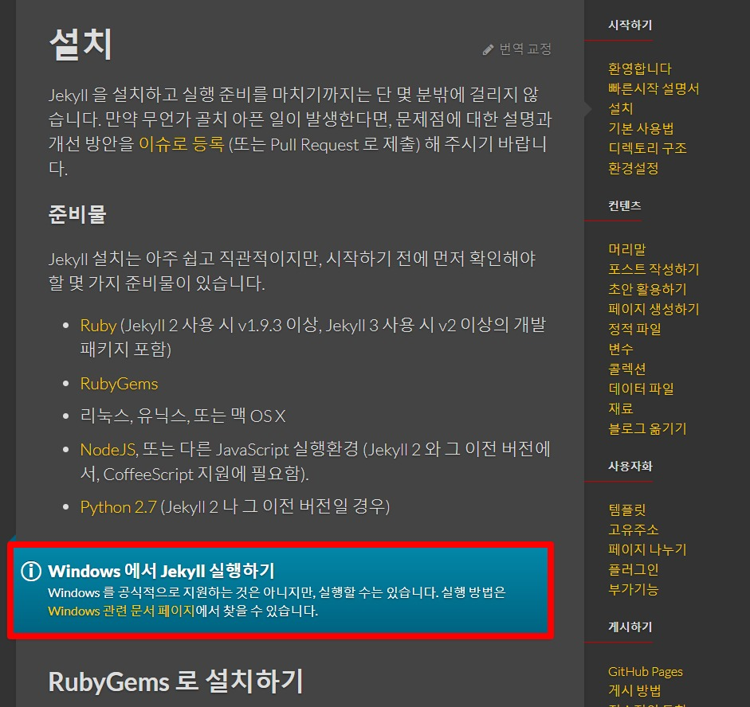

Jekyll로 페이지를 만드는 것은 간단하지만 설치하는 것은 *- 특히 Windows에서 -* 간단하지 않을 수 있습니다. Jekyll은 리눅스 지원 언어인 [Ruby(루비)][ruby]를 기반으로 만들었기 때문에 MAC이 아닌 Windows 환경에서는 주의를 기울여야 합니다.

## [Ruby Installer for Windows](https://rubyinstaller.org/downloads/)

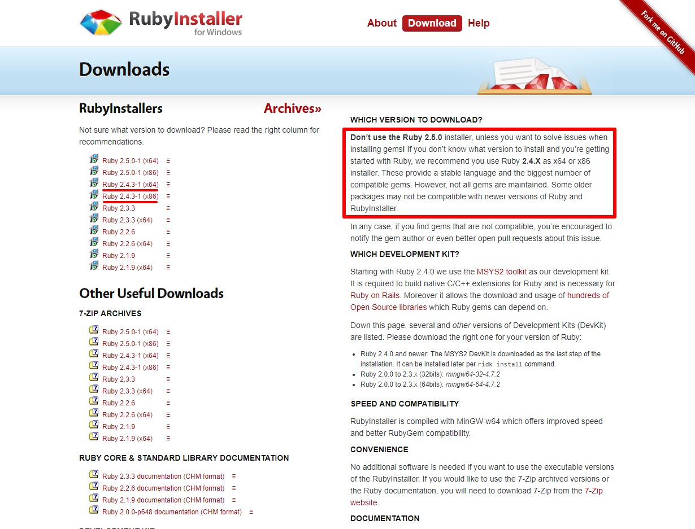

우측 빨간색 박스 안 내용에서 설치 시 Ruby 2.5.0 버전에 다소 문제가 있으니 **2.4.X** 버전을 추천하고 있습니다. 여러분의 Windows 환경을 확인한 후 맞는 버전(x32/x64)을 다운로드하여 설치합니다. (필자는 x64로 진행)

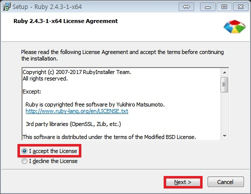

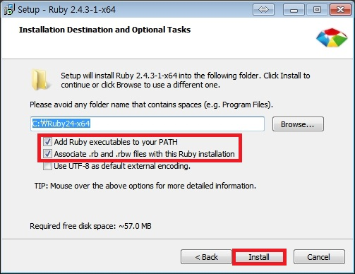

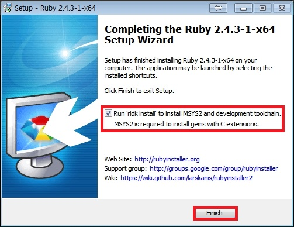

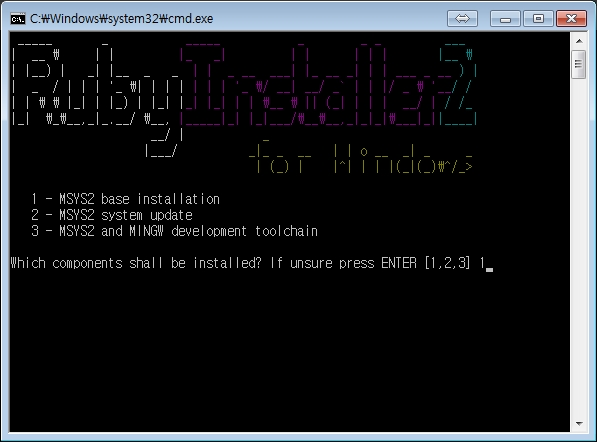

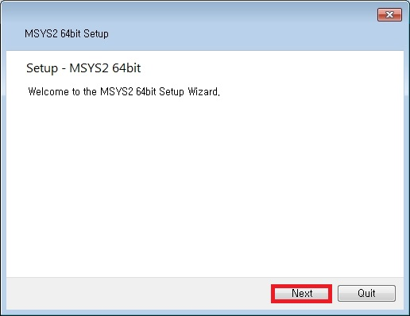

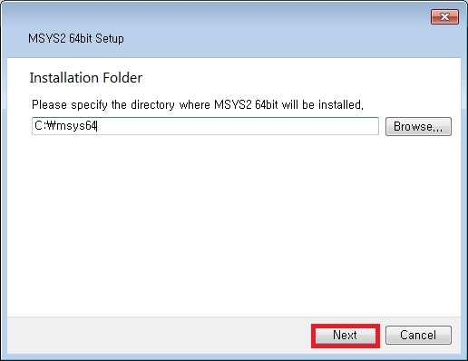

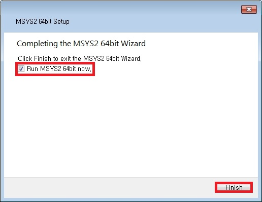

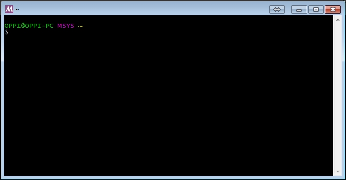

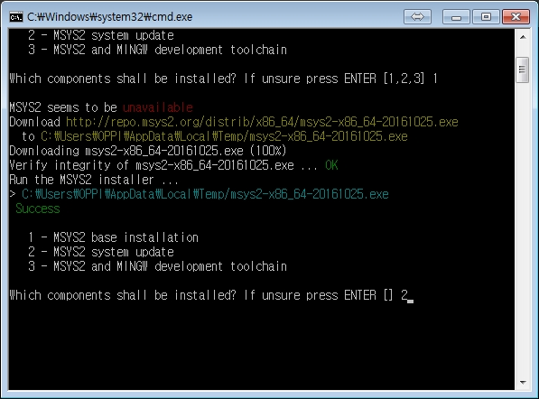

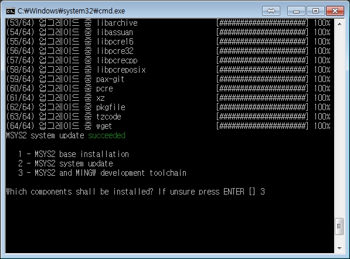

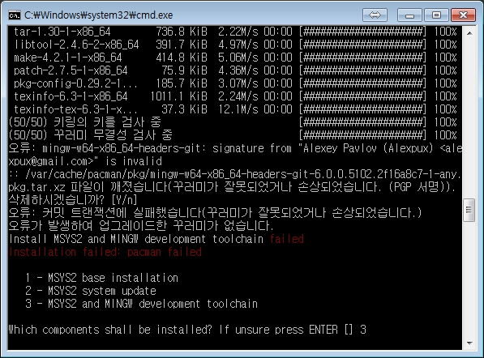

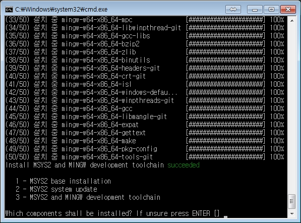

## Gem

**Gem**(젬)은 루비 프로젝트에 필요한 기능을 제공하는 라이브러리입니다. [RubyGems(루비젬)](https://rubygems.org/)에서 원하는 gem을 검색하고 사용할 수 있습니다. 다음 명령어를 실행하세요.

```shell{promptHost: localhost}
gem
```

다음과 같은 내용이 나온다면 Ruby가 성공적으로 설치된 것입니다.

```shell
RubyGems is a sophisticated package manager for Ruby.  This is a
basic help message containing pointers to more information.

    Usage:
        gem -h/--help
        gem -v/--version
        gem command [arguments...] [options...]

    Examples:
        gem install rake
        gem list --local
        gem build package.gemspec
        gem help install

    Further help:
        gem help commands            list all 'gem' commands
        gem help examples            show some examples of usage
        gem help gem_dependencies    gem dependencies file guide
        gem help platforms           gem platforms guide
        gem help <COMMAND>           show help on COMMAND
                                                                     (e.g. 'gem help install')
        gem server                   present a web page at
                                                                 http://localhost:8808/
                                                                 with info about installed gems
    Further information:
        http://guides.rubygems.org
```

gem 명령어를 사용하여 Jekyll을 설치하세요.

```shell{promptHost: localhost}
gem install jekyll
```

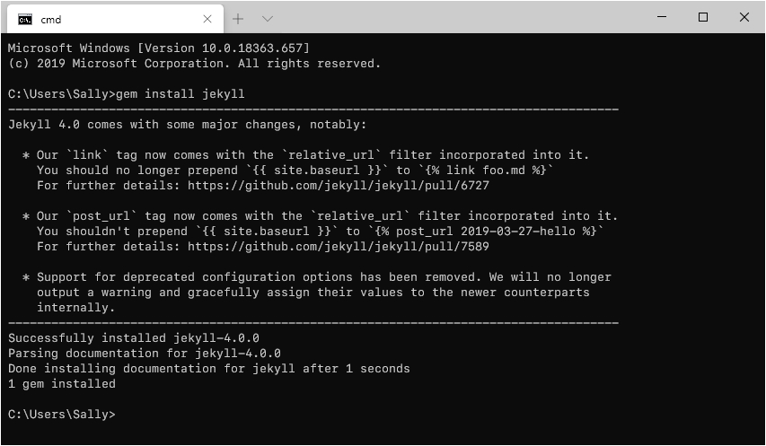

Jekyll 설치를 마치면 다음 명령어를 실행하세요.

```shell{promptHost: localhost}
jekyll
```

다음과 같은 내용이 나온다면 Jekyll이 성공적으로 설치된 것입니다.

```shell
jekyll 3.7.2 -- Jekyll is a blog-aware, static site generator in Ruby

Usage:

    jekyll <subcommand> [options]

Options:
                -s, --source [DIR]  Source directory (defaults to ./)
                -d, --destination [DIR]  Destination directory (defaults to ./_site)
                        --safe         Safe mode (defaults to false)
                -p, --plugins PLUGINS_DIR1[,PLUGINS_DIR2[,...]]  Plugins directory (defaults to ./_plugins)
                        --layouts DIR  Layouts directory (defaults to ./_layouts)
                        --profile      Generate a Liquid rendering profile
                -h, --help         Show this message
                -v, --version      Print the name and version
                -t, --trace        Show the full backtrace when an error occurs

Subcommands:
    docs
    import
    build, b              Build your site
    clean                 Clean the site (removes site output and metadata file) without building.
    doctor, hyde          Search site and print specific deprecation warnings
    help                  Show the help message, optionally for a given subcommand.
    new                   Creates a new Jekyll site scaffold in PATH
    new-theme             Creates a new Jekyll theme scaffold
    serve, server, s      Serve your site locally
```

## Bundler

[Bundler(번들러)](http://ruby-korea.github.io/bundler-site/)는 정확한 gem 버전을 추적하고 설치하여 루비 프로젝트를 위한 일관된 환경을 제공합니다. 다음 명령어를 실행하세요.

```shell{promptHost: localhost}
gem install bundler
```

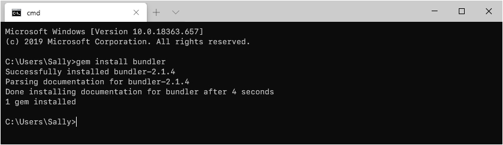

## Jekyll 사이트 만들기

새 Jekyll 사이트를 생성해 봅시다. 다음 명령어를 실행하세요. (여러분은 test 대신 마음에 드는 이름으로 수정해도 무방합니다.)

```shell{promptHost: localhost}
jekyll new test
```

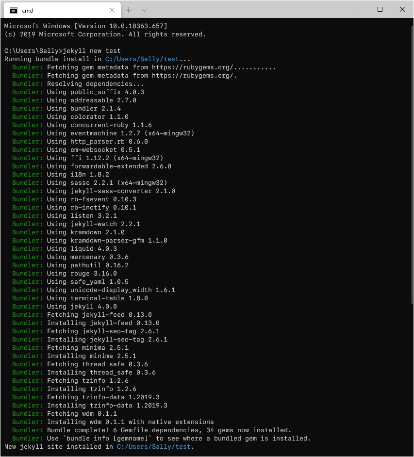

필요한 bundle까지 모두 설치를 완료하였습니다. 이제 test 폴더로 이동합니다.

```shell{promptHost: localhost}
cd test
```

Jekyll은 개발 서버를 내장하고 있어 로컬에서 브라우저로 접속하여 사이트가 어떻게 생성될지 미리 살펴볼 수 있습니다.

```shell{promptHost: localhost}
jekyll serve
```

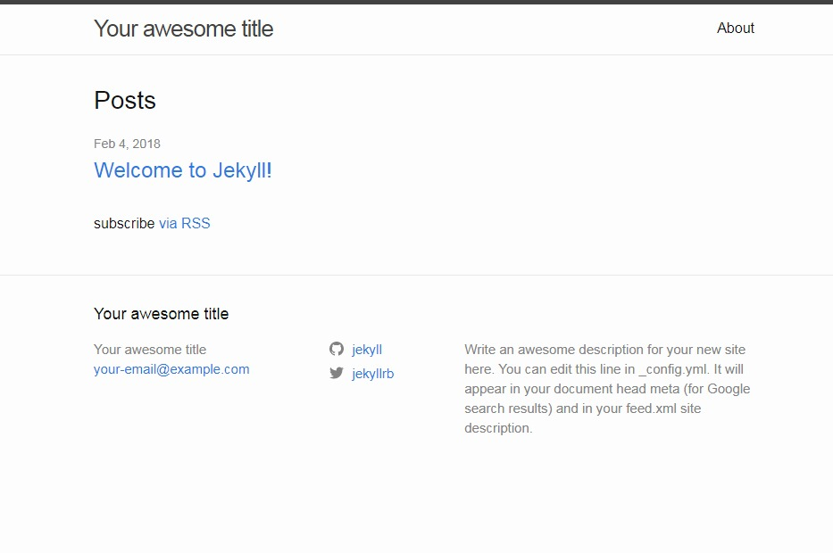

브라우저에서 **http://127.0.0.1:4000** 접속 후 위와 같은 화면이 보인다면 샘플 블로그가 잘 구동된 것입니다. 포트 번호는 기본 4000이 주어지며 옵션을 추가하여 다른 포트 번호로 변경할 수 있습니다.

```shell{promptHost: localhost}
jekyll serve --port 5000
```

gem 버전이 다른 경우 번들이 적용된 환경을 로드하기 위하여 다음 명령어가 필요할 수 있습니다.

```shell{promptHost: localhost}
bundle exec jekyll serve
bundle exec jekyll serve --baseurl '' // 소스가 최상위(root)에 있지 않은 경우
```
