## 목차

1. [시작하기](#시작하기)
2. [프로젝트 실행](#프로젝트-실행)
3. [프로젝트 구조](#프로젝트-구조)
4. [테마 설정](#테마-설정)
4. [언더스코어 폴더](#언더스코어-폴더)

## 시작하기

**Jekyll**로 블로그를 만드는 것은 *- 설치가 잘 된다는 전체 하에 -* 간단한 작업입니다. Java 애플리케이션 개발을 빌리자면 흔히 <mark>설정으로 시작해서 설정으로 끝난다</mark>고 하지요. Jekyll도 *- Java만큼은 아니지만 -* 마찬가지입니다.

## 프로젝트 실행

```shell{promptHost: localhost}
jekyll serve
```

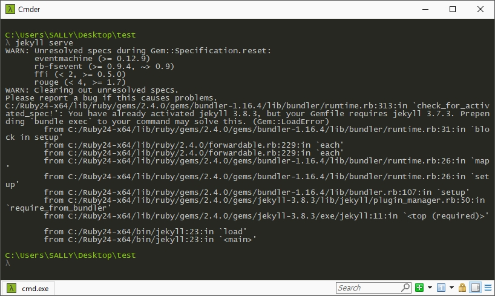

gem 버전이 다른 경우 위와 같은 오류가 발생할 수 있습니다. 번들이 적용된 환경을 로드하기 위하여 jekyll serve 명령어 앞에 **bundle exec** 명령어를 붙이고 실행하세요.

```shell{promptHost: localhost}
bundle exec jekyll serve
```

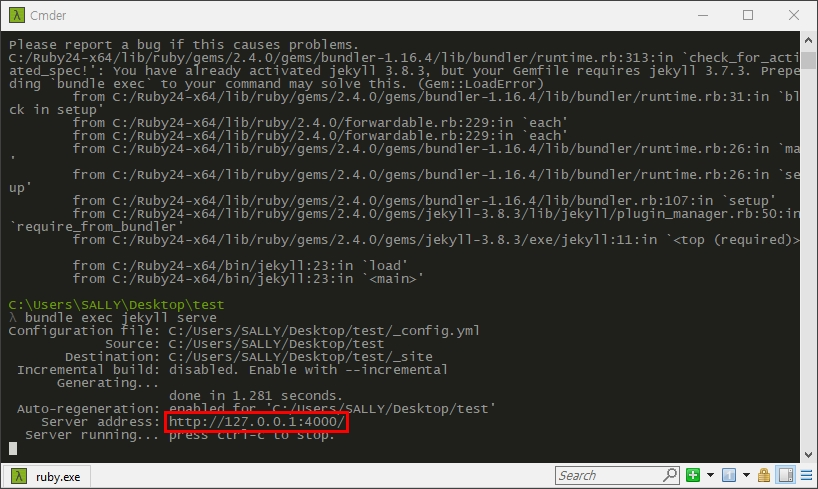

위에서 박스로 표시한 **http://127.0.0.1:4000** 주소를 복사하여 브라우저로 접속하세요. 다음과 같이 테스트 페이지가 구동된 것을 볼 수 있습니다.

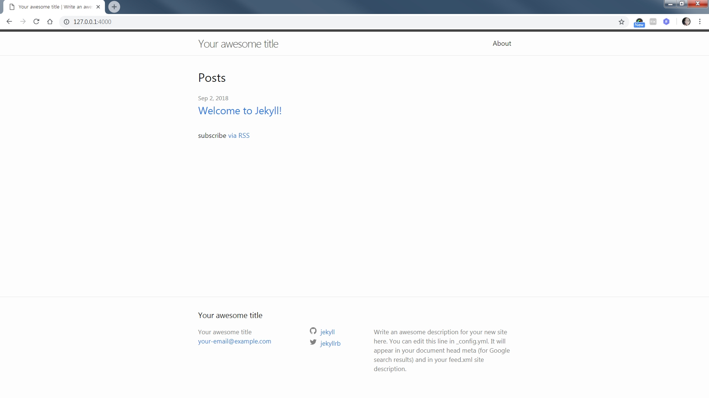

## 프로젝트 구조

이제 기본 테마의 폴더 구조를 살펴봅시다. 필자는 [Sublime Text 3(서브라임 텍스트)](https://www.sublimetext.com/)를 사용하도록 하겠습니다. 각자 사용 중인 편집기로 폴더를 로드하세요.

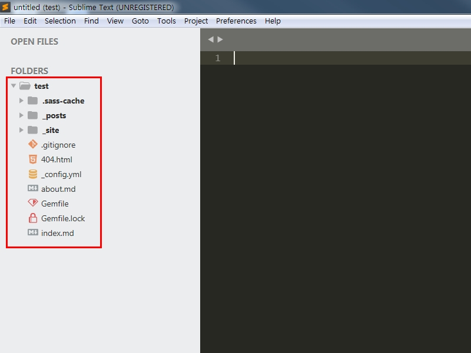

폴더 구조가 굉장히 간단하지요? 물론 제대로 된 [폴더 구조](https://jekyllrb-ko.github.io/docs/structure/)는 따로 있습니다. 그렇다면 이 소스는 왜 폴더가 몇 개 없이도 구동이 되는 걸까요? 바로 외부 테마를 의존성으로 사용하기 때문인데요, **Gemfile** 파일을 살펴보세요.

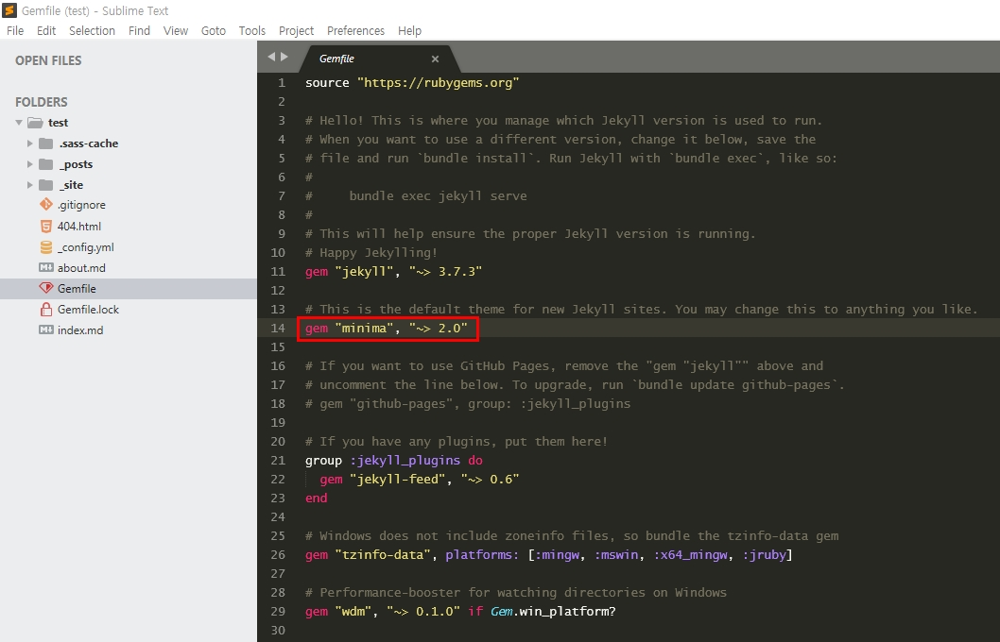

**minima**는 기본 테마의 이름입니다. 위에 주석으로 'This is the default theme for new Jekyll sites. You may change this to anything you like. (지킬 사이트의 기본 테마입니다. 당신이 좋아하는 어떠한 테마로도 바꿀 수 있습니다.)' 설명하고 있습니다.

**Gem**(젬)은 루비 프로젝트에 필요한 기능을 제공하는 라이브러리입니다. [이전 글](/jekyll/installation)을 보시면 Jekyll을 설치할 때 사용한 적이 있습니다. 하지만 상황에 따라 이렇게 Gemfile 안에 넣어 사용해도 됩니다.

```shell{promptHost: localhost}
gem "minima", "~> 2.0"
```

위 명령어에서 **~>** 기호는 **앞 자릿수는 같고 마지막 자릿수보다 크거나 같다**는 의미를 가지고 있습니다. 간단하게 부등호로 표현하면 이해가 더 빠를 것입니다.

```
"~> 2.0"   : 2.0 <= x < 3.0     // 2.0 - 2.9
"~> 2.3.0" : 2.3.0 <= x < 2.4.0 // 2.3.0 - 2.3.9
```

## 테마 설정

Jekyll 테마는 어디에서 얻을 수 있을까요? 바로 gem들의 집합소인 [RubyGems(루비젬)](https://rubygems.org/)에서 얻을 수 있습니다. RubyGems 사이트에 접속 후 'jekyll-theme'를 검색하세요.

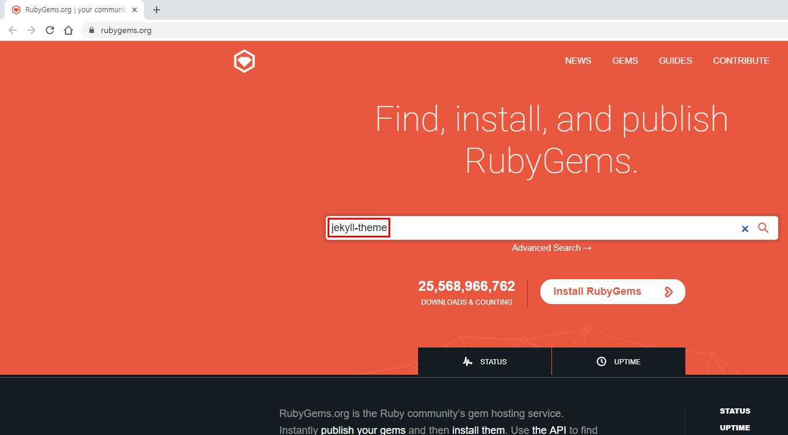

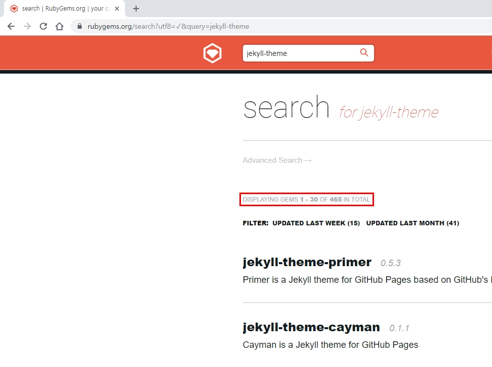

현재 총 465개의 테마가 존재합니다. 썸네일이 없어서 아쉽긴 합니다만 RubyGems 사이트 자체가 모든 종류의 gem 라이브러리들을 다루기 때문에 [Jekyll Themes(지킬 테마)](http://jekyllthemes.org/)와 같이 구성할 수 없다는 점을 생각하면 이해가 됩니다.

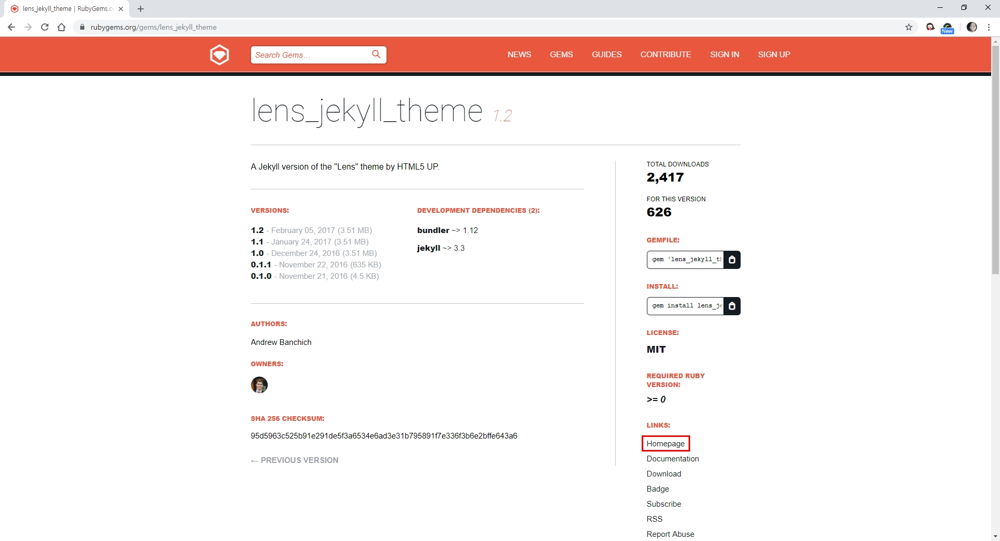

테마를 하나 선택하고 상세 화면으로 진입하면 우측 하단에 Homepage 링크가 있습니다. 대부분 Git이나 GitLab으로 이동합니다.

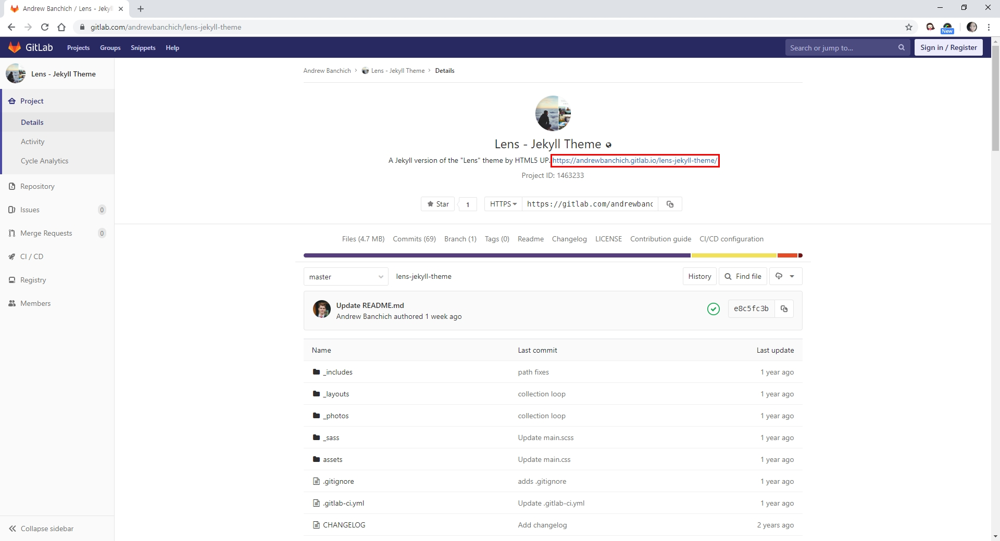

소개글 또는 설명글에 있는 URL을 클릭하면 미리 보기 페이지로 이동합니다. (가끔 RubyGems 페이지로 이동하는 경우도 있습니다.)

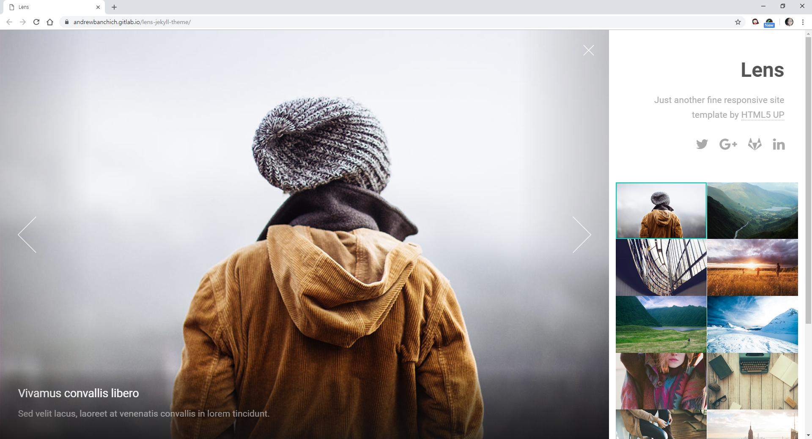

RubyGems 페이지로 돌아와서 GEMFILE 바로 밑의 'Copy to clipboard' 버튼을 눌러 해당 명령어를 복사하세요.

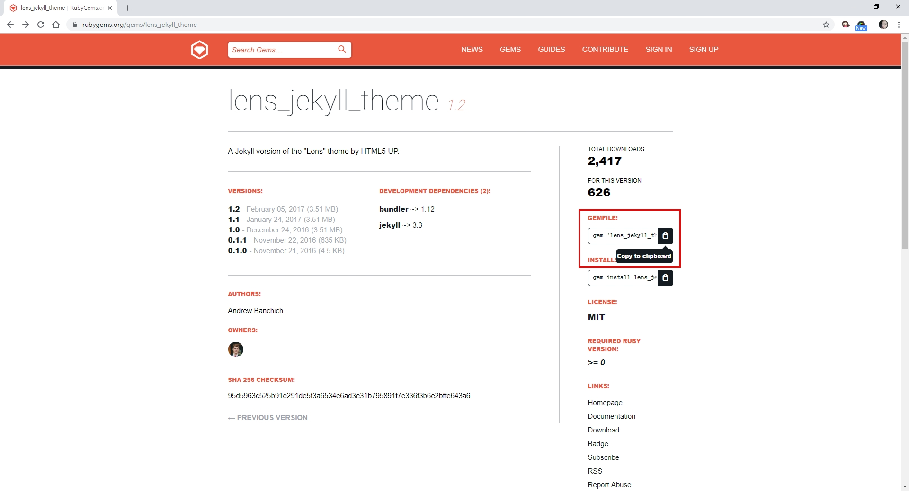

**Gemfile** 파일을 엽니다. 기존 minima 테마는 삭제 또는 주석 처리하고 바로 밑에 복사한 명령어를 붙여넣기하세요.

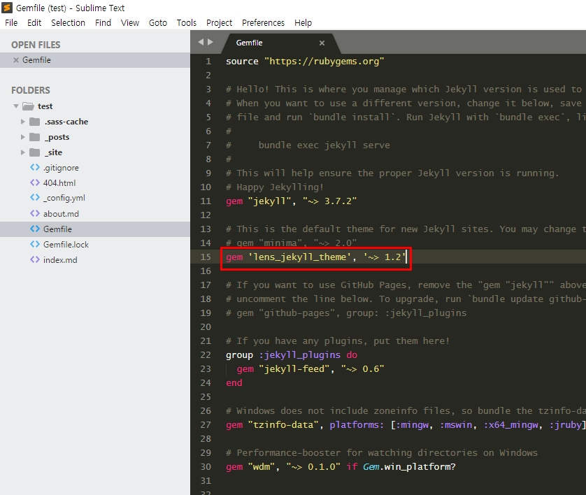

**_config.yml** 파일을 열어서 박스로 표시한 부분을 새 테마명으로 변경하세요.

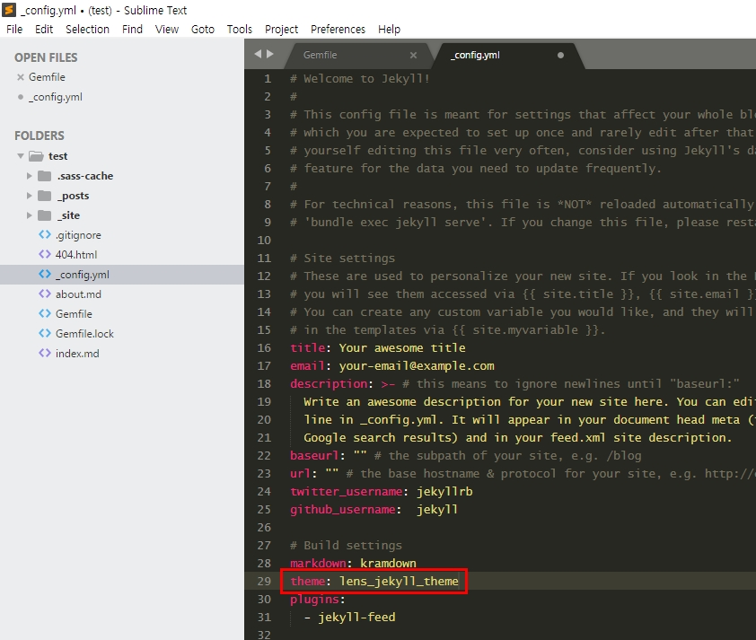

테스트 페이지를 재구동하면 오류 메시지가 나옵니다. 해당 테마의 gem이 설치되지 않았기 때문인데요, `bundle install` 명령어를 실행해서 해당 테마의 gem을 설치하세요.

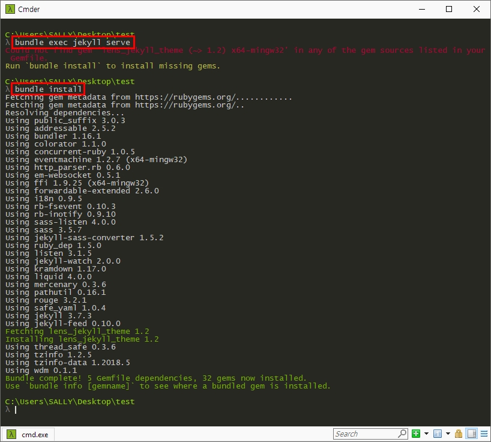

Lens 테마로 변경되었습니다. 어떠신가요? 입맛에 맞게 소스를 수정하는 건 어렵긴 하지만 포스팅만 하시는 분들 기준에서는 테마를 자유자재로 변경할 수 있어서 나름 큰 장점이라고 생각합니다.

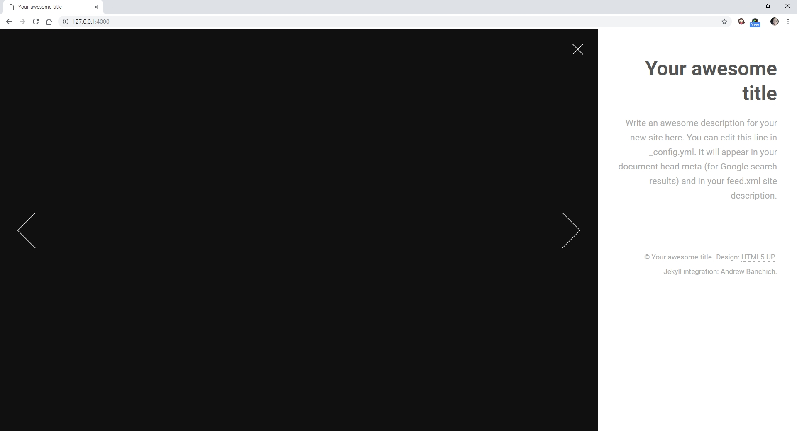

## 언더스코어 폴더

Jekyll 템플릿의 폴더들은 이름 앞에 \_(언더스코어)가 붙습니다. 일종의 Jekyll 규칙인데요, 이 규약에 맞춰 소스를 구성하면 Jekyll 엔진이 \_가 붙은 폴더 내 파일들을 컴파일하여 HTML로 이루어진 정적 웹 페이지 파일들을 만듭니다.

* **\_posts**: 블로그의 포스트를 담는 폴더
* **\_site**: Jekyll 엔진이 변환 작업을 마친 후 생성된 사이트를 저장하는 목적지 폴더. **결과물**

목적지 폴더(default: \_site)는 빌드 시 자동으로 결과물을 저장하는 곳입니다. <mark>우리가 따로 작업할 필요는 없다</mark>는 점 명심하세요. 빌드가 어떻게 되었나 확인은 할 수 있어도 내용은 수정하지 마세요. 수정은 Jekyll 엔진이 컴파일하기 전 파일을 작업해야 합니다.

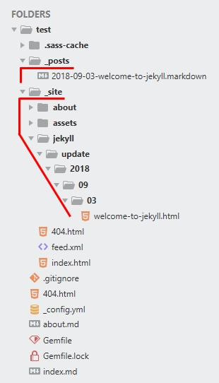
