> 아마존 웹 서비스에서 제공하는 Amazon EKS(Elastic Kubernetes Service)로 인프라를 구성한 내용을 정리한 글입니다. 내용이 방대하여 사전 설치가 필요한 명령어 및 프로그램에 대한 설명이 생략될 수 있습니다. 🙏

## 목차

1. [IAM 사용자 추가](#IAM-사용자-추가)
2. [EKS 클러스터 생성](#EKS-클러스터-생성)
3. [스토리지 클래스 배포](#스토리지-클래스-배포)
4. [EBS CSI 드라이버 배포](#EBS-CSI-드라이버-배포)
5. [ALB 수신 컨트롤러 배포](#ALB-수신-컨트롤러-배포)
6. [RDS 데이터베이스 생성](#RDS-데이터베이스-생성)
7. [네임스페이스 생성](#네임스페이스-생성)
8. [ExternalName 설정](#ExternalName-설정)
9.  [MariaDB CLI 배포](#MariaDB-CLI-배포)
10. [MaxScale 배포](#MaxScale-배포)
11. [Docker 자격 증명 기반 Secret 배포](#Docker-자격-증명-기반-Secret-배포)

## IAM 사용자 추가

AWS 서비스를 사용하기 위해 루트 사용자 이메일 주소로 **IAM**(Identity and Access Management, 아이에이앰)에 사용자를 추가해야 합니다. 자세한 정보는 [IAM](/post/aws/iam) 내용을 참조하세요.

## Kubernetes API

쿠버네티스 오브젝트는 **쿠버네티스 API**를 요청해서 생성합니다. 쿠버네티스 오브젝트를 생성할 때 오브젝트에 대한 기본적인 정보와 더불어 의도한 상태를 기술한 오브젝트 `spec`이 필요합니다. 요청한 내용은 JSON 형식으로 정보를 포함하는데 대부분 `.yaml` 파일로 `kubectl`에 제공합니다. `kubectl`은 API 요청이 이루어질 때 JSON 형식으로 정보를 변환합니다.

**deployment.yaml** (예시)

```yaml
apiVersion: apps/v1
kind: Deployment
metadata:
  name: nginx-deployment
spec:
  selector:
    matchLabels:
      app: nginx
  replicas: 2
  template:
    metadata:
      labels:
        app: nginx
    spec:
      containers:
        - name: nginx
          image: nginx:1.14.2
          ports:
            - containerPort: 80
```

생성하고자 하는 쿠버네티스 오브젝트에 대한 `.yaml` 파일 내, 다음 필드를 위한 값들을 설정합니다.

* apiVersion: 해당 오브젝트 생성에 사용하는 쿠버네티스 API 버전 (안정성: stable > beta > alpha)
* kind: 오브젝트의 종류
* metadata: 유일한 오브젝트로 구분하기 위한 데이터
* spec: 오브젝트에 대한 상태

오브젝트 `spec`에 대한 정확한 포맷은 모든 쿠버네티스 오브젝트마다 다르고, 그 오브젝트 특유의 중첩된 필드를 포함합니다. 다음 명령어를 입력하여 오브젝트를 생성합니다.

```shell{promptHost: localhost}
kubectl apply -f deployment.yaml
```

자세한 정보는 쿠버네티스 공식 문서의 [쿠버네티스 오브젝트 이해하기](https://kubernetes.io/ko/docs/concepts/overview/working-with-objects/kubernetes-objects/) 내용을 참조하세요.

## EKS 클러스터 생성

쿠버네티스를 시작하기 위해 가장 먼저 해야 할 일은 **클러스터**를 생성하는 것입니다. 쿠버네티스 클러스터는 컨테이너화된 애플리케이션을 실행하는 노드의 집합입니다.

**cluster.yaml**

```yaml
apiVersion: eksctl.io/v1alpha5
kind: ClusterConfig
metadata:
  name: <insert-your-cluster-name>
  region: ap-northeast-2
vpc:
  cidr: "<insert-your-cidr>"
  nat:
    gateway: HighlyAvailable
nodeGroups:
  - name: <insert-your-worker-name>
    instanceType: m5.large
    availabilityZones:
      - ap-northeast-2a
      - ap-northeast-2b
    labels:
      role: worker
    desiredCapacity: 2
    privateNetworking: true
    iam:
      withAddonPolicies:
        ebs: true
        efs: true
        autoScaler: true
```

```shell{promptHost: localhost}
eksctl create cluster -f cluster.yaml
```

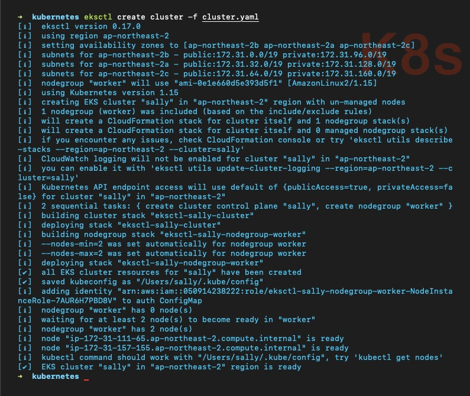

도커에서 쿠버네티스를 활성화하면 기본적으로 `current-context` 필드를 `docker-desktop` 클러스터로 지정합니다. `~/.kube/config` 파일에서 현재 생성한 클러스터로 변경이 잘 이루어졌는지 확인하세요.

```shell{promptHost: localhost}
kubectl config get-contexts
```

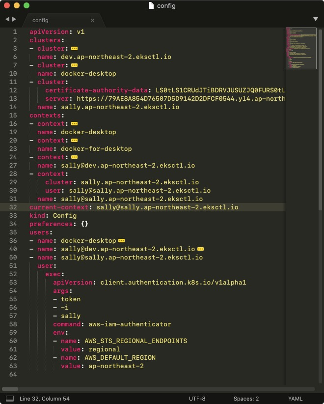

### VPC

**VPC**(Virtual Private Cloud)는 사용자의 AWS 계정 전용 가상 네트워크입니다.

VPC는 AWS 클라우드에서 다른 가상 네트워크와 논리적으로 분리되어 있습니다. Amazon EC2 인스턴스와 같은 AWS 리소스를 VPC에서 실행할 수 있습니다.

VPC를 만들 때 VPC의 IPv4 주소의 범위는 **CIDR**(Classless Inter-Domain Routing, 사이더) 블록 형태로 지정해야 합니다. (예: 172.31.0.0/16) 자세한 정보는 [CIDR 표기법](https://m.blog.naver.com/ncloud24/221208338209) 내용을 참조하세요.

### NAT Gateway

**NAT**(Network Address Translation, 네트워크 주소 변환) 게이트웨이는 프라이빗 서브넷의 인스턴스를 인터넷 또는 기타 AWS 서비스에 연결합니다. 프라이빗 서브넷을 사용하면 NAT 게이트웨이를 사용한다고 보시면 됩니다.</small>

### CloudFormation

**CloudFormation**은 인프라 관리를 간소화하여 리소스 관리 시간을 줄이고 AWS에서 실행되는 애플리케이션에 더 많은 시간을 사용하도록 해 주는 서비스입니다. 템플릿을 사용하여 스택을 생성할 경우 Auto Scaling 그룹, 로드 밸런서 및 데이터베이스를 자동으로 프로비저닝합니다.

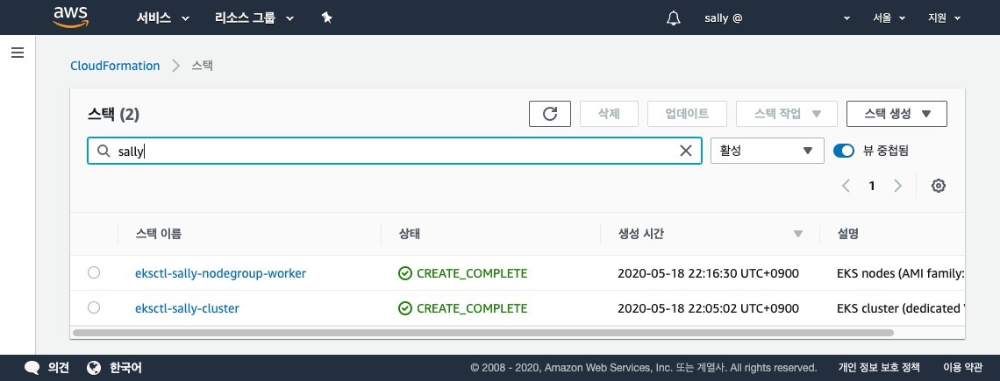

클러스터 생성을 성공적으로 완료하였습니다. 생성 도중에 문제가 발생한 경우에도 해당 서비스를 통해 확인할 수 있습니다.

## 스토리지 클래스 배포

볼륨은 쿠버네티스의 디스크 서비스입니다. 쿠버네티스는 많은 유형의 볼륨을 지원하고, 파드는 여러 볼륨을 동시에 사용할 수 있습니다. 볼륨 유형에 대한 전체 목록은 쿠버네티스 공식 문서의 [볼륨 유형들](https://kubernetes.io/ko/docs/concepts/storage/volumes/#볼륨-유형들) 내용을 참조하세요.

**storage-classes.yaml**

```yaml
apiVersion: storage.k8s.io/v1
kind: StorageClass
metadata:
  name: ebs-default
provisioner: ebs.csi.aws.com
volumeBindingMode: WaitForFirstConsumer
parameters:
  type: gp2
---
apiVersion: storage.k8s.io/v1
kind: StorageClass
metadata:
  name: ebs-default-a
provisioner: ebs.csi.aws.com
volumeBindingMode: WaitForFirstConsumer
parameters:
  type: gp2
allowedTopologies:
  - matchLabelExpressions:
      - key: topology.ebs.csi.aws.com/zone
        values:
          - ap-northeast-2a
---
apiVersion: storage.k8s.io/v1
kind: StorageClass
metadata:
  name: ebs-default-encrypted
provisioner: ebs.csi.aws.com
volumeBindingMode: WaitForFirstConsumer
parameters:
  type: gp2
  encrypted: "true"
---
apiVersion: storage.k8s.io/v1
kind: StorageClass
metadata:
  name: ebs-fast
provisioner: ebs.csi.aws.com
volumeBindingMode: WaitForFirstConsumer
parameters:
  type: io1
  iopsPerGB: "10"
```

볼륨 타입은 애플리케이션의 입출력 특성에 따라 선택합니다.

* `gp2`: 범용 SSD 볼륨
* `io1`: 프로비저닝된 IOPS* SSD 볼륨

<small>※ IOPS(Input/Output Operations Per Second, 아이옵스): 초당 입/출력 처리 횟수</small>

`volumeBindingMode` 필드는 볼륨 바인딩과 동적 프로비저닝의 시작 시기를 제어합니다. `WaitForFirstConsumer` 모드로 지정하면 볼륨을 사용하는 파드가 생성될 때까지 볼륨의 바인딩과 프로비저닝을 지연시킵니다.

```shell{promptHost: localhost}
kubectl apply -f storage-classes.yaml
kubectl get storageclasses
```

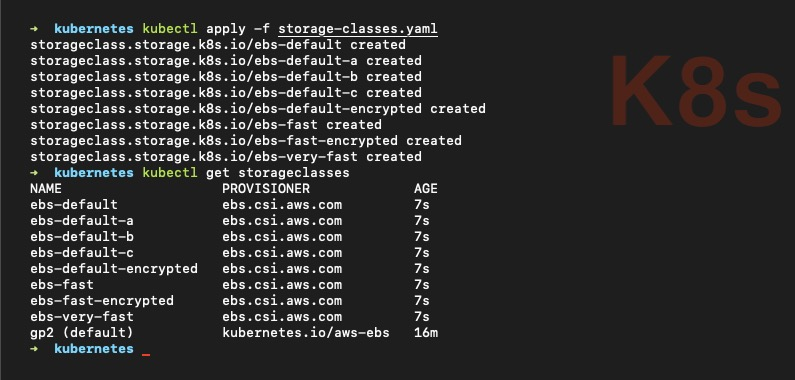

> 필자는 스토리지 클래스 8개를 생성하였습니다. 예제에는 내용이 길어서 4개만 작성하였습니다.

스토리지 클래스 생성을 완료하였습니다. 클러스터 관리자는 앞으로 생성할 오브젝트에 `storageClassName` 필드가 있다면 해당 스토리지 클래스의 `name` 값을 입력해야 합니다. 쿠버네티스는 동적 볼륨 프로비저닝을 통해 On-Demand(온디맨드, 주문형 서비스) 방식으로 스토리지 볼륨을 생성합니다.

> 온디맨드 방식은 볼륨을 원하는 옵션으로 상품화하여 등록한 후 앞으로 사용할 오브젝트에서 해당 볼륨을 선택해 주문하는 방식을 의미합니다.

## EBS CSI 드라이버 배포

EBS(Elastic Block Store, 고성능 블록 스토리지 서비스) **CSI**(Container Storage Interface)는 쿠버네티스를 위한 임의의 스토리지 시스템을 컨테이너 워크로드에 노출시키는 인터페이스입니다. EBS CSI 드라이버는 EKS 클러스터가 EBS 볼륨의 수명 주기를 관리할 수 있게 해 주는 CSI 인터페이스를 제공합니다.

```shell{promptHost: localhost}
kubectl apply -k "github.com/kubernetes-sigs/aws-ebs-csi-driver/deploy/kubernetes/overlays/stable/?ref=master"
```

* `-k`: kustomization directory

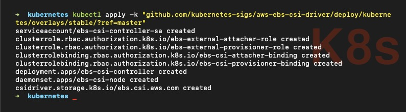

EBS CSI 드라이버를 사용하기 위하여 노드 그룹에 정책을 연결해 봅시다. IAM - 정책 - 정책 생성 버튼 클릭 후 다음과 같이 정책을 하나 생성하세요. 이름은 마음대로 하셔도 됩니다. (필자는 `Amazon_EBS_CSI_Driver` 이름으로 생성)

```json
{
    "Version": "2012-10-17",
    "Statement": [
        {
            "Effect": "Allow",
            "Action": [
                "ec2:AttachVolume",
                "ec2:CreateSnapshot",
                "ec2:CreateTags",
                "ec2:CreateVolume",
                "ec2:DeleteSnapshot",
                "ec2:DeleteTags",
                "ec2:DeleteVolume",
                "ec2:DescribeInstances",
                "ec2:DescribeSnapshots",
                "ec2:DescribeTags",
                "ec2:DescribeVolumes",
                "ec2:DetachVolume"
            ],
            "Resource": "*"
        }
    ]
}
```

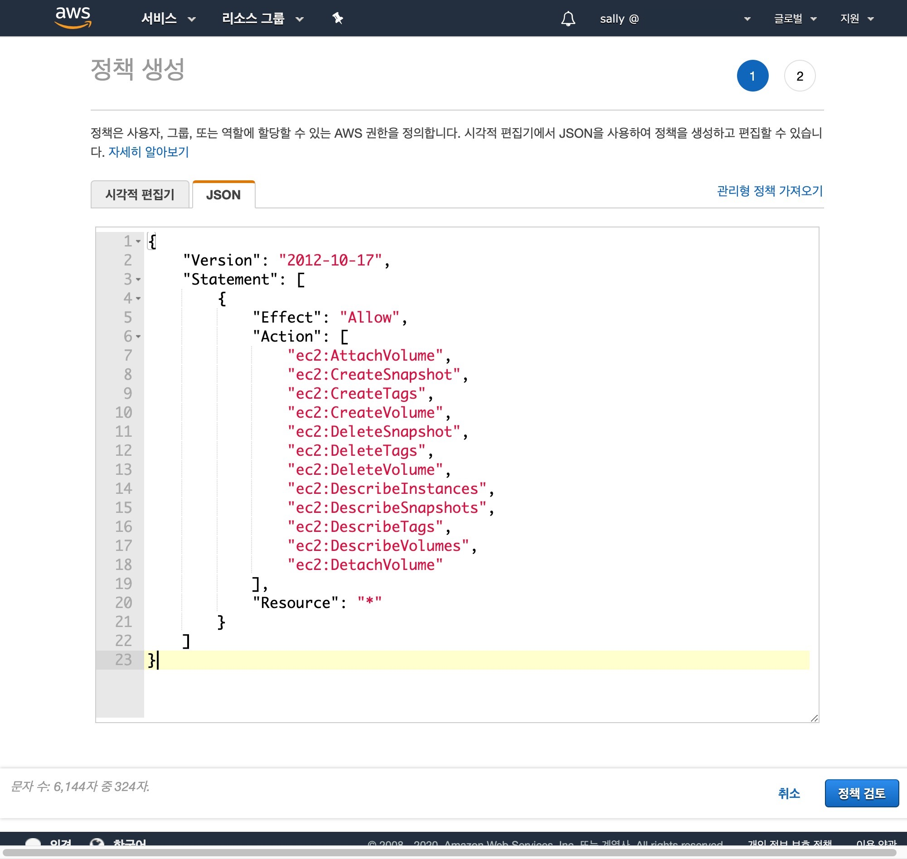

IAM - 역할 - `<your-cluster-name>` 항목을 검색하여 `NodeInstanceRole` 단어를 포함하는 역할에 정책을 연결하세요.

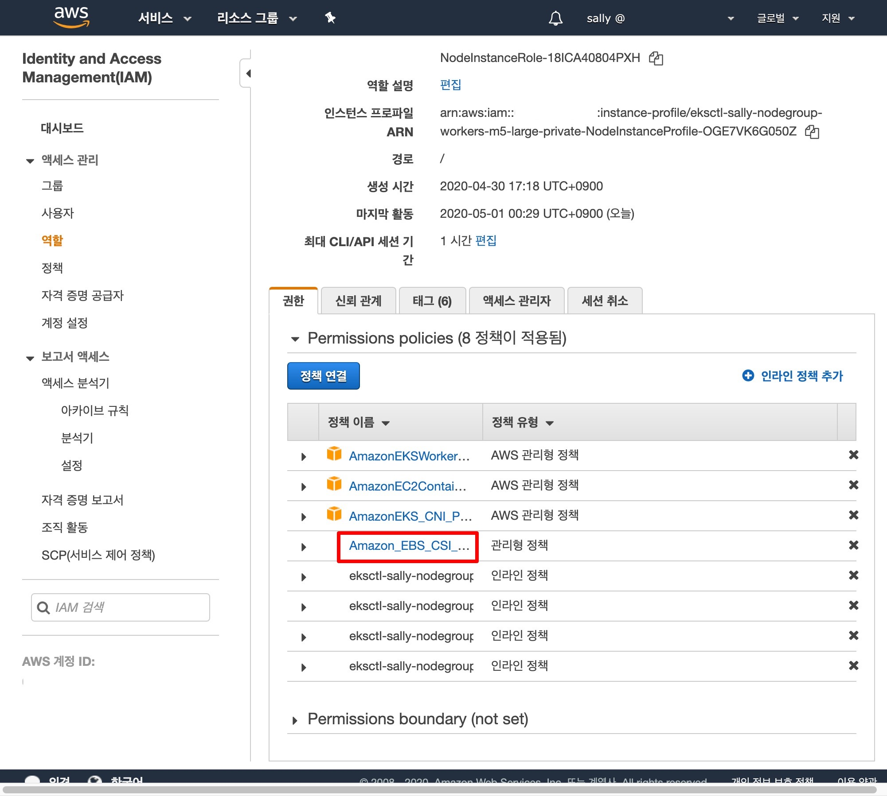

```shell{promptHost: localhost}
kubectl get pods --namespace=kube-system
```

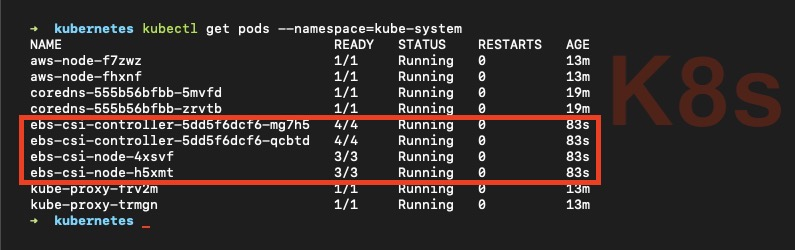

정책 연결을 완료하였습니다. 이제 쿠버네티스로 EBS CSI 드라이버의 기능을 사용할 수 있습니다.

## ALB 수신 컨트롤러 배포

**LB**(Load Balancer, 로드 밸런서)는 애플리케이션이 2개 이상 있을 때 서버에 가해지는 부하(load)를 분산(balancer)시켜 작업을 나누는 장치 또는 기술을 의미합니다.

**ALB**(Application Load Balancer)는 AWS에서 서비스 중인 로드 밸런서 중의 하나로 애플리케이션(HTTP, FTP, SMTP) 계층에서 로드를 분산하는 L7(Layer 7, 7계층) 로드 밸런서입니다. HTTP 헤더, 쿠키 등과 같은 사용자의 요청을 기준으로 특정 서버에 트래픽을 분산하는 것이 가능합니다. 클라이언트의 요청을 보다 세분화하여 서버에 전달할 수 있습니다.

**aws-alb-ingress-controller.yaml**

```yaml
apiVersion: v1
kind: ServiceAccount
metadata:
  name: aws-alb-ingress-controller
  labels:
    app.kubernetes.io/name: aws-alb-ingress-controller
    helm.sh/chart: aws-alb-ingress-controller-0.1.11
    app.kubernetes.io/managed-by: Helm
---
apiVersion: rbac.authorization.k8s.io/v1
kind: ClusterRole
metadata:
  name: aws-alb-ingress-controller
  labels:
    app.kubernetes.io/name: aws-alb-ingress-controller
    helm.sh/chart: aws-alb-ingress-controller-0.1.11
    app.kubernetes.io/managed-by: Helm
rules:
  - apiGroups:
      - ""
      - extensions
    resources:
      - configmaps
      - endpoints
      - events
      - ingresses
      - ingresses/status
      - services
    verbs:
      - create
      - get
      - list
      - update
      - watch
      - patch
  - apiGroups:
      - ""
      - extensions
    resources:
      - nodes
      - pods
      - secrets
      - services
      - namespaces
    verbs:
      - get
      - list
      - watch
---
apiVersion: rbac.authorization.k8s.io/v1
kind: ClusterRoleBinding
metadata:
  name: aws-alb-ingress-controller
  labels:
    app.kubernetes.io/name: aws-alb-ingress-controller
    helm.sh/chart: aws-alb-ingress-controller-0.1.11
    app.kubernetes.io/managed-by: Helm
roleRef:
  apiGroup: rbac.authorization.k8s.io
  kind: ClusterRole
  name: aws-alb-ingress-controller
subjects:
  - kind: ServiceAccount
    name: aws-alb-ingress-controller
    namespace: default
---
apiVersion: apps/v1
kind: Deployment
metadata:
  name: aws-alb-ingress-controller
  labels:
    app.kubernetes.io/name: aws-alb-ingress-controller
    helm.sh/chart: aws-alb-ingress-controller-0.1.11
    app.kubernetes.io/managed-by: Helm
spec:
  replicas: 1
  selector:
    matchLabels:
      app.kubernetes.io/name: aws-alb-ingress-controller
  template:
    metadata:
      labels:
        app.kubernetes.io/name: aws-alb-ingress-controller
    spec:
      containers:
        - name: aws-alb-ingress-controller
          image: "docker.io/amazon/aws-alb-ingress-controller:v1.1.3"
          imagePullPolicy: IfNotPresent
          args:
            - --cluster-name=<your-cluster-name>
            - --ingress-class=alb
            - --aws-region=ap-northeast-2
            - --aws-vpc-id=<your-vpc-id>
          env:
          ports:
            - name: health
              containerPort: 10254
              protocol: TCP
          resources: {}
      serviceAccountName: aws-alb-ingress-controller
      terminationGracePeriodSeconds: 60
```

`--aws-vpc-id` 필드에 대한 정보는 *- AWS > VPC 메뉴 또는 -* 다음 명령어를 입력해 확인할 수 있습니다. 자세한 정보는 AWS 공식 문서의 [describe-cluster](https://docs.aws.amazon.com/cli/latest/reference/eks/describe-cluster.html) 내용을 참조하세요.

```shell{promptHost: localhost}
aws eks describe-cluster --name=<your-cluster-name>
```

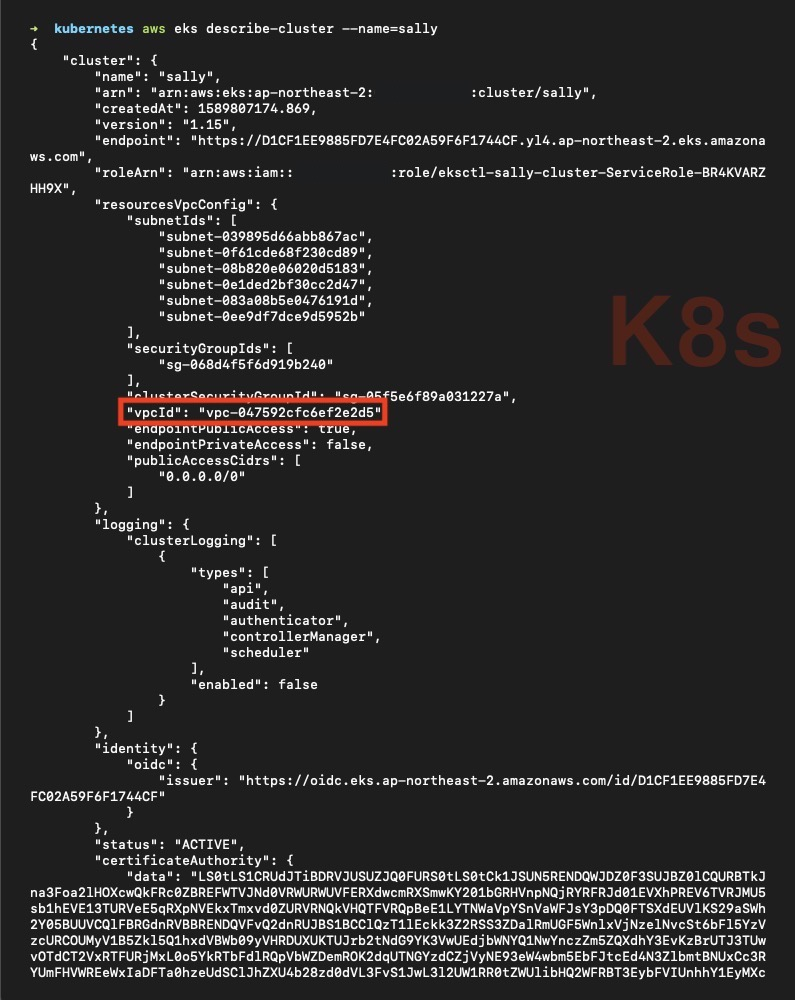

> 필자는 **Helm**(헬름)에서 제공하는 차트를 사용하였습니다. 하단의 `--cluster-name`, `--aws-region`, `--aws-vpc-id` 필드는 여러분이 설정한 값으로 입력하세요. 헬름 차트에 대한 자세한 정보는 [aws-alb-ingress-controller](https://github.com/helm/charts/tree/master/incubator/aws-alb-ingress-controller) 내용을 참조하세요.

```shell{promptHost: localhost}
kubectl apply -f aws-alb-ingress-controller.yaml
kubectl get all
```

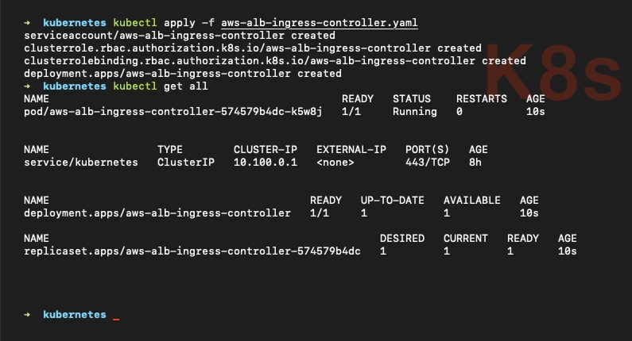

ALB 수신 컨트롤러 생성을 완료하였습니다.

## RDS 데이터베이스 생성

**RDS**(Relational Database Service)는 AWS 클라우드에서 관계형 데이터베이스를 더 쉽게 설치, 운영 및 확장할 수 있는 웹 서비스입니다. RDS는 어렵거나 지루한 관계형 데이터베이스 관리 작업을 대다수 대신합니다.

RDS - 데이터베이스 - 데이터베이스 생성 버튼을 클릭하여 새 데이터베이스 정보를 입력하세요. 데이터베이스 인스턴스 생성에 대한 자세한 정보는 AWS 공식 문서의 [RDS DB 인스턴스 만들기](https://docs.aws.amazon.com/ko_kr/AmazonRDS/latest/UserGuide/CHAP_Tutorials.WebServerDB.CreateDBInstance.html) 내용을 참조하세요.

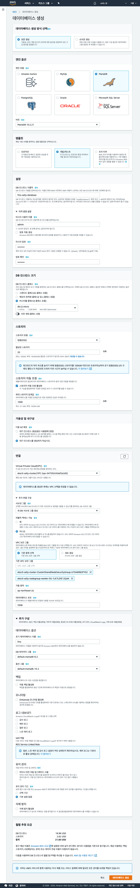

> 필자의 경우 최소 사양으로 구성하였습니다. 사양이 높을수록 월 청구 요금도 높아지기 때문에 하단의 월별 추정 요금을 확인하면서 설정하세요.

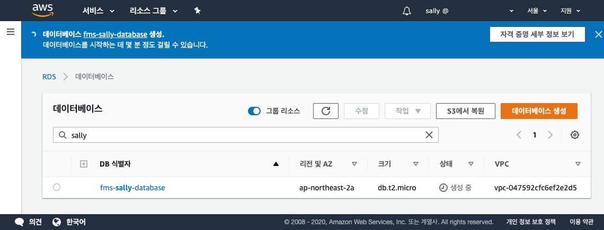

데이터베이스 생성을 완료하였습니다.

## 네임스페이스 생성

**Namespace**(네임스페이스)는 클러스터 내 논리적인 분리를 통한 가상 클러스터를 의미합니다. 같은 네임스페이스 내 오브젝트는 기본적으로 동일한 접근 제어 정책을 갖습니다.

```shell{promptHost: localhost}
kubectl get namespace
```

쿠버네티스는 처음에 3개의 네임스페이스를 갖습니다.

* `default`: 다른 네임스페이스가 없는 오브젝트를 위한 기본 네임스페이스
* `kube-system`: 쿠버네티스 시스템에서 생성한 오브젝트를 위한 네임스페이스
* `kube-public`: 모든 사용자(인증되지 않은 사용자 포함)가 읽기 권한으로 접근할 수 있는 네임스페이스

다음 명령어를 입력하여 네임스페이스를 생성합니다.

```shell{promptHost: localhost}
kubectl create namespace <insert-your-namespace-name>
```

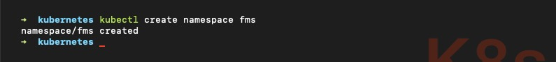

> 필자는 `fms` 네임스페이스를 생성하였습니다. 여러분이 원하는 네임스페이스를 생성하세요. 네임스페이스를 삭제하고 싶다면 다음 명령어를 입력하세요.

```shell{promptHost: localhost}
kubectl delete namespace <insert-your-namespace-name>
```

모든 오브젝트가 네임스페이스에 속하지는 않습니다. 파드, 서비스 등의 쿠버네티스 리소스는 네임스페이스에 속하지만 네임스페이스 리소스 자체는 네임스페이스에 속하지 않습니다. 노드나 퍼시스턴트 볼륨 등의 저수준 리소스는 어느 네임스페이스에도 속하지 않습니다.

```shell{promptHost: localhost}
kubectl api-resources --namespaced=true  // 네임스페이스에 속하는 리소스 조회
kubectl api-resources --namespaced=false // 네임스페이스에 속하지 않는 리소스 조회
```

### 네임스페이스에 속하는 리소스

```shell{promptHost: localhost}
kubectl get <NAME|SHORTNAMES> --namespace=<your-namespace>
```

| NAME                        | SHORTNAMES | KIND                     |
| --------------------------- | ---------- | ------------------------ |
| `bindings`                  |            | Binding                  |
| `configmaps`                | `cm`       | ConfigMap                |
| `endpoints`                 | `ep`       | Endpoints                |
| `events`                    | `ev`       | Event                    |
| `limitranges`               | `limits`   | LimitRange               |
| `persistentvolumeclaims`    | `pvc`      | PersistentVolumeClaim    |
| `pods`                      | `pod`      | Pod                      |
| `podtemplates`              |            | PodTemplate              |
| `replicationcontrollers`    | `rc`       | ReplicationController    |
| `resourcequotas`            | `quota`    | ResourceQuota            |
| `secrets`                   |            | Secret                   |
| `serviceaccounts`           | `sa`       | ServiceAccount           |
| `services`                  | `svc`      | Service                  |
| `controllerrevisions`       |            | ControllerRevision       |
| `daemonsets`                | `ds`       | DaemonSet                |
| `deployments`               | `deploy`   | Deployment               |
| `replicasets`               | `rs`       | ReplicaSet               |
| `statefulsets`              | `sts`      | StatefulSet              |
| `localsubjectaccessreviews` |            | LocalSubjectAccessReview |
| `horizontalpodautoscalers`  | `hpa`      | HorizontalPodAutoscaler  |
| `cronjobs`                  | `cj`       | CronJob                  |
| `jobs`                      |            | Job                      |
| `leases`                    |            | Lease                    |
| `events`                    | `ev`       | Event                    |
| `daemonsets`                | `ds`       | DaemonSet                |
| `deployments`               | `deploy`   | Deployment               |
| `ingresses`                 | `ing`      | Ingress                  |
| `networkpolicies`           | `netpol`   | NetworkPolicy            |
| `replicasets`               | `rs`       | ReplicaSet               |
| `ingresses`                 | `ing`      | Ingress                  |
| `networkpolicies`           | `netpo`    | NetworkPolicy            |
| `poddisruptionbudgets`      | `pdb`      | PodDisruptionBudget      |
| `rolebindings`              |            | RoleBinding              |
| `roles`                     |            |                          |

### 네임스페이스에 속하지 않는 리소스

```shell{promptHost: localhost}
kubectl get <NAME|SHORTNAMES>
```

| NAME                              | SHORTNAMES | KIND                           |
| --------------------------------- | ---------- | ------------------------------ |
| `componentstatuses`               | `cs`       | ComponentStatus                |
| `namespaces`                      | `ns`       | Namespace                      |
| `nodes`                           | `no`       | Node                           |
| `persistentvolumes`               | `pv`       | PersistentVolume               |
| `mutatingwebhookconfigurations`   |            | MutatingWebhookConfiguration   |
| `validatingwebhookconfigurations` |            | ValidatingWebhookConfiguration |
| `customresourcedefinitions`       | `crd`      | CustomResourceDefinition       |
| `apiservices`                     |            | APIService                     |
| `tokenreviews`                    |            | TokenReview                    |
| `selfsubjectaccessreviews`        |            | SelfSubjectAccessReview        |
| `selfsubjectrulesreviews`         |            | SelfSubjectRulesReview         |
| `subjectaccessreviews`            |            | SubjectAccessReview            |
| `certificatesigningrequests`      | `csr`      | CertificateSigningRequest      |
| `eniconfigs`                      |            | ENIConfig                      |
| `podsecuritypolicies`             | `psp`      | PodSecurityPolicy              |
| `runtimeclasses`                  |            | RuntimeClass                   |
| `podsecuritypolicies`             | `psp`      | PodSecurityPolicy              |
| `clusterrolebindings`             |            | ClusterRoleBinding             |
| `clusterroles`                    |            | ClusterRole                    |
| `priorityclasses`                 | `pc`       | PriorityClass                  |
| `csidrivers`                      |            | CSIDriver                      |
| `csinodes`                        |            | CSINode                        |
| `storageclasses`                  | `sc`       | StorageClass                   |
| `volumeattachments`               |            | VolumeAttachment               |

네임스페이스 생성을 완료하였습니다.

## ExternalName 설정

**자격 증명 세부 정보 보기** 또는 RDS - 데이터베이스 - `<your-database-identifier>` 항목을 클릭하여 현재 생성한 데이터베이스의 엔드포인트를 복사합니다.

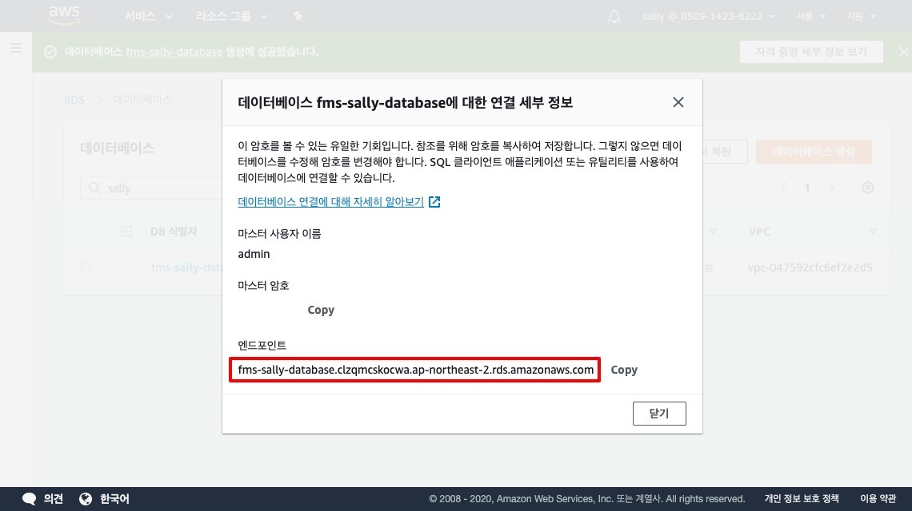

데이터베이스의 경우 쿠버네티스에서 관리하지 않는 AWS 서비스로 쿠버네티스 명령어로는 조회할 수 없지만 필자와 동일한 VPC 보안 그룹에 속해 있어 서비스를 사용할 수 있습니다.

다만, 서비스에서 사용할 때 *- 가독성이 낮은 -* 엔드포인트 주소 전체를 입력해야 하는데 `ExternalName` 유형을 지정해서 `spec.externalName` 파라미터를 사용하면 쿠버네티스 안에서 별칭 형태로 서비스에 적용할 수 있습니다. 자세한 정보는 쿠버네티스 공식 문서의 [ExternalName 유형](https://kubernetes.io/ko/docs/concepts/services-networking/service/#externalname) 내용을 참조하세요.

**external-name.yaml**

```yaml
kind: Service
apiVersion: v1
metadata:
  name: mariadb
  namespace: <your-namespace>
spec:
  type: ExternalName
  externalName: <database-endpoint>
```

```shell{promptHost: localhost}
kubectl apply -f external-name.yaml
kubectl get services --namespace=<your-namespace>
```

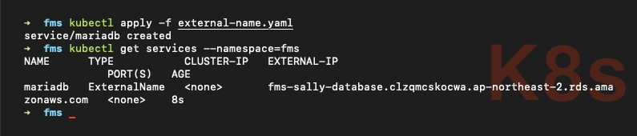

이제 오브젝트에 *- 가독성이 높은 -* `mariadb` 별칭으로 서비스에 적용할 수 있습니다.

## MariaDB CLI 배포

외부 서비스인 데이터베이스는 쿠버네티스 명령어로 조회할 수 없기 때문에 쿠버네티스 안에서 사용할 수 있도록 CLI 툴을 배포해 봅시다.

**mariadb-cli.yaml**

```yaml
apiVersion: apps/v1
kind: Deployment
metadata:
  name: mariadb-cli
  namespace: <your-namespace>
  labels:
    app: mariadb-cli
    component: client
spec:
  selector:
    matchLabels:
      app: mariadb-cli
      component: client
  replicas: 1
  template:
    metadata:
      labels:
        app: mariadb-cli
        component: client
    spec:
      serviceAccountName: default
      containers:
        - name: mariadb
          image: mariadb:10.3
          imagePullPolicy: "IfNotPresent"
          command: ["/bin/sh"]
          args:
            [
              "-c",
              "while true; do echo $(date +%Y-%m-%d' '%H:%M:%S); sleep 60; done",
            ]
          resources:
            requests:
              cpu: 50m
              memory: 64Mi
            limits:
              cpu: 100m
              memory: 64Mi
```

```shell{promptHost: localhost}
kubectl apply -f mariadb-cli.yaml
kubectl get pods --namespace=<your-namespace>
```

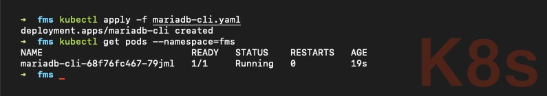

> 필자의 경우 *- 지속적 연결 상태 확인 목적으로 -* `args` 필드에 60초마다 현재 시각을 출력하는 스크립트를 정의해 놓았습니다. 여러분은 다른 스크립트로 정의하거나 정의하지 않아도 됩니다. `kubectl logs -f <mariadb-cli-pod> --namespace=<your-namespace>` 명령어로 확인할 수 있습니다.

다음 명령어를 입력하면 *- 다소 복잡하긴 하지만 -* 파드를 조회하는 과정을 생략할 수 있습니다.

```shell{promptHost: localhost}
kubectl logs -f $(kubectl get pods -o jsonpath="{.items[0].metadata.name}" --namespace=<your-namespace> -l "app=mariadb-cli") --namespace=<your-namespace> --timestamps
```
* `-l, --selector`: 레이블 셀렉터. 쿠버네티스 오브젝트를 식별합니다. 자세한 정보는 쿠버네티스 공식 문서의 [레이블과 셀렉터](https://kubernetes.io/ko/docs/concepts/overview/working-with-objects/labels/#레이블-셀렉터) 내용을 참조하세요.
* `-o, --output`: 반환된 목록의 각 파드에서 이름을 가져오는 표현식을 지정합니다.

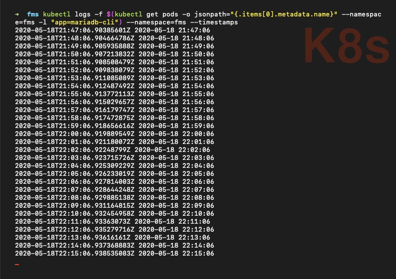

다음 명령어를 입력하여 `mariadb-cli` 내부로 접속합니다.

```shell{promptHost: localhost}
kubectl exec -it <mariadb-cli-pod> --namespace=<your-namespace> bash
mysql -h <mariadb-external-name> -u admin -p
Enter Password: <mariadb-password>
```

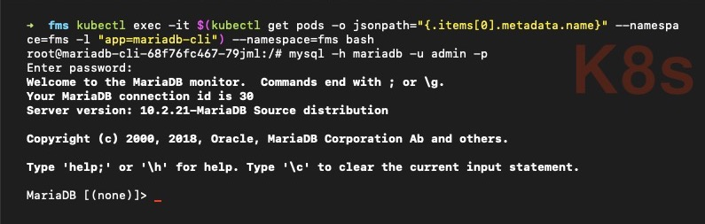

> `<mariadb-external-name>` 필드의 경우 엔드포인트 주소 그대로 입력해도 무방하지만 미리 정의해 놓은 별칭을 사용하는 것이 좋습니다.

### [ERROR] Connection Failed.

접속에 실패할 경우 로드 밸런서 및 보안 그룹 설정을 검토하세요.

1. `aws-alb-ingress-controller` 설정에서 `cluster-name` 또는 `aws-vpc-id` 필드 값 확인
2. 데이터베이스 보안 그룹 `ClusterSharedNodeSecurityGroup` 추가 확인 (`ControlPlaneSecurityGroup` 아님)

## MaxScale 배포

MariaDB **MaxScale**(맥스스케일)은 기본 데이터베이스 인프라에서 애플리케이션 개발을 분리하여 애플리케이션 개발을 단순화하는 데이터베이스 프록시입니다.

MaxScale 서비스를 사용하기 위해 `maxscale` 계정을 생성하고 특정 테이블에 대한 권한을 부여해야 합니다. 자세한 정보는 MariaDB 공식 문서의 [Creating a user account for MaxScale](https://mariadb.com/kb/en/mariadb-maxscale-23-setting-up-mariadb-maxscale/#creating-a-user-account-for-maxscale) 내용을 참조하세요.

```sql
CREATE USER 'maxscale'@'%' IDENTIFIED BY '<insert-your-maxscale-password>';
GRANT SELECT ON mysql.user TO 'maxscale'@'%';
GRANT SELECT ON mysql.db TO 'maxscale'@'%';
GRANT SELECT ON mysql.tables_priv TO 'maxscale'@'%';
GRANT SELECT ON mysql.roles_mapping TO 'maxscale'@'%';
GRANT SHOW DATABASES ON *.* TO 'maxscale'@'%';

SELECT Host, User FROM mysql.user;
```

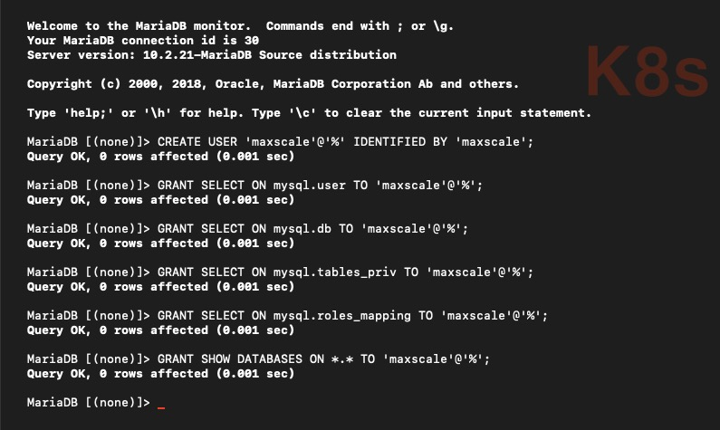

**my-maxscale.cnf**

```properties
[master]
type=server
address=mariadb
port=3306
protocol=MariaDBBackend

[slave1]
type=server
address=mariadb
port=3306
protocol=MariaDBBackend

[slave2]
type=server
address=mariadb
port=3306
protocol=MariaDBBackend

# Monitor for the servers
# This will keep MaxScale aware of the state of the servers.
# MySQL Monitor documentation:
# https://github.com/mariadb-corporation/MaxScale/blob/2.3/Documentation/Monitors/MariaDB-Monitor.md

[MariaDB-Monitor]
type=monitor
module=mariadbmon
servers=master
user=maxscale
passwd=<your-maxscale-password>
auto_failover=true
auto_rejoin=true
enforce_read_only_slaves=1

# Service definitions
# Service Definition for a read-only service and a read/write splitting service.

# ReadConnRoute documentation:
# https://github.com/mariadb-corporation/MaxScale/blob/2.3/Documentation/Routers/ReadConnRoute.md

[Read-Only-Service]
type=service
router=readconnroute
servers=master
user=maxscale
passwd=<your-maxscale-password>
router_options=slave

# ReadWriteSplit documentation:
# https://github.com/mariadb-corporation/MaxScale/blob/2.3/Documentation/Routers/ReadWriteSplit.md

[Read-Write-Service]
type=service
router=readwritesplit
servers=master
user=maxscale
passwd=<your-maxscale-password>
master_failure_mode=fail_on_write

# Listener definitions for the services
# Listeners represent the ports the services will listen on.

[Read-Only-Listener]
type=listener
service=Read-Only-Service
protocol=MySQLClient
port=4008
address=0.0.0.0

[Read-Write-Listener]
type=listener
service=Read-Write-Service
protocol=MySQLClient
port=4006
address=0.0.0.0
```

Maxscale 구성으로 시크릿을 생성해 봅시다.

```shell{promptHost: localhost}
kubectl create secret generic maxscale-config --from-file=my-maxscale.cnf=<repository-absolute-path>/my-maxscale.cnf --namespace=<your-namespace>
kubectl get secrets --namespace=<your-namespace>
```

> `<repository-absolute-path>` 필드의 경우 `${PWD}` 변수를 사용하면 편리합니다.

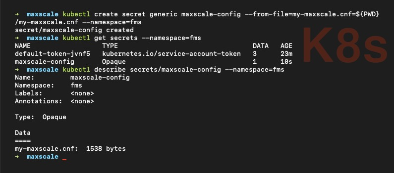

**maxscale.yaml**

```yaml
apiVersion: v1
kind: Service
metadata:
  name: maxscale
  namespace: <your-namespace>
  labels:
    app: maxscale
spec:
  ports:
    - port: 4006
      targetPort: 4006
      protocol: TCP
  selector:
    app: maxscale
  type: ClusterIP
---
apiVersion: extensions/v1beta1
kind: Deployment
metadata:
  name: maxscale
  namespace: <your-namespace>
spec:
  replicas: 1
  template:
    metadata:
      labels:
        app: maxscale
    spec:
      initContainers:
        - name: init-myservice
          image: mariadb/maxscale:2.3
          volumeMounts:
            - name: conf-d
              mountPath: /tmp/maxscale.cnf.d
            - name: secret-conf-d
              mountPath: /tmp/source.maxscale.cnf.d
          command:
            - "sh"
            - "-c"
            - "cat /tmp/source.maxscale.cnf.d/my-maxscale.cnf >> /tmp/maxscale.cnf.d/my-maxscale.cnf"
      containers:
        - name: maxscale
          image: mariadb/maxscale:2.3
          imagePullPolicy: IfNotPresent
          resources:
            requests:
              cpu: 50m
              memory: 200Mi
            limits:
              cpu: 300m
              memory: 300Mi
          ports:
            - containerPort: 4006
              name: readwrite-port
            - containerPort: 4008
              name: readonly-port
          volumeMounts:
            - name: conf-d
              mountPath: "/etc/maxscale.cnf.d"
              readOnly: true
      volumes:
        - name: secret-conf-d
          secret:
            secretName: maxscale-config
            items:
              - key: my-maxscale.cnf
                path: my-maxscale.cnf
        - name: conf-d
          emptyDir: {}
```

```shell{promptHost: localhost}
kubectl apply -f maxscale.yaml
kubectl get services --namespace=<your-namespace>
```

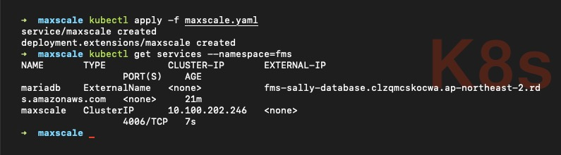

MaxScale 배포를 완료하였습니다. 이제 `kubectl port-forward` 명령어로 리소스 이름과 파드 이름과 사용하여 일치하는 파드를 선택해 포트 포워딩을 할 수 있습니다.

```shell{promptHost: localhost}
kubectl port-forward service/maxscale 4006:4006 --namespace=<your-namespace>
```

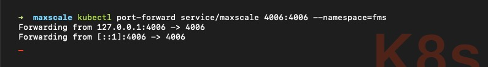

파드의 포트를 로컬 포트로 포워딩한 상태입니다. 데이터베이스 툴을 사용하여 직접 데이터베이스에 접속해 봅시다. (필자는 [`DBeaver`](https://dbeaver.io/download/) 툴을 사용하였습니다.)

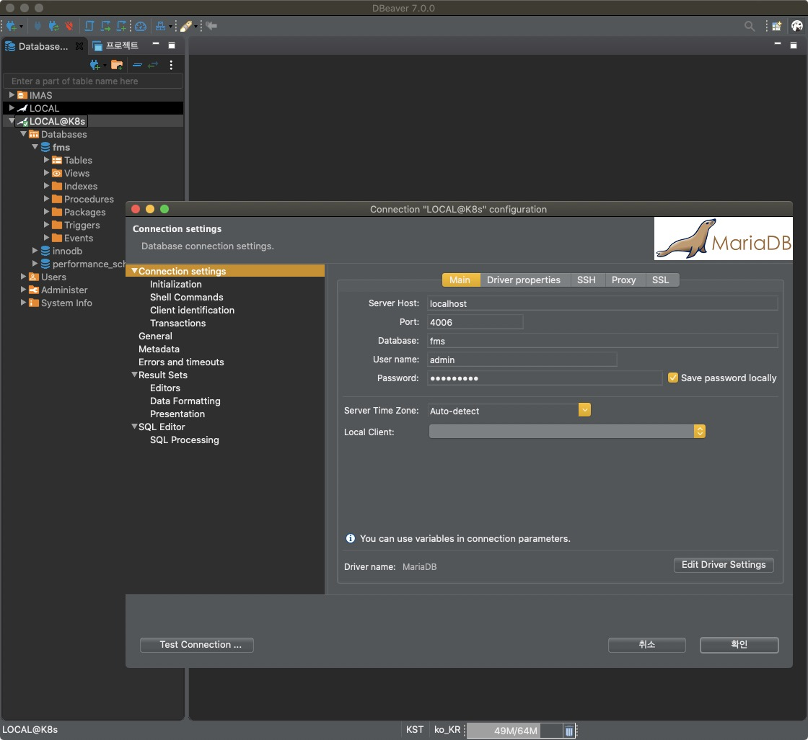

데이터베이스 접속을 완료하였습니다. 이제 데이터베이스에 마이그레이션 및 다양한 작업을 수행할 수 있습니다.

## Docker 자격 증명 기반 Secret 배포

애플리케이션을 오브젝트로 배포할 때 도커 이미지를 가져오기 위한 자격 증명이 필요합니다. 그렇다면 배포하는 `.yaml` 파일마다 도커 계정과 비밀번호를 설정해야 할까요? *- 보안을 중요시하는 개발자라면 -* 절대로 그렇게 설정하고 싶지 않을 겁니다. 쿠버네티스는 중요한 정보를 별도로 저장할 수 있도록 **Secret**(시크릿) 기능을 지원합니다. 지금부터 도커 계정 정보를 시크릿으로 만들어 배포해 봅시다.

도커 사용자 이름과 비밀번호를 `base64` 형태로 변환합니다.

```shell{promptHost: localhost}
echo -n '<username>:<password>' | base64
```

**docker/config.json**

변환한 정보를 `auth` 필드에 삽입합니다.

```json
{
  "auths": {
    "https://index.docker.io/v1/": {
      "auth": "<base64-encoded-string>"
    }
  }
}
```

해당 파일을 `base64` 형태로 변환합니다.

```shell{promptHost: localhost}
cat config.json | base64
```

**docker/dockerhub.yaml**

변환한 정보를 `.dockerconfigjson` 필드에 삽입합니다.

```yaml
apiVersion: v1
kind: Secret
metadata:
  name: dockerhub
  namespace: <your-namespace>
type: kubernetes.io/dockerconfigjson
data:
  .dockerconfigjson: <base64-encoded-string>
```

```shell{promptHost: localhost}
kubectl apply -f dockerhub.yaml
kubectl get secrets --namespace=<your-namespace>
kubectl describe secrets/dockerhub --namespace=<your-namespace>
```

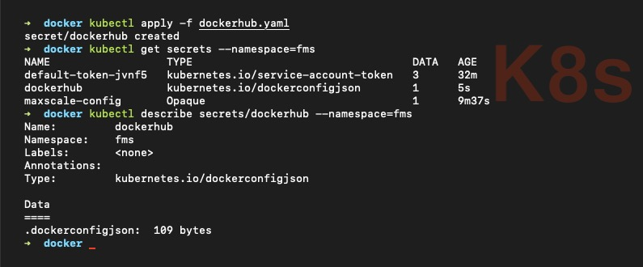

시크릿 배포를 완료하였습니다. 이제 애플리케이션 오브젝트 내 `imagePullSecrets` 필드에 다음과 같이 도커 자격 증명을 지정할 수 있습니다.

```yaml
...
spec:
  imagePullSecrets:
    - name: dockerhub
```

# ㅗㅜㅑ 🤭<br />설마 여기까지 온 건가요?

이 엄청난 스크롤의 압박을 극복한 당신은 최소 쿠버네티스 사랑꾼! 👍 이제 서비스를 구성하는 파드를 쿠버네티스 오브젝트로 만들고 배포하는 단계가 남았습니다. 심호흡하고 [Amazon EKS 프로젝트 배포하기](/post/kubernetes/deploy-project) 글을 살펴보세요.
