## 목차

1. [Auto Scaling 그룹 설정](#Auto-Scaling-그룹-설정)
2. [외부 서비스 종속성 해제](#외부-서비스-종속성-해제)
3. [EKS 클러스터 삭제](#EKS-클러스터-삭제)
4. [VPC 삭제](#VPC-삭제)
5. [스택 삭제](#스택-삭제)

## Auto Scaling 그룹 설정

EKS 클러스터는 EC2 인스턴스를 생성하면서 인스턴스 상태가 이상이 있는 경우에도 고정된 수의 인스턴스를 계속 유지하도록 **Auto Scaling**(오토 스케일링) 그룹을 생성합니다. EC2 - AUTO SCALING - Auto Scaling 그룹 - `<your-nodegroup-worker>` - 편집 버튼 클릭 후 인스턴스의 최소 및 최대 용량 한도를 0으로 지정하여 모든 리소스의 작동을 중지해 봅시다.

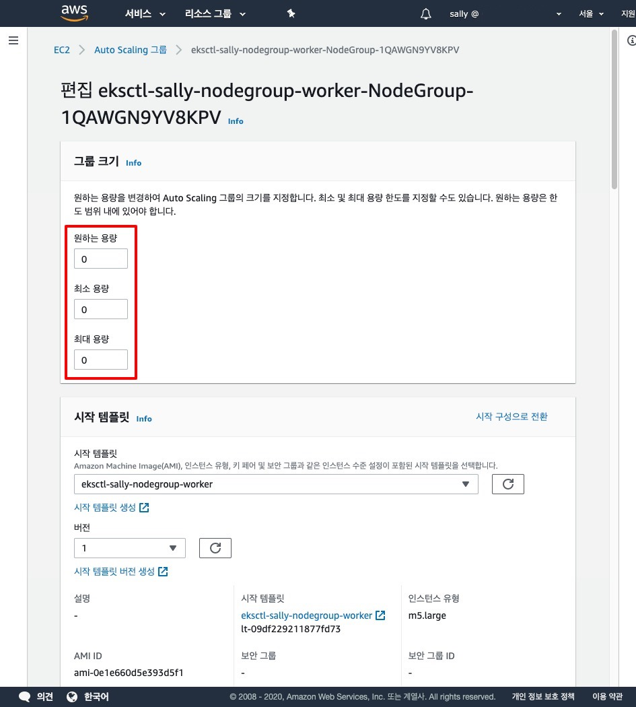

## 외부 서비스 종속성 해제

### RDS

데이터베이스의 경우 쿠버네티스에서 관리하지 않는 외부 서비스로 해당 서비스와 연결된 리소스가 있는 경우 쿠버네티스에서 삭제할 수 없기 때문에 수동으로 삭제해야 합니다.

RDS - 데이터베이스 - 삭제 버튼을 클릭하여 데이터베이스를 삭제하세요.

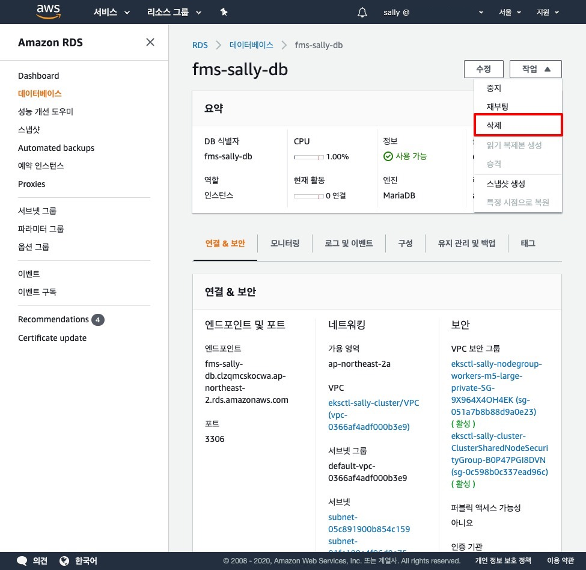

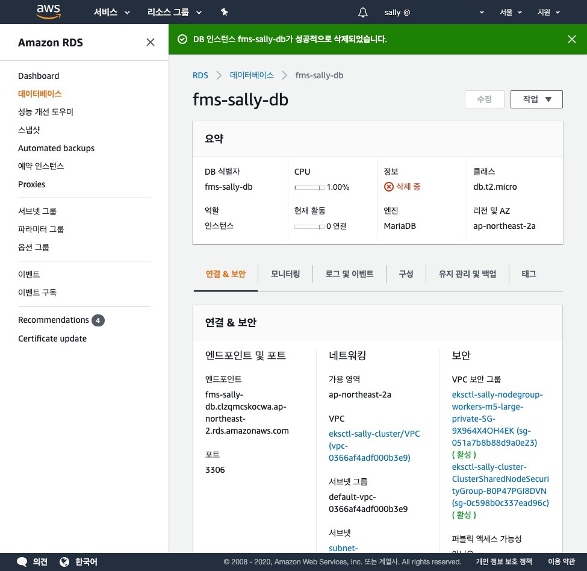

데이터베이스 삭제를 완료하였습니다.

### Route 53

외부 접속을 위하여 호스팅한 리소스가 있는 경우 Route 53 - 호스팅 영역 - `<your-domain>` - 레코드 목록에서 삭제할 리소스와 연결된 레코드를 삭제하세요.

### 정책

임의로 연결한 정책이 있다면 쿠버네티스에서 관리하지 않아 삭제할 수 없기 때문에 수동으로 삭제해야 합니다. EBS CSI 드라이버를 사용하는 경우 노드 그룹에 정책을 연결하기 때문에 임의로 연결한 정책이 있습니다. IAM - 역할 - `<your-cluster-name>` 항목을 검색하여 `NodeInstanceRole` 단어를 포함하는 역할에 임의로 연결한 정책을 삭제하세요.

## EKS 클러스터 삭제

다음 명령어를 입력하세요. 약 10~20분 정도 소요됩니다.

```shell{promptUser: user}{promptHost: localhost}
eksctl delete cluster <your-cluster-name>
```

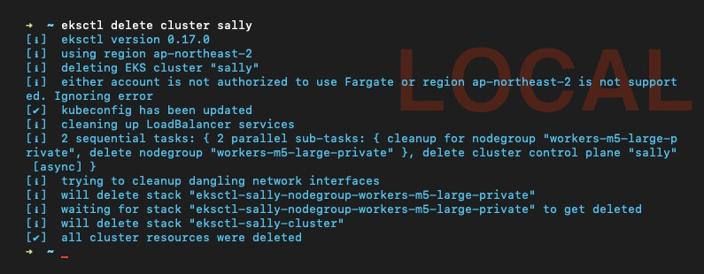

클러스터 삭제를 완료하였습니다.

### [ERROR] DependencyViolation

외부 서비스를 삭제하지 않는 경우 다음과 같은 오류를 표시합니다.

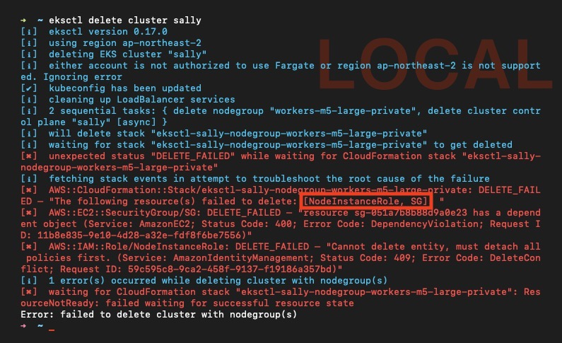

CloudFormation 이벤트 내역에서 자세한 내용을 확인할 수 있습니다.

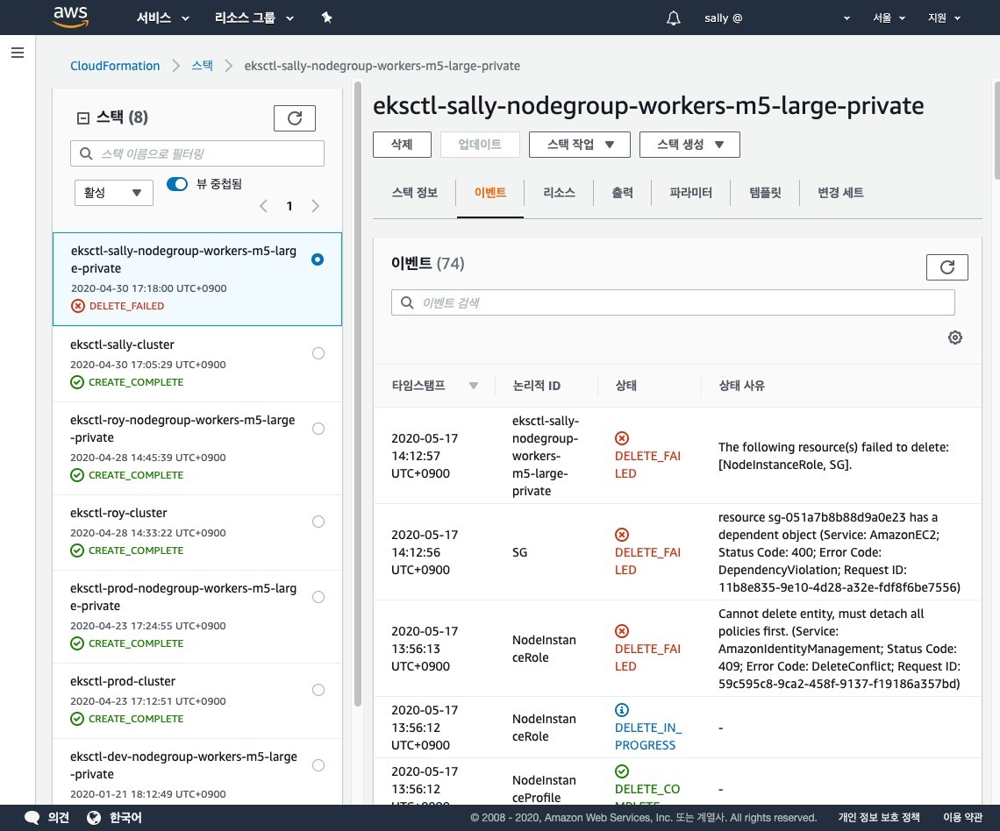

EC2 - 보안 그룹 - `<your-target-security-group>` - 삭제 버튼 클릭 후 자세한 정보를 확인합니다.

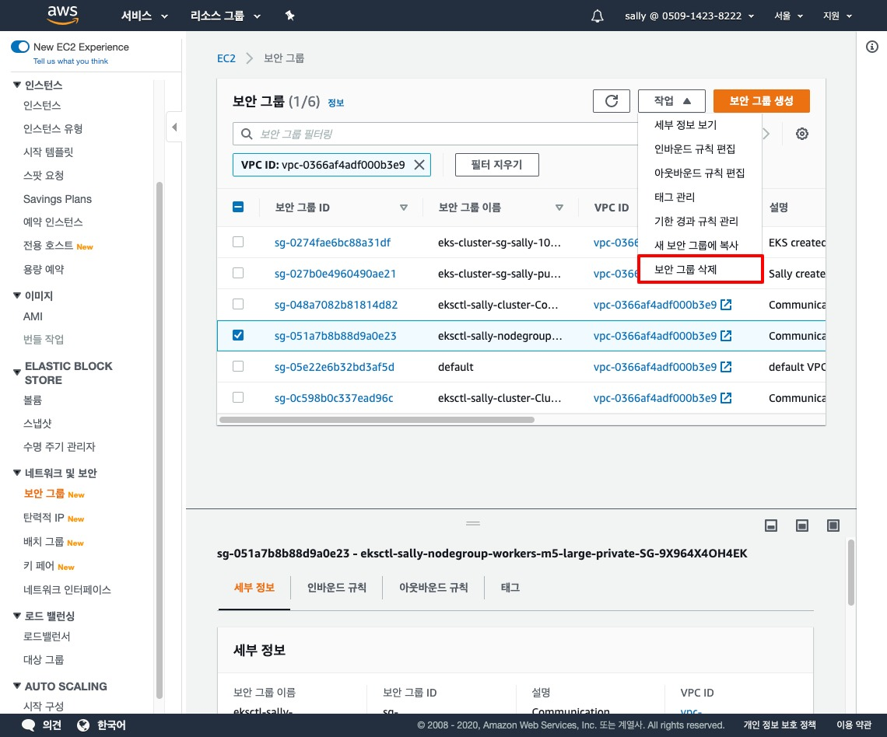

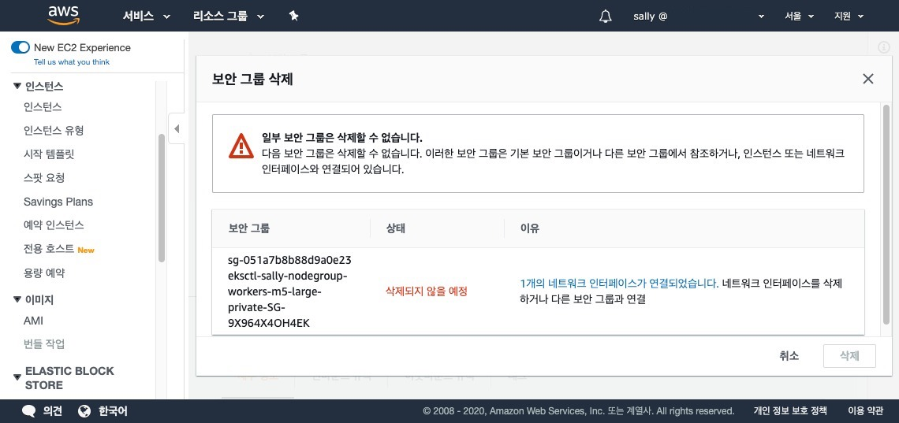

> 해당 오류 문구는 외부 서비스인 RDS 종속성과 관련된 것이지만 AWS는 그다지 친절하게 안내하지 않기 때문에 여러분이 어떤 외부 서비스를 사용하고 있는지 미리 파악해 두는 것이 중요합니다.

## VPC 삭제

클러스터는 삭제하였지만 CloudFormation 이벤트 내역에서 VPC 삭제 도중 오류가 발생한 것을 확인할 수 있습니다.

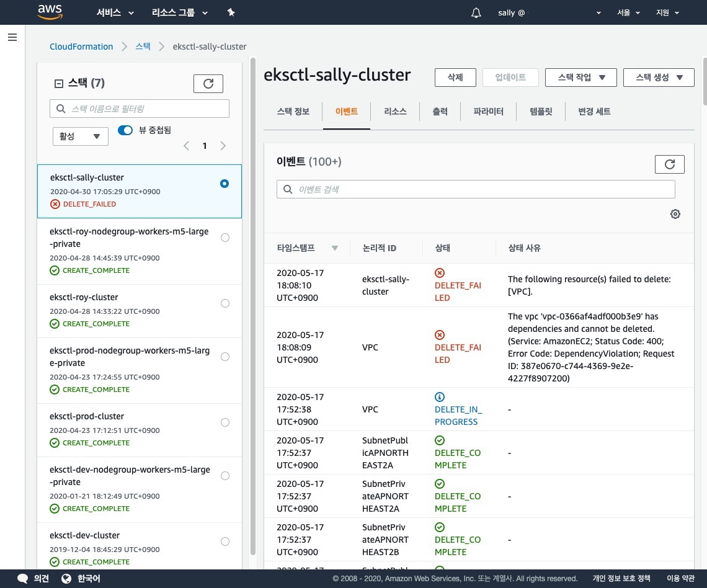

VPC - `<your-vpc>` - 작업 - 삭제 버튼을 클릭하여 VPC 삭제를 진행합니다.

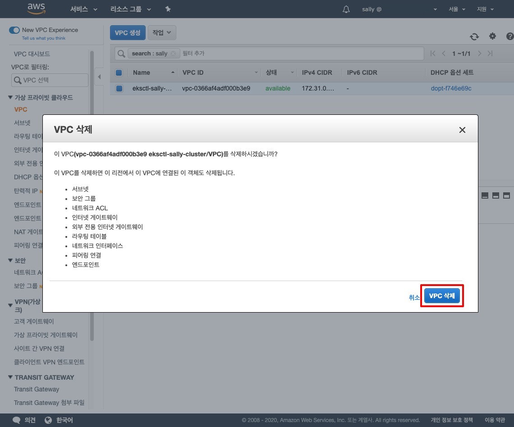

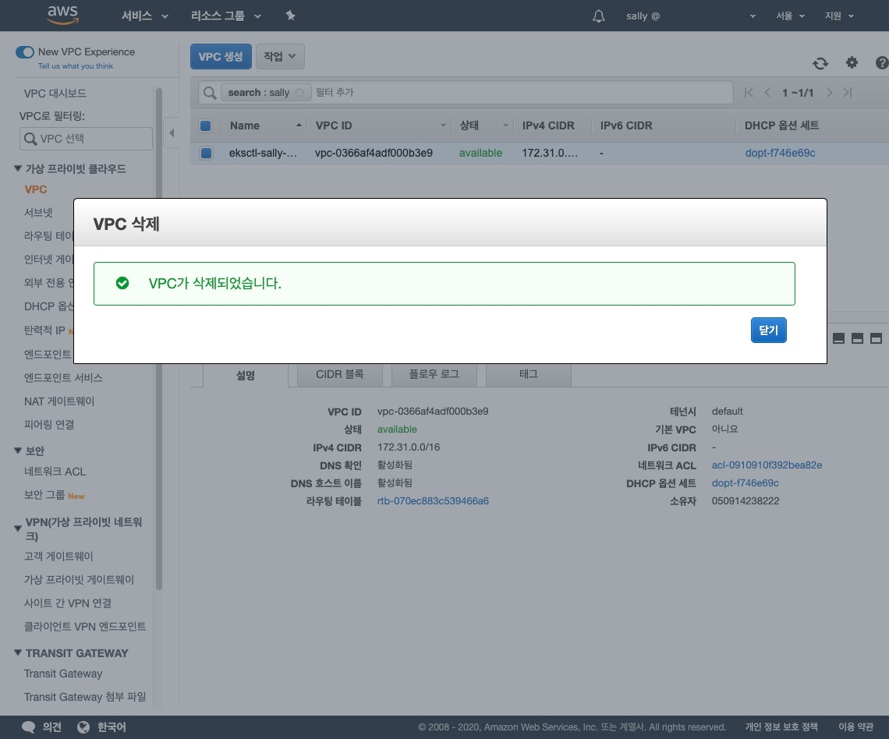

VPC 삭제를 완료하였습니다.

## 스택 삭제

CloudFormation - 스택 - `<your-stack>` - 삭제 버튼을 클릭하여 클러스터와 관련된 모든 스택 리소스를 삭제합니다.

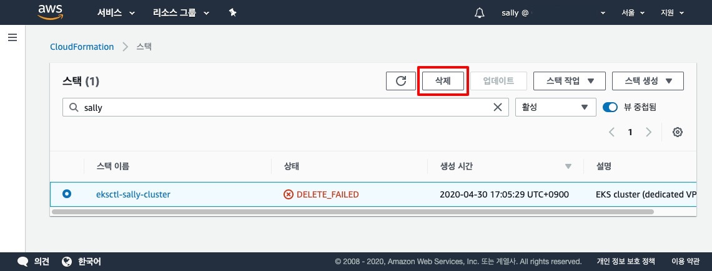

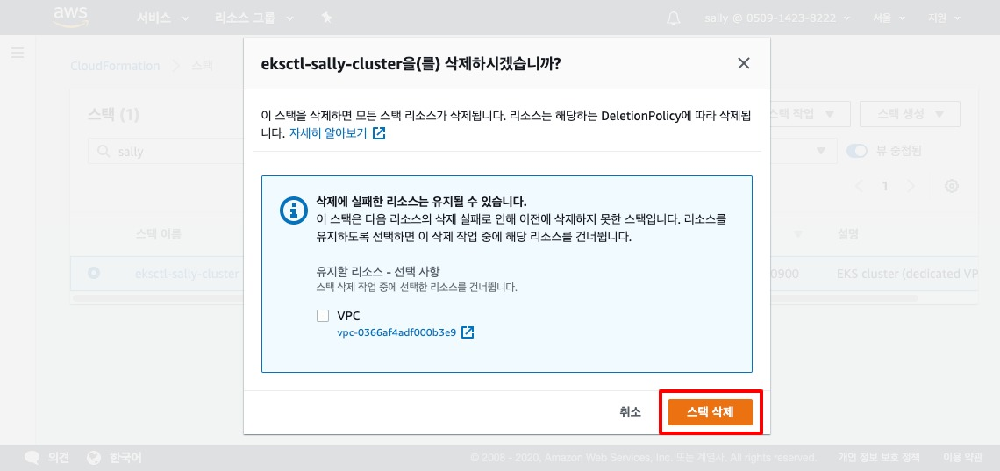

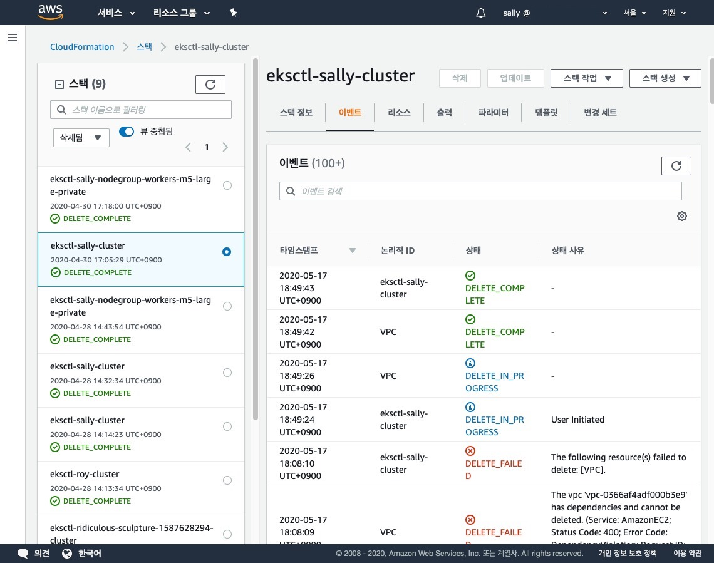

모든 스택 리소스 삭제를 완료하였습니다.

