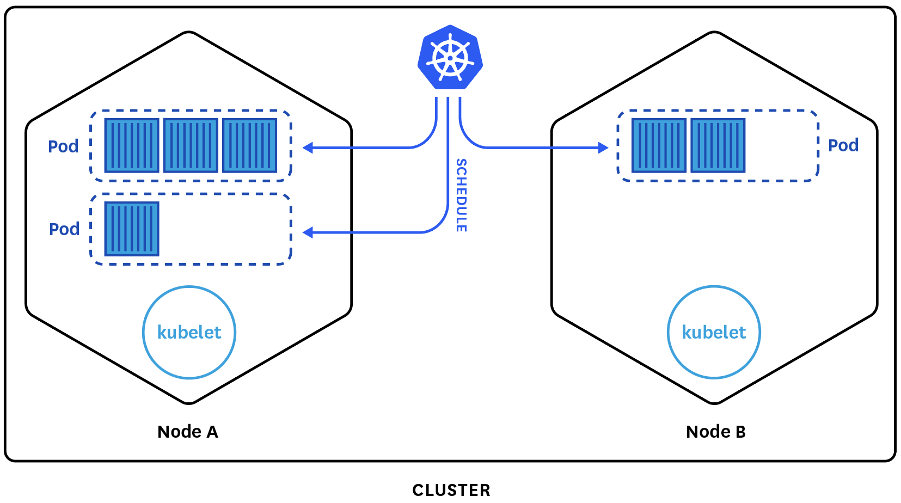
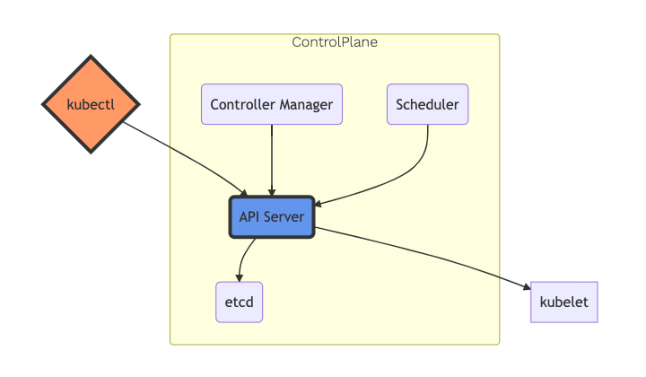
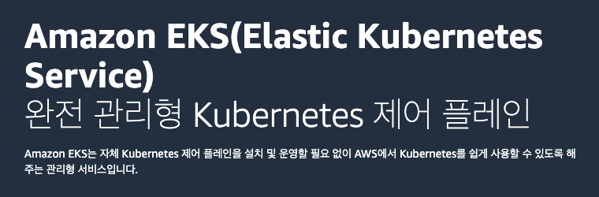
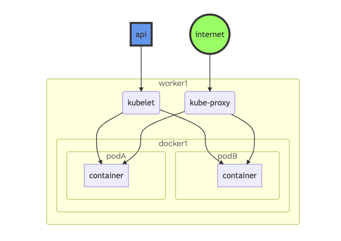
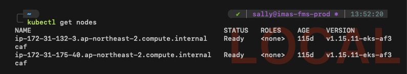

# 🧐<br />클러스터?

쿠버네티스를 시작하기 위해 가장 먼저 해야 할 일은 **Cluster**(클러스터)를 생성하는 것입니다. 쿠버네티스 클러스터는 컨테이너화된 애플리케이션을 실행하는 노드의 집합입니다.



## Node

**Node**(노드)는 쿠버네티스 클러스터를 구성하는 머신입니다. 머신은 클러스터 유형에 따라 가상 머신(Virtual Machine, VM) 또는 물리 머신(Physical Computer)일 수 있습니다.

> 쿠버네티스는 클라우드, 온프레미스 환경을 모두 지원합니다. AWS, GCP, Azure 서비스에 구성하면 가상 머신, 서버 컴퓨터에 구성하면 물리 머신이 됩니다.

노드에는 두 가지 종류가 있습니다.

* Master Node
* Worker Node

### Master Node

**Master Node**(마스터 노드)는 클러스터를 관리하는 노드입니다. 두뇌 역할을 하는 **Control Plane**(컨트롤 플레인)을 형성합니다. 컨트롤 플레인은 전체 쿠버네티스 시스템을 관리하고 통제합니다. 컨테이너의 라이프사이클을 정의, 배포, 관리하기 위한 API와 인터페이스를 노출하는 컨테이너를 관리합니다.



노란색 영역이 컨트롤 플레인입니다. 중심 컴포넌트는 RESTful 인터페이스로 쿠버네티스 기능을 제공하는 **API 서버**입니다. 컨트롤 플레인에 대한 자세한 정보는 Amazon EKS 워크샵의 [쿠버네티스 아키텍처 - 컨트롤 플레인](https://awskrug.github.io/eks-workshop/introduction/architecture/architecture_control/) 내용을 참조하세요.

클러스터를 구성할 때 어려움을 겪는 부분이 바로 마스터 노드를 구성하는 일입니다. AWS의 경우 이와 같은 문제를 인지하고 쿠버네티스를 쉽게 사용할 수 있도록 **Amazon EKS** 관리형 서비스를 만들어 자체 쿠버네티스 컨트롤 플레인을 제공하고 있습니다.



AWS 공식 사이트에서 소개한 정의입니다. **완전 관리형**(fully managed)은 **우리가 마스터 노드를 구성할 필요가 없다**는 의미입니다. 실제로 필자도 EKS 서비스를 사용하면서 별도의 마스터 노드를 구성하지 않았습니다.

### Worker Node

**Worker Node**(워커 노드, 작업자 노드)는 파드를 통해 실제 컨테이너 이미지를 실행하는 노드입니다. 컨테이너에 CPU, 메모리, 네트워크, 스토리지와 같은 능력을 제공하는 **Data Plane**(데이터 플레인)을 형성합니다.



EKS 서비스로 구성한 쿠버네티스의 워커 노드는 **EC2 인스턴스**로 실행합니다. 워커 노드는 줄여서 **노드**로 부르기도 합니다. Amazon EKS 서비스에서 **노드와 인스턴스는 같은 의미**입니다. 다음 명령어는 클러스터 노드를 조회합니다.

```shell{promptHost: localhost}
kubectl get nodes
```



클러스터에 2개의 EC2 인스턴스 노드를 실행하고 있습니다. 노드의 이름은 `<private-IPv4-address>.<region>.compute.internal` 형식으로 구성합니다.

데이터 플레인에 대한 자세한 정보는 Amazon EKS 워크샵의 [쿠버네티스 아키텍처 - 데이터 플레인](https://awskrug.github.io/eks-workshop/introduction/architecture/architecture_worker/) 내용을 참조하세요.
