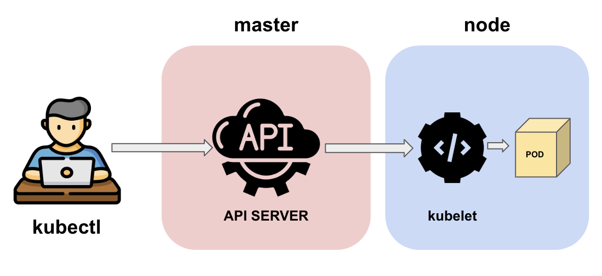
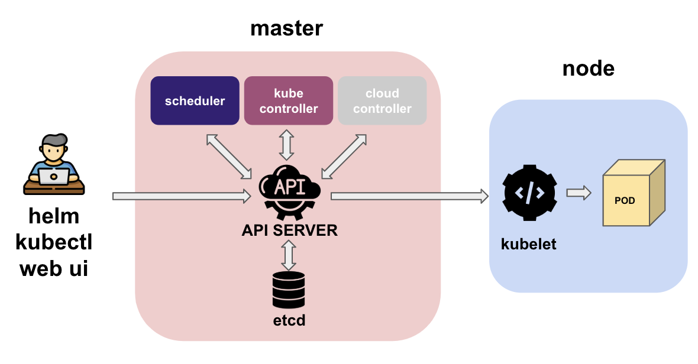
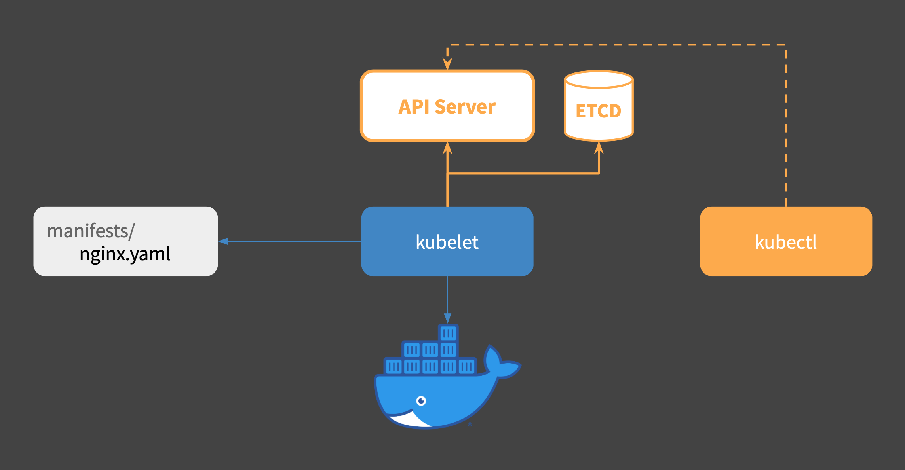
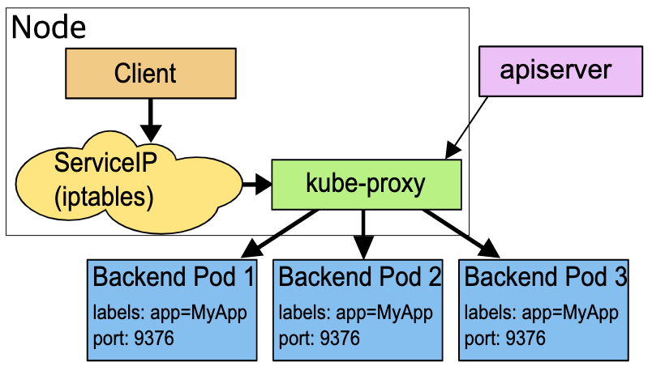
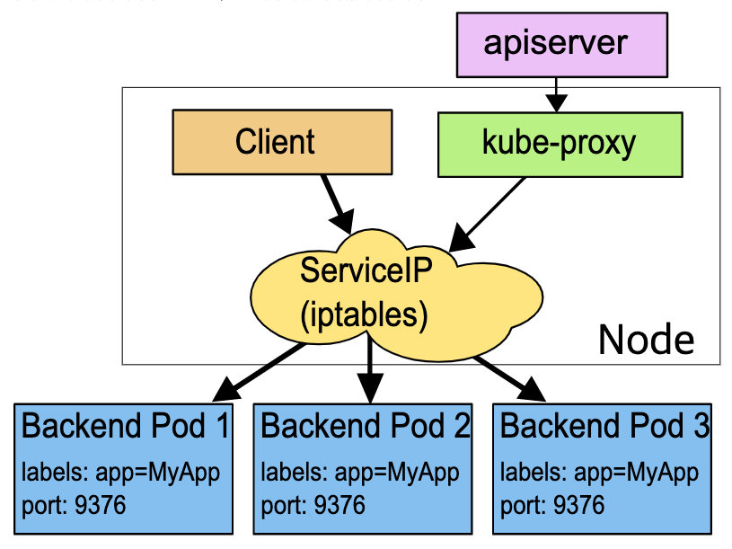

> 쿠버네티스 공식 문서의 [컴포넌트](https://kubernetes.io/ko/docs/concepts/overview/components/)와 서비큐라의 [쿠버네티스 기본 개념](https://subicura.com/2019/05/19/kubernetes-basic-1.html#쿠버네티스-기본-개념) 내용을 참조해서 작성한 글입니다. 자세한 내용은 해당 문서를 참조해 주세요. 😉

**Component**(컴포넌트)는 독립적인 소프트웨어 단위 모듈입니다. 독립적인 모듈은 의존성이 없기 때문에 재사용을 가능하게 합니다. 파란색 7각형 모양의 도형이 컴포넌트를 의미합니다.

## Master Node - Control Plane Component

**Master Node**(마스터 노드)는 다양한 모듈의 확장성을 고려한 **MSA*** 방식으로 구성하였습니다. **Control Plane**(컨트롤 플레인) 컴포넌트는 클러스터에 관한 전반적인 결정을 수행하고 클러스터 이벤트를 감지합니다.

* MSA(Microservices Architecture, 마이크로서비스 아키텍처): 하나의 큰 애플리케이션을 여러 개의 작은 애플리케이션으로 쪼개어 변경과 조합이 가능하도록 만든 소프트웨어 개발 기법

### kube-apiserver

**kube-apiserver**(큐브 API 서버)는 쿠버네티스의 모든 요청을 처리하는 마스터의 핵심 컴포넌트입니다. `kubectl` *- 및 내부 컴포넌트 -* 요청을 처리합니다.  **Desired State**(원하는 상태)를 etcd에 저장하고 저장한 상태를 조회합니다. 요청에 대한 권한을 체크한 후 요청을 거부할 수도 있습니다. 노드에서 실행 중인 컨테이너의 로그를 보여주고 명령을 보내는 등 디버거 역할도 수행합니다.

### etcd

**etcd**(/etc distributed, 엣시디)는 키-값 데이터베이스 저장소입니다. 쿠버네티스 클러스터의 구성, 서비스 검색 및 스케줄러 조정, 시스템의 실제 상태(current state)와 원하는 상태(desired state)를 저장합니다.

쿠버네티스 클러스터는 **모든 데이터를 etcd에 저장**합니다. `kubectl get <xyz>` 명령어 실행 시 읽을 수 있는 모든 데이터를 저장합니다. `kubectl create <xyz>` 명령어 실행 시 변경된 항목을 업데이트하고 서로에게 변경 사항을 알립니다.

### kube-scheduler

**kube-scheduler**(큐브 스케줄러)는 새로운 파드를 배포할 때 자원 할당이 가능한 노드를 선택합니다. `cpu`, `memory`, `affinity` 등의 조건을 만족하는 노드를 찾아 배포합니다.

### kube-controller-manager

**kube-controller-manager**(큐브 컨트롤러 매니저)는 쿠버네티스 오브젝트의 상태를 관리합니다.

### cloud-controller-manager

**cloud-controller-manager**(클라우드 컨트롤러 매니저)는 AWS, GCE, Azure 등 클라우드에 특화된 컴포넌트입니다. 노드를 추가/삭제하고 로드 밸런서를 연결하거나 볼륨을 붙일 수 있습니다.

## Worker Node - Node Component

**Worker Node**(워커 노드)는 마스터 노드와 통신하면서 필요한 파드를 생성합니다. 모든 노드 상에서 동작합니다.

### kubelet

**kubelet**(큐블릿)은 각 노드에서 실행하는 기본 **노드 에이전트**로 마스터 노드와 통신합니다. 각 노드에 할당된 파드의 생명 주기를 관리합니다. 파드 배포 시 **PodSpec*** 정보를 토대로 컨테이너에 이상이 없는지 확인합니다.

* PodSpec: 파드를 설명하는 YAML 또는 JSON 객체

### kube-proxy

**kube-proxy**(큐브 프록시)는 각 노드에서 실행하는 프록시로 컨테이너 서비스 포트로 접근할 수 있도록 합니다. 쿠버네티스는 클러스터 내부에 별도의 가상 네트워크를 설정하고 관리합니다.

kube-proxy는 클러스터 내부 IP로 연결 요청이 들어오면 적절한 파드에 전달합니다. 네트워크를 관리하는 방법은 userspace, **iptables**(기본 모드), IPVS(IP Virtual Server) 3가지가 있습니다.

#### userspace 모드

클라이언트에서 서비스 IP를 통한 요청이 들어오면 iptables 프로그램을 거쳐 **kube-proxy에 전달**합니다. kube-proxy는 **Round Robin*** 방식에 따라 요청을 파드에 분배합니다.

* Round Robin(라운드 로빈): 프로세스들 사이에 순서대로 일정 시간 CPU를 할당하고 할당된 시간이 지나면 그 프로세스는 잠시 보류한 뒤 다른 프로세스에게 기회를 부여하는 운영 방식

kube-proxy를 거치기 때문에 파드에 요청이 실패하면 자동으로 다른 파드에 요청을 재시도합니다.

#### iptables 모드

클라이언트에서 서비스 IP를 통한 요청이 들어오면 iptables 프로그램을 거쳐 **직접 파드에 전달**합니다. kube-proxy는 API 서버 요청만 받고 클라이언트 트래픽은 받지 않기 때문에 userspace 모드보다 성능이 빠릅니다.

kube-proxy를 거치지 않아 파드에 요청이 실패하면 재시도를 하지 않기 때문에 배포 오브젝트 설정 시 `readinessProbe` 값을 알맞게 설정해야 합니다.
