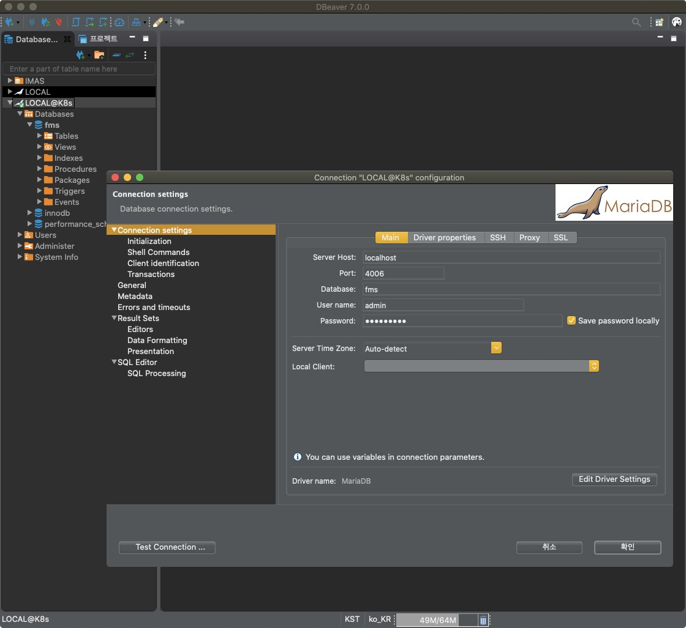

## 목차

1. [IAM 정책 연결](#IAM-정책-연결)
2. [테이블 생성](#테이블-생성)
3. [오브젝트 배포](#오브젝트-배포)

## IAM 정책 연결

IAM - 역할 - `<your-cluster-name>` 항목을 검색해서 `NodeInstanceRole` 단어를 포함하는 역할에 `ingressController-iam-policy` 정책을 연결하세요.


## 테이블 생성

RDS 데이터베이스에 테이블을 생성하기 위해 `kubectl port-forward` 명령어로 maxscale 파드를 선택해 포트 포워딩을 한 다음 로컬에서 작업합니다.

```shell{promptUser: user}{promptHost: localhost}
kubectl port-forward service/maxscale 4006:4006 --namespace=<your-namespace>
```


파드의 포트를 로컬 포트로 포워딩한 상태입니다. 데이터베이스 툴을 사용하여 직접 데이터베이스에 접속해 봅시다. (필자는 [`DBeaver`](https://dbeaver.io/download/) 툴을 사용하였습니다.)



데이터베이스 접속을 완료하였습니다. 이제 데이터베이스에 마이그레이션 및 다양한 작업을 수행할 수 있습니다.

## 오브젝트 배포

### Deployment

**Deployment**(디플로이먼트) 오브젝트는 파드와 레플리카셋에 대한 선언적 업데이트를 제공합니다. 자세한 정보는 쿠버네티스 공식 문서의 [디플로이먼트](https://kubernetes.io/ko/docs/concepts/workloads/controllers/deployment/) 내용을 참조하세요.

`containers` 필드에 컨테이너 이미지에 대한 정보를 입력합니다. 자세한 정보는 쿠버네티스 공식 문서의 [컨테이너 이미지](https://kubernetes.io/ko/docs/concepts/containers/#컨테이너-이미지) 내용을 참조하세요.

* `image`: 컨테이너가 항상 같은 버전의 이미지를 사용하도록 하기 위해 `<image>:<digest>` 형태의 **다이제스트** 정보를 명시하는 것이 좋습니다. 다이제스트는 특정 버전의 이미지를 고유하게 식별하며 다이제스트 값을 변경하지 않는 한 쿠버네티스에 의해 절대로 변경되지 않습니다.
* `imagePullPolicy`: 이미지 Pull(풀) 정책을 설정합니다.
    * `IfNotPresent`: 이미지가 로컬에 이미 존재하지 않으면 이미지 풀을 시도합니다.
    * `Always`: 파드가 시작될 때마다 이미지 풀을 시도합니다.

> 운영(Production) 환경에서 컨테이너를 생성할 때 `:latest` 태그의 사용은 실행 중인 이미지를 추적하거나 롤백할 때 어려움이 있어 추천하지 않습니다.

```yaml
apiVersion: apps/v1
kind: Deployment
metadata:
  name: collector
  namespace: <your-namespace>
  labels:
    app: collector
spec:
  replicas: 1
  selector:
    matchLabels:
      app: collector
  template:
    metadata:
      labels:
        app: collector
    spec:
      containers:
        - name: collector
          image: <id>/<project>:<digest-of-the-image>
          imagePullPolicy: <IfNotPresent|Always>
          resources:
            requests:
              cpu: 200m
              memory: 1Gi
            limits:
              cpu: 1000m
              memory: 1Gi
          env:
            - name: SPRING_PROFILES_ACTIVE
              value: "<local|development|production>"
            - name: FMS_KAFKA_BROKER_LIST
              value: "kafka:9092"
            - name: SPRING_DATASOURCE_JDBC_URL
              value: "jdbc:log4jdbc:mysql://mariadb:3306/<database-name>?autoReconnect=true&zeroDateTimeBehavior=convertToNull&useSSL=false&serverTimezone=Asia/Seoul"
            - name: NEW_RELIC_AGENT_ENABLED
              value: "false"
            - name: SPRING_DATASOURCE_USERNAME
              value: "<mariadb-username>"
            - name: SPRING_DATASOURCE_PASSWORD
              value: "<mariadb-password>"
            - name: SPRING_DATASOURCE_MAXIMUM_POOL_SIZE
              value: "30"
      imagePullSecrets:
        - name: dockerhub
```


### Ingress

**Ingress**(인그레스) 오브젝트는 서비스에 대한 로드 밸런서를 생성하고 웹 사이트에 대한 트래픽을 인스턴스 간에 분산할 수 있도록 합니다. 다음과 같이 오브젝트를 구성하고 배포하세요.

```yaml
apiVersion: extensions/v1beta1
kind: Ingress
metadata:
  name: <your-service-name>
  namespace: <your-namespace>
  annotations:
    kubernetes.io/ingress.class: alb
    alb.ingress.kubernetes.io/certificate-arn: arn:aws:acm:ap-northeast-2:050914238222:certificate/f47dc907-3e20-4eba-9a37-71c039a9c28f
    alb.ingress.kubernetes.io/listen-ports: '[{"HTTP":80},{"HTTPS":443}]'
    alb.ingress.kubernetes.io/scheme: internet-facing
    alb.ingress.kubernetes.io/subnets: <your-public-subnet-id-1>, <your-public-subnet-id-2>, <your-public-subnet-id-3>
    alb.ingress.kubernetes.io/security-groups: <your-public-security-group-id>, <your-cluster-shared-node-security-group-id>, <your-nodegroup-security-group-id>
    alb.ingress.kubernetes.io/tags: Env=Dev
    alb.ingress.kubernetes.io/healthcheck-path: /health
    alb.ingress.kubernetes.io/load-balancer-attributes: idle_timeout.timeout_seconds=600
spec:
  rules:
    - host: <your-service-server-host>
      http:
        paths:
          - path: /api/*
            backend:
              serviceName: api
              servicePort: 8080
          - path: /*
            backend:
              serviceName: web
              servicePort: 80
```

Route 53 - 호스팅 영역 - `<your-domain>` - 레코드 세트 생성 - `<your-service-server-host>` 이름의 레코드를 생성합니다. 별칭으로 이전 단계에서 생성한 로드 밸런서를 선택합니다.


### Service

네트워크 서비스로 노출이 필요한 클라이언트 프로젝트 파드는 Deployment 오브젝트 외에 추상적 개념인 **Service**(서비스) 오브젝트를 같이 구성해야 합니다.

```yaml
apiVersion: v1
kind: Service
metadata:
  name: api
  namespace: <your-namespace>
  labels:
    app: api
spec:
  ports:
    - port: 8080
      targetPort: 8080
      protocol: TCP
  selector:
    app: api
  type: NodePort
---
apiVersion: apps/v1
kind: Deployment
metadata:
  name: api
  namespace: <your-namespace>
  labels:
    app: api
spec:
  replicas: 2
  selector:
    matchLabels:
      app: api
  strategy:
    rollingUpdate:
      maxSurge: 2
      maxUnavailable: 0
  minReadySeconds: 30
  template:
    metadata:
      labels:
        app: api
    spec:
      containers:
        ...
      imagePullSecrets:
        - name: dockerhub
```

오브젝트를 배포한 다음 호스트와 로드 밸런서의 엔드포인트 주소의 연결 상태를 확인하세요. `ADDRESS` 필드에 값이 있으면 정상적으로 연결된 것입니다.

```shell{promptUser: user}{promptHost: localhost}
kubectl get ingresses --namespace=<your-namespace>
```


> 로드 밸런서 전파에는 다소 시간이 소요됩니다. 따라서 *- 필자는 5분 안에 값이 들어왔지만 몇 시간이 지나도 -* `ADDRESS` 필드에 엔드포인트 값이 없을 수 있습니다. 호스팅의 경우 쿠버네티스에서 관리하지 않는 AWS 서비스로 요청 시 바로 처리가 되지 않는 점에 유의하세요.
>
> (+) *- 필자의 경험에 의하면 -* `Unhealthy` 경고를 표시하더라도 `paths` 필드에 해당하는 오브젝트를 배포하면 주소를 찾으면서 엔드포인트 값이 들어오는 것으로 보입니다.

# 마치며

지금까지 2020년 모빌리티 스타트업에서 근무할 때 적용한 Amazon EKS 구성에 대한 핵심적인 내용을 공유하였습니다. Amazon EKS 서비스는 버전 업데이트가 활발하고 버전 간에 **BREAKING CHANGE**가 빈번하게 발생하는 편이기 때문에 최신 버전에서 위 내용에 맞춰 구성할 경우 실패할 수 있습니다. 꼭 다양한 레퍼런스를 참조해서 구성하세요.
