> 실습을 통해 GitHub 전용 [Drone(드론)](https://drone.io/) 서버를 Amazon EKS 서비스에 배포해 봅시다. 내용이 방대하여 사전 설치가 필요한 명령어 및 프로그램에 대한 설명이 생략될 수 있습니다. 🙏

**CI/CD**는 개발 단계를 자동화하여 애플리케이션을 보다 짧은 주기로 고객에게 제공하는 방법입니다. CI/CD는 새로운 코드 통합으로 인해 개발 및 운영팀에 발생하는 문제를 해결하여 최소한의 노력으로 코드를 배포하는 것을 목표로 합니다.

* `CI`: 자동화 프로세스의 지속적인 통합(Continuous Integration)
* `CD`: 지속적인 서비스 제공(Continuous Delivery) 또는 지속적인 배포(Continuous Deployment)

## 목차

1. [IAM 정책 연결](#IAM-정책-연결)
2. [GitHub OAuth 애플리케이션 등록](#GitHub-OAuth-애플리케이션-등록)
3. [퍼블릭 보안 그룹 생성](퍼블릭-보안-그룹-생성)
4. [Drone 템플릿 추출](Drone-템플릿-추출)
5. [오브젝트 배포](#오브젝트-배포)
   * [Namespace](#Namespace)
   * [Secret](#Secret)
   * [PersistentVolumeClaim](#PersistentVolumeClaim)
   * [ServiceAccount](#ServiceAccount)
   * [ClusterRole](#ClusterRole)
   * [Role](#Role)
   * [Deployment](#Deployment)
   * [Service](#Service)
   * [Ingress](#Ingress)
6. [GitHub Webhook 설정](#GitHub-Webhook-설정)

## IAM 정책 연결

IAM - 역할 - `<your-cluster-name>` 항목을 검색하여 `NodeInstanceRole` 단어를 포함하는 역할에 `ingressController-iam-policy` 정책을 연결해 주세요.

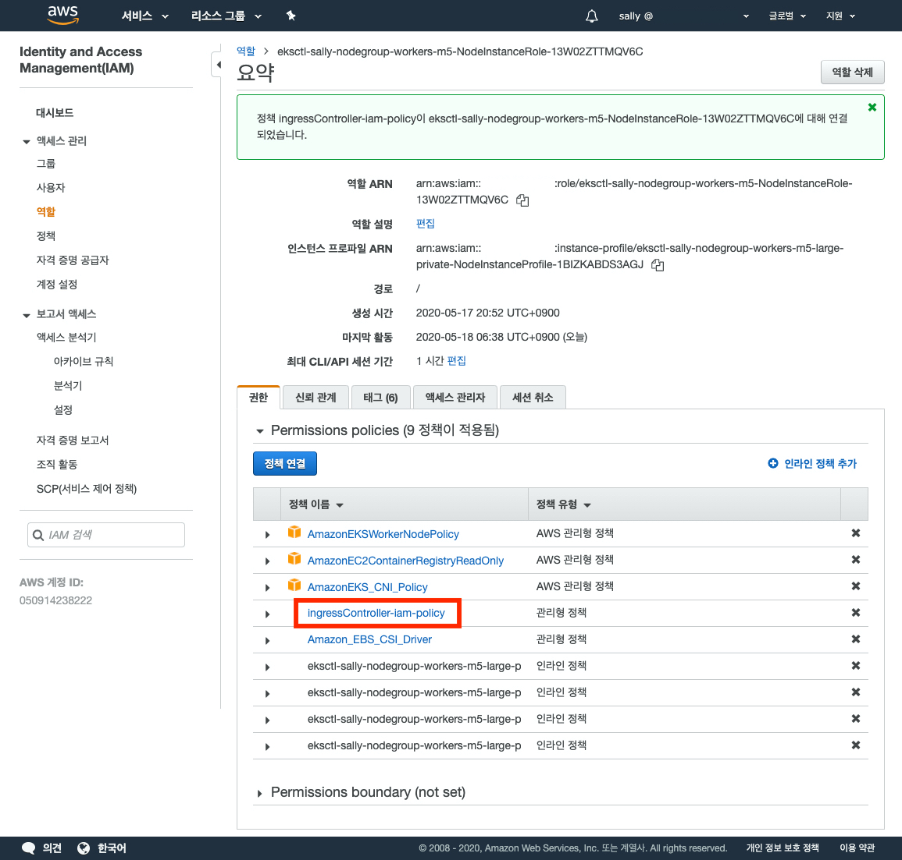

## GitHub OAuth 애플리케이션 등록

Drone 공식 문서의 [GitHub](https://docs.drone.io/server/provider/github/) 내용 중 **Step 1: Preparation - Create an OAuth Application** 항목을 참조해 주세요.

## 퍼블릭 보안 그룹 생성

로드 밸런서에 적용할 퍼블릭 보안 그룹을 생성합니다.

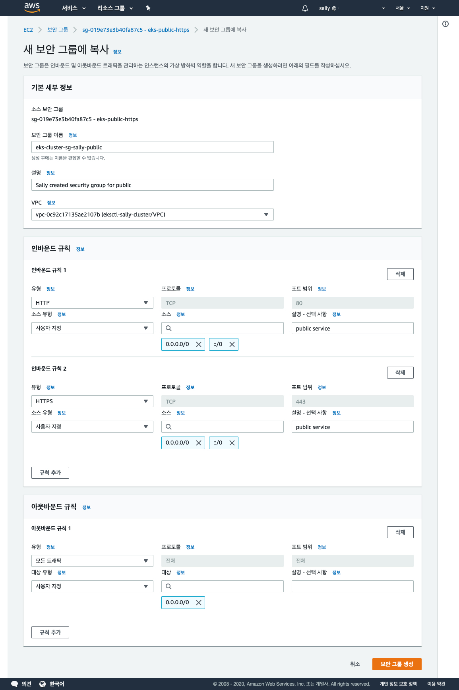

> 필자는 기존 퍼블릭 보안 그룹을 복사하여 생성하였습니다. 여러분은 새로운 보안 그룹을 생성할 때 위와 같이 설정해 주세요.

## Drone 템플릿 추출

필자는 **Helm**(헬름)에서 제공하는 차트를 사용하였습니다. 헬름 차트에 대한 자세한 정보는 헬름 공식 문서의 [Drone.io](https://github.com/helm/charts/tree/master/stable/drone) 내용을 참조해 주세요.

[values.yaml](https://github.com/helm/charts/blob/master/stable/drone/values.yaml) 템플릿을 복사한 후 다음 필드를 수정해 주세요.

```yaml
...
ingress:
  enabled: false
...
sourceControl:
  provider: github
  secret:
  github:
    clientID: <your-github-oauth-client-id>
    clientSecretKey: clientSecret
    clientSecretValue: <your-github-oauth-client-secret>
    server: https://github.com
...
```

헬름 차트를 설치합니다. (해당 서비스는 템플릿 추출 후 삭제할 것입니다.)

```shell{promptUser: user}{promptHost: localhost}
helm repo add stable https://kubernetes-charts.storage.googleapis.com
helm install drone -f values.yaml stable/drone
```

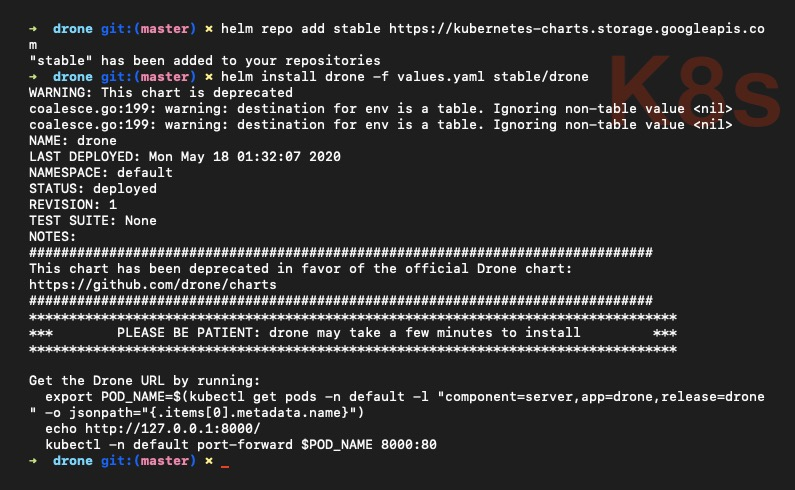

배포한 서비스를 확인합니다. 헬름은 네임스페이스를 지정하지 않으면 `default` 네임스페이스에 배포합니다.

```shell{promptUser: user}{promptHost: localhost}
helm list
```

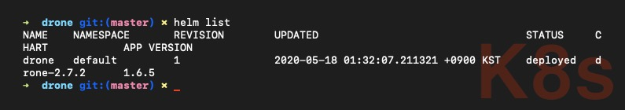

`default` 네임스페이스의 파드를 조회하면 `drone-drone-server-***` 형태의 파드가 실행 중인 것을 확인할 수 있습니다.

```shell{promptUser: user}{promptHost: localhost}
kubectl get pod --namespace=default
```

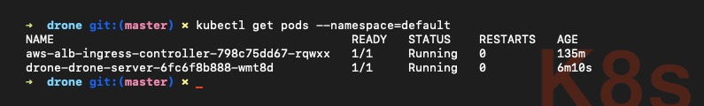

템플릿을 추출합니다.

```shell{promptUser: user}{promptHost: localhost}
helm template default stable/drone
```

내용을 전체 복사한 후 임시 `.yaml` 파일에 다음과 같이 정리합니다.

```yaml
<drone/templates/secrets.yaml> # DRONE_RPC_SECRET
---
<drone/templates/secrets.yaml> # DRONE_GITHUB_CLIENT_SECRET
---
<drone/templates/pvc.yaml>
---
<drone/templates/service-account-pipeline.yaml>
---
<drone/templates/service-account.yaml>
---
<drone/templates/role.yaml>
---
<drone/templates/role-pipeline.yaml>
---
<drone/templates/role-binding.yaml>
---
<drone/templates/role-binding-pipeline.yaml>
---
<drone/templates/service.yaml>
```

파드를 조회하여 `Annotations.checksum/secrets` 필드의 값을 복사한 후 별도로 보관합니다.

```shell{promptUser: user}{promptHost: localhost}
kubectl describe pod/<drone-server-pod>
```

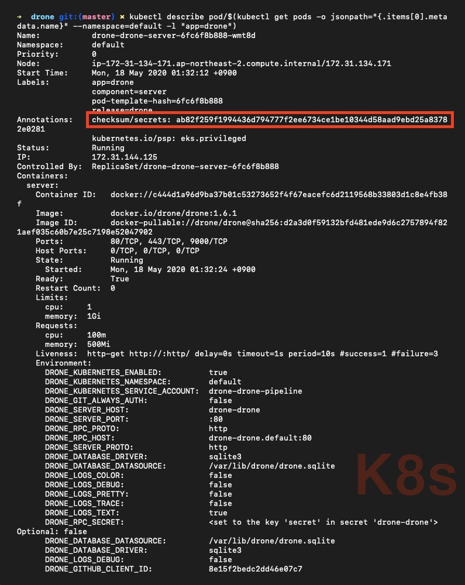

헬름 차트를 삭제합니다.

```shell{promptUser: user}{promptHost: localhost}
helm uninstall drone
release "drone" uninstalled
```

## 오브젝트 배포

### Namespace

쿠버네티스에 드론 서버를 설치하기 위해 가장 먼저 해야 할 일은 **네임스페이스**를 생성하는 것입니다. 다음 명령어를 입력합니다.

```shell{promptUser: user}{promptHost: localhost}
kubectl create namespace <insert-your-namespace-name>
kubectl get namespaces
```

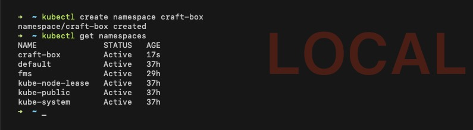

> 필자는 `craft-box` 네임스페이스를 생성하였습니다. 여러분이 원하는 네임스페이스를 생성해 주세요.

### Secret

**drone-rpc-secret.yaml**

이전 단계에서 추출한 `DRONE_RPC_SECRET` 값을 `base64` 형태로 변환합니다. 서버와 서버와의 RPC(Remote Procedure Call, 원격 프로시저 호출) 연결을 인증하는 데 사용합니다.

```shell{promptUser: user}{promptHost: localhost}
echo -n '<drone-rpc-secret>' | base64
```

* `-n`: 개행 문자 인코딩을 방지합니다. (자세한 정보는 `$ man echo` 내용을 참조해 주세요.)


변환한 정보를 `<secret>` 필드에 삽입합니다.

```yaml
apiVersion: v1
kind: Secret
metadata:
  name: drone
  namespace: craft-box
  labels:
    app: drone
    chart: "drone-2.3.1"
    heritage: "Helm"
type: Opaque
data:
  secret: "<base64-encoded-drone-rpc-secret>"
```

* `Opaque`: 키-값(key-value) 포맷의 시크릿 타입

**drone-github-client-secret.yaml**

이전 단계에서 추출한 `<github-oauth-client-secret>` 값을 `base64` 형태로 변환합니다.

```shell{promptUser: user}{promptHost: localhost}
echo -n '<your-github-oauth-client-secret>' | base64
```

변환한 정보를 `<clientSecret>` 필드에 삽입합니다.

```yaml
apiVersion: v1
kind: Secret
metadata:
  name: drone-source-control
  namespace: craft-box
  labels:
    app: drone
    chart: "drone-2.3.1"
    heritage: "Helm"
type: Opaque
data:
  clientSecret: "<base64-encoded-your-github-oauth-client-secret>"
```

**secrets.yaml**

```yaml
<drone-rpc-secret.yaml>
---
<drone-github-client-secret.yaml>
```

### PersistentVolumeClaim

**PersistentVolumeClaim** 오브젝트는 사용할 볼륨에 대한 설정을 정의해 **PersistentVolume**을 생성할 수 있도록 요청합니다.

**pvc.yaml**

```yaml
apiVersion: v1
kind: PersistentVolumeClaim
metadata:
  name: drone
  namespace: craft-box
spec:
  accessModes:
    - "ReadWriteOnce"
  resources:
    requests:
      storage: "1Gi"
```

### ServiceAccount

쿠버네티스 클러스터 API에 접근하기 위해 유효한 사용자인지 인증을 거쳐야 합니다. 다양한 인증 방법 중 **ServiceAccount** 오브젝트로 `drone`, `drone-pipeline` 사용자 계정을 만들어 적용해 봅시다.

**service-account.yaml**

```yaml
apiVersion: v1
kind: ServiceAccount
metadata:
  name: drone
  namespace: craft-box
  labels:
    app: drone
    chart: "drone-2.3.1"
    heritage: "Helm"
```

**service-account-pipeline.yaml**

```yaml
apiVersion: v1
kind: ServiceAccount
metadata:
  name: drone-pipeline
  namespace: craft-box
  labels:
    app: drone
    chart: "drone-2.3.1"
    heritage: "Helm"
```

### Role

**Role** 오브젝트는 특정 네임스페이스 내 API와 리소스에 대한 권한을 명시한 규칙들의 집합입니다. 인증을 완료한 사용자가 어떤 API에 접근이 가능한지, 어떤 리소스에 어떠한 작업들이 가능한지 등의 권한을 정의합니다.

**role.yaml**

```yaml
apiVersion: rbac.authorization.k8s.io/v1
kind: Role
metadata:
  name: drone
  namespace: craft-box
  labels:
    app: drone
    chart: "drone-2.3.1"
    heritage: "Helm"
rules:
  - apiGroups:
      - batch
    resources:
      - jobs
    verbs:
      - "*"
  - apiGroups:
      - extensions
    resources:
      - deployments
    verbs:
      - get
      - list
      - patch
      - update
```

**role-binding.yaml**

**RoleBinding** 오브젝트는 *- ServiceAccount 오브젝트에서 정의한 -* `drone` 사용자와 Role 권한을 연결합니다. 즉, 사용자에게 권한을 부여하지만 그 권한에 대한 정보는 Role이 지정합니다.

```yaml
apiVersion: rbac.authorization.k8s.io/v1
kind: RoleBinding
metadata:
  name: drone
  namespace: craft-box
  labels:
    app: drone
    chart: "drone-2.3.1"
    heritage: "Helm"
roleRef:
  apiGroup: rbac.authorization.k8s.io
  kind: Role
  name: drone
subjects:
  - kind: ServiceAccount
    name: drone
    namespace: craft-box
```

### ClusterRole

**ClusterRole** 오브젝트는 특정 네임스페이스에 대한 권한이 아닌 클러스터 전체에 대한 권한을 관리합니다. 네임스페이스에 한정되지 않은 API와 리소스에 대한 권한도 지정할 수 있습니다.

**role-pipeline.yaml**

```yaml
apiVersion: rbac.authorization.k8s.io/v1
kind: ClusterRole
metadata:
  name: drone-pipeline
  namespace: craft-box
  labels:
    app: drone
    chart: "drone-2.3.1"
    heritage: "Helm"
rules:
  - apiGroups:
      - extensions
    resources:
      - deployments
    verbs:
      - get
      - list
      - watch
      - patch
      - update
  - apiGroups:
      - ""
    resources:
      - namespaces
      - configmaps
      - secrets
      - pods
      - services
    verbs:
      - create
      - delete
      - get
      - list
      - watch
  - apiGroups:
      - ""
    resources:
      - pods/log
    verbs:
      - get
```

**role-binding-pipeline.yaml**

**ClusterRoleBinding** 오브젝트는 *- ServiceAccount 오브젝트에서 정의한 -* `drone-pipeline` 사용자와 ClusterRole 권한을 연결합니다.

```yaml
apiVersion: rbac.authorization.k8s.io/v1
kind: ClusterRoleBinding
metadata:
  name: drone-pipeline
  namespace: craft-box
  labels:
    app: drone
    chart: "drone-2.3.1"
    heritage: "Helm"
subjects:
  - kind: ServiceAccount
    name: drone-pipeline
    namespace: craft-box
roleRef:
  kind: ClusterRole
  name: drone-pipeline
  apiGroup: rbac.authorization.k8s.io
```

### Service

**Service** 오브젝트는 고유한 DNS 이름을 부여합니다. 서비스 등록 후 쿠버네티스 안에서 별칭 형태로 서비스에 적용할 수 있습니다.

**service.yaml**

```yaml
apiVersion: v1
kind: Service
metadata:
  name: drone
  namespace: craft-box
  labels:
    app: drone
    chart: "drone-2.3.1"
    heritage: "Helm"
spec:
  type: NodePort
  ports:
    - name: http
      port: 80
      targetPort: 80
  selector:
    app: drone
    component: server
```

### Deployment

**deployment-server.yaml**

```yaml
apiVersion: apps/v1
kind: Deployment
metadata:
  name: drone-server
  namespace: craft-box
  labels:
    app: drone
    chart: "drone-2.3.1"
    heritage: "Helm"
    component: server
spec:
  selector:
    matchLabels:
      app: drone
      component: server
  replicas: 1
  template:
    metadata:
      annotations:
        checksum/secrets: <paste-your-checksum/secrets-string>
      labels:
        app: drone
        component: server
    spec:
      serviceAccountName: drone
      containers:
        - name: server
          image: "docker.io/drone/drone:1.6.1"
          imagePullPolicy: IfNotPresent
          env:
            - name: DRONE_KUBERNETES_ENABLED
              value: "true"
            - name: DRONE_KUBERNETES_NAMESPACE
              value: craft-box
            - name: DRONE_KUBERNETES_SERVICE_ACCOUNT
              value: drone-pipeline
            - name: DRONE_GIT_ALWAYS_AUTH
              value: "true"
            - name: DRONE_SERVER_HOST
              value: "<your-drone-server-host>"
            - name: DRONE_RPC_PROTO
              value: "http"
            - name: DRONE_RPC_HOST
              value: drone.craft-box:80
            - name: DRONE_SERVER_PROTO
              value: "https"
            - name: DRONE_RPC_SECRET
              valueFrom:
                secretKeyRef:
                  name: drone
                  key: secret
            - name: DRONE_DATABASE_DATASOURCE
              value: "/var/lib/drone/drone.sqlite"
            - name: DRONE_DATABASE_DRIVER
              value: "sqlite3"
            - name: DRONE_CPU_SHARES
              value: "2"
            - name: DRONE_CPU_SET
              value: "1,2"
            - name: DRONE_MEMORY_LIMIT
              value: "2147483648"
            - name: DRONE_RUNNER_CAPACITY
              value: "2"
            - name: DRONE_LOGS_DEBUG
              value: "false"
            - name: DRONE_USER_CREATE
              value: "username:<your-github-username>,admin:true"
            - name: DRONE_GITHUB_CLIENT_ID
              value: <your-github-oauth-client-id>
            - name: DRONE_GITHUB_SERVER
              value: https://github.com
            - name: DRONE_GITHUB_CLIENT_SECRET
              valueFrom:
                secretKeyRef:
                  name: drone-source-control
                  key: clientSecret
          ports:
            - name: http
              containerPort: 80
              protocol: TCP
            - name: https
              containerPort: 443
              protocol: TCP
            - name: grpc
              containerPort: 9000
              protocol: TCP
          livenessProbe:
            httpGet:
              path: /
              port: http
          resources:
            limits:
              cpu: "200m"
              memory: "300Mi"
            requests:
              cpu: "30m"
              memory: "100Mi"
          volumeMounts:
            - name: data
              mountPath: /var/lib/drone
      volumes:
        - name: data
          persistentVolumeClaim:
            claimName: drone
```

**drone.yaml**

```yaml
<secrets.yaml>
---
<pvc.yaml>
---
<service-account.yaml>
---
<service-account-pipeline.yaml>
---
<role.yaml>
---
<role-binding.yaml>
---
<role-pipeline.yaml>
---
<role-binding-pipeline.yaml>
---
<service.yaml>
---
<deployment-server.yaml>
```

```shell{promptUser: user}{promptHost: localhost}
kubectl apply -f drone.yaml
```

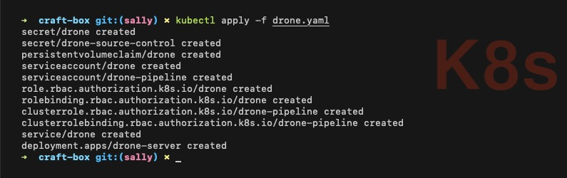

### Ingress

**Ingress** 오브젝트를 배포하면 로드 밸런서를 생성합니다.

**ingress-drone-external.yaml**

```yaml
apiVersion: extensions/v1beta1
kind: Ingress
metadata:
  name: drone-external
  namespace: craft-box
  annotations:
    kubernetes.io/ingress.class: alb
    alb.ingress.kubernetes.io/certificate-arn: <your-aws-certificate-manager-arn>
    alb.ingress.kubernetes.io/listen-ports: '[{"HTTPS":443}]'
    alb.ingress.kubernetes.io/scheme: internet-facing
    alb.ingress.kubernetes.io/subnets: <your-public-subnet-id-1>, <your-public-subnet-id-2>, <your-public-subnet-id-3>
    alb.ingress.kubernetes.io/security-groups: <your-public-security-group-id>, <your-cluster-shared-node-security-group-id>, <your-nodegroup-security-group-id>
    alb.ingress.kubernetes.io/tags: Env=Dev,Group=CraftBox
    alb.ingress.kubernetes.io/healthcheck-path: /health
spec:
  rules:
    - host: <your-drone-server-host>
      http:
        paths:
          - path: /*
            backend:
              serviceName: drone
              servicePort: 80
```

```shell{promptUser: user}{promptHost: localhost}
kubectl apply -f ingress-drone-external.yaml
```

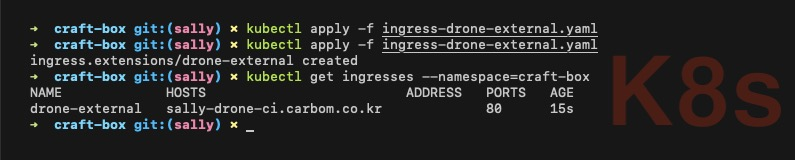

> 지금은 `ADDRESS` 필드에 엔드포인트 주소에 해당하는 값이 없기 때문에 설정한 호스트로 접속이 불가합니다.

Route 53 - 호스팅 영역 - `<your-domain>` - 레코드 세트 생성 - `<your-drone-server-host>` 이름의 레코드를 생성합니다. 별칭으로 이전 단계에서 생성한 로드 밸런서를 선택합니다.

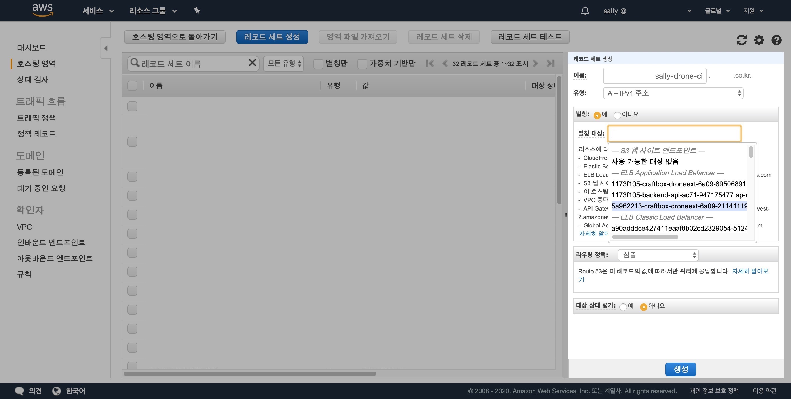

레코드 생성 후 호스트와 로드 밸런서의 엔드포인트 주소의 연결 상태를 확인합니다.

```shell{promptUser: user}{promptHost: localhost}
kubectl get ingresses --namespace=<your-namespace>
```

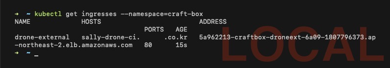

> 로드 밸런서 전파에는 다소 시간이 소요됩니다. 따라서 *- 몇 시간이 지나도 -* `ADDRESS` 필드에 값이 없을 수 있습니다. 호스팅의 경우 쿠버네티스에서 관리하지 않는 AWS 서비스로 요청 시 바로 처리가 되지 않는 점에 유의해 주세요.
>
> (+) *- 필자의 경험에 의하면 -* `Unhealthy` 경고를 표시하더라도 `paths` 필드에 해당하는 오브젝트를 배포하면 주소를 찾으면서 엔드포인트 값이 들어오는 것으로 보입니다.

브라우저에서 [`<your-drone-server-host>`]() 접속 후 다음과 같은 화면이 보인다면 드론 서버가 잘 구동된 것입니다.

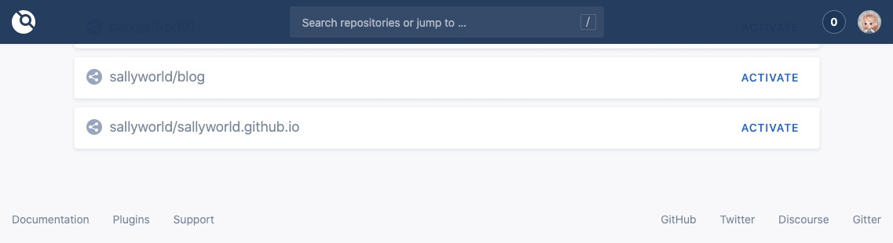

### [ERROR] Login Failed. Bad credentials

[`<your-drone-server-host>`/login/error?message=Bad%20credentials]() 주소로 이동하면서 다음과 같은 문구를 화면에 표시하면 `DRONE_GITHUB_CLIENT_SECRET` 값을 검토할 필요가 있습니다.

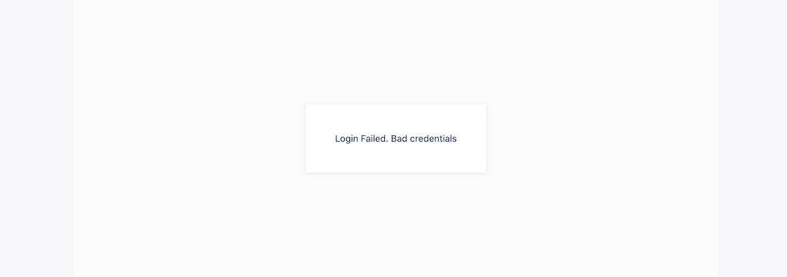

다음 명령어를 입력하여 `drone-server` 내부로 접속합니다.

```shell{promptUser: user}{promptHost: localhost}
kubectl exec -it <drone-server-pod> --namespace=<your-namespace> sh
```

다음 명령어를 입력하면 *- 다소 복잡하긴 하지만 -* 파드를 조회하는 과정을 생략할 수 있습니다.

```shell{promptUser: user}{promptHost: localhost}
kubectl exec -it $(kubectl get pods -o jsonpath="{.items[0].metadata.name}" --namespace=<your-namespace> -l "component=server,app=drone") --namespace=<your-namespace> sh
```

`export` 명령어로 환경 변수 `DRONE_GITHUB_CLIENT_SECRET` 값을 확인해 주세요. 혹시 개행 문자가 포함되어 줄 바꿈 처리가 된 것은 아닌지 확인해 주세요.

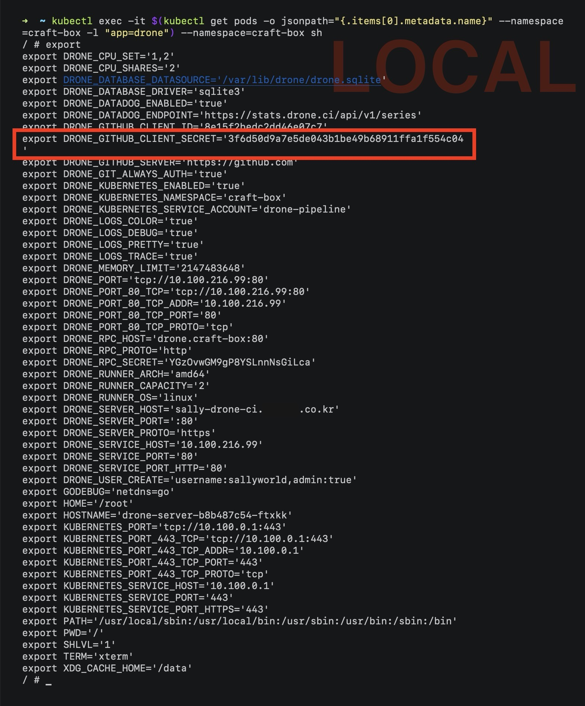

값은 일치하지만 줄 바꿈 처리가 된 경우 `<github-oauth-client-secret>` 값을 `base64` 형태로 변환하면서 개행 문자가 포함된 것으로 자격 증명 시 오류가 발생합니다. `echo` 명령어로 인코딩 시 `-n` 옵션을 꼭 사용해 주세요.

## GitHub Webhook 설정

GitHub **Webhook**(웹훅)은 구독한 이벤트에 대한 작업 수행 시 해당 정보를 HTTP POST 방식으로 전달합니다. Drone CI에서 저장소를 활성화한 후 웹훅을 설정해 봅시다.

> Drone CI는 웹훅 설정 시 저장소별 Secret 키를 생성합니다. 여러분이 GitHub에서 웹훅을 직접 등록하는 것은 *- Secret 키를 생성할 수 없기 때문에 -* 불가합니다.

Drone CI(`<your-drone-server-host>`) - Repositories - `<your-github-repository>` - **ACTIVE** 버튼을 클릭합니다.

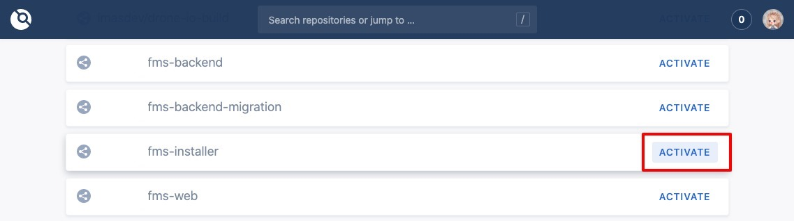

**ACTIVATE REPOSITORY** 버튼을 클릭해 저장소를 활성화합니다.

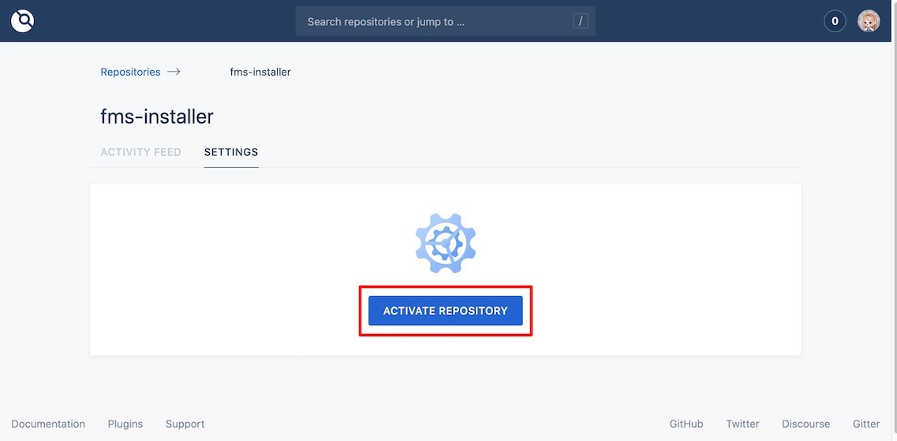

설정을 진행합니다.

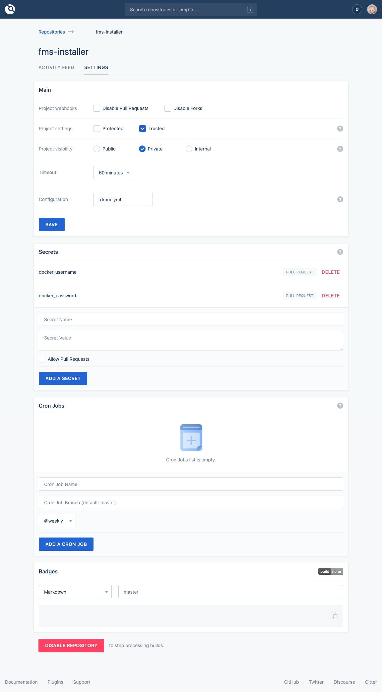

* **Main**
  * Project settings: 저장소 보호 여부를 설정합니다.

    |구분|설명|
    |---|---|
    |Protected|인증을 완료한 사용자만 Drone CLI를 통해 수정 가능합니다.|
    |Trusted|저장소에 접근할 수 있는 사용자는 누구나 수정 가능합니다. 이 경우 브랜치 내부에 `.drone.yaml` 파일이 위치합니다.|

  * Project visibility: 저장소 유형을 설정합니다.
  * Timeout: Docker 배포 제한 시간을 설정합니다. 해당 시간까지 지연될 경우 배포를 취소하고 실패 처리합니다.
  * Configuration: 드론 설정 파일의 이름을 지정합니다. (`.drone.yaml`)
* **Secrets**: 중요한 정보를 `.drone.yaml` 파일에 일반 텍스트로 저장하지 않고 Drone CI에서 별도로 관리할 수 있도록 합니다.

GitHub - `<your-github-repository>` - Settings - Webhooks 화면에서 웹훅의 상세 정보를 확인할 수 있습니다.

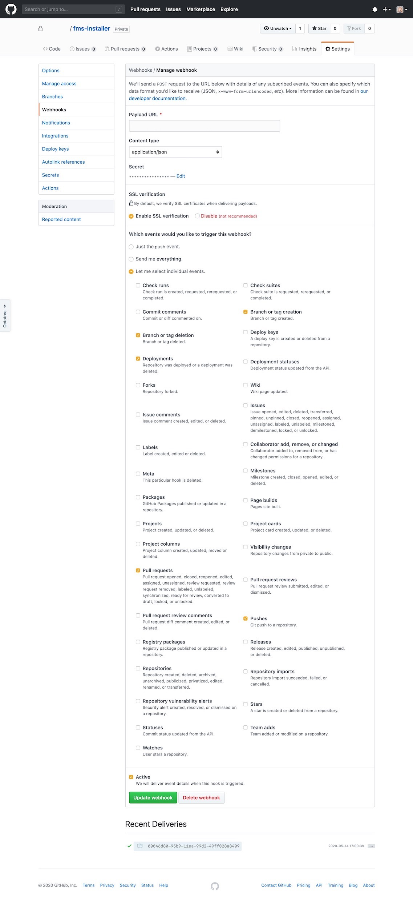

**Dockerfile**

자세한 정보는 [Docker 공식 문서 > Dockerfile](https://docs.docker.com/engine/reference/builder/) 내용을 참조합니다.

**.drone.yaml** (예시)

자세한 정보는 Drone 공식 문서의 [Pipelines > Kubernetes](https://docs.drone.io/pipeline/kubernetes/overview/) 내용을 참조합니다.

```yaml
kind: pipeline
type: kubernetes
name: <your-service-name>

steps:
  - name: build
    image: node:10.10.0
    commands:
      - npm install
  - name: docker
    image: plugins/docker:18.09
    settings:
      username:
        from_secret: docker_username
      password:
        from_secret: docker_password
      repo: <your-docker-repository>
      tags:
        - ${DRONE_COMMIT}
        - ${DRONE_REPO_BRANCH}-latest
    when:
      status:
        - success
  - name: notify
    image: plugins/slack
    settings:
      webhook: <your-slack-webhook-link>
      channel: <your-slack-webhook-channel>
    template: >
        {{#success build.status}}
          [{{repo.name}}] {{build.commit}} by {{build.ref}} is succeeded. ({{since build.started}}/{{since build.created}}) {{build.link}} :white_check_mark:
        {{else}}
          [{{repo.name}}] {{build.commit}} by {{build.ref}} is failed. ({{since build.started}}/{{since build.created}}) {{build.link}} :cry:
        {{/success}}
    when:
      status: [success, failure]
trigger:
  event:
    - push
  branch:
    - master
    - develop
```

> 프로젝트 성향에 맞게 작성해 주세요. 팀에서 **Slack**(슬랙) 메신저를 사용 중인 경우 별도의 웹훅 설정을 통해 특정 슬랙 채널에 메시지를 보낼 수 있습니다.

작성한 파일을 프로젝트 최상단에 넣습니다.

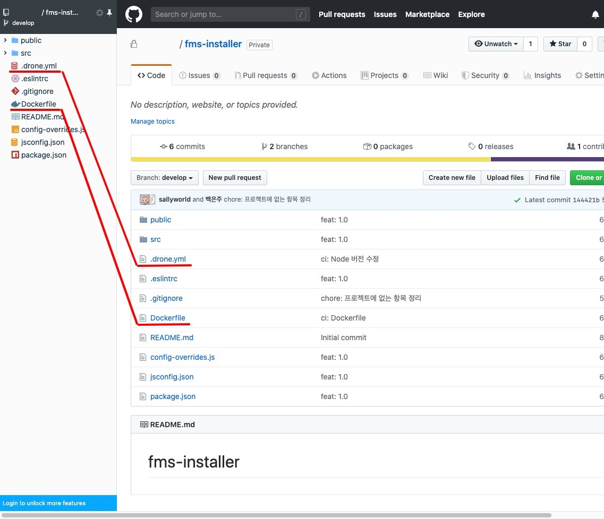

파일을 넣는 과정에서 푸시 이벤트가 발생하여 웹훅을 통해 Drone CI에서 작업을 수행한 것을 알 수 있습니다.

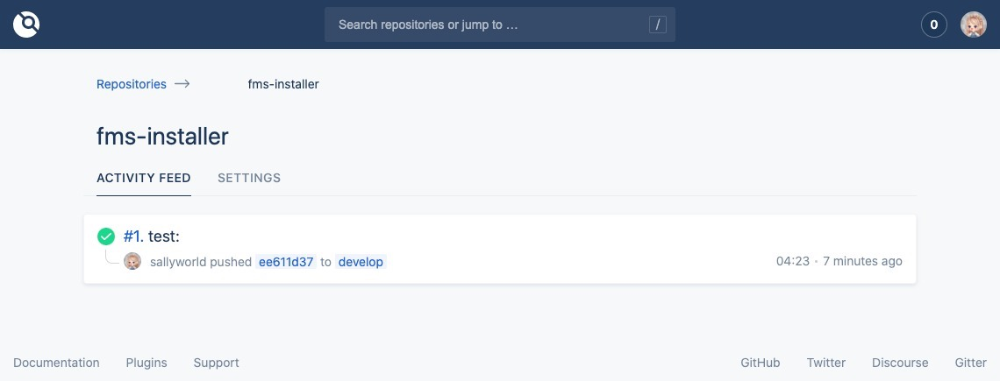

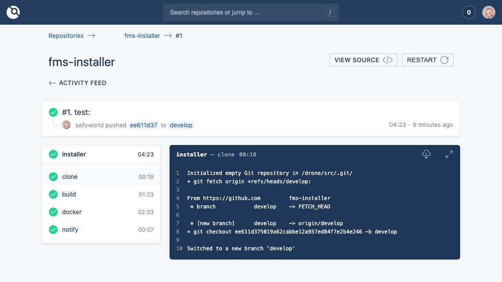

Docker Hub - repositories - `<your-docker-ropository>` 화면에서 이미지를 확인할 수 있습니다.

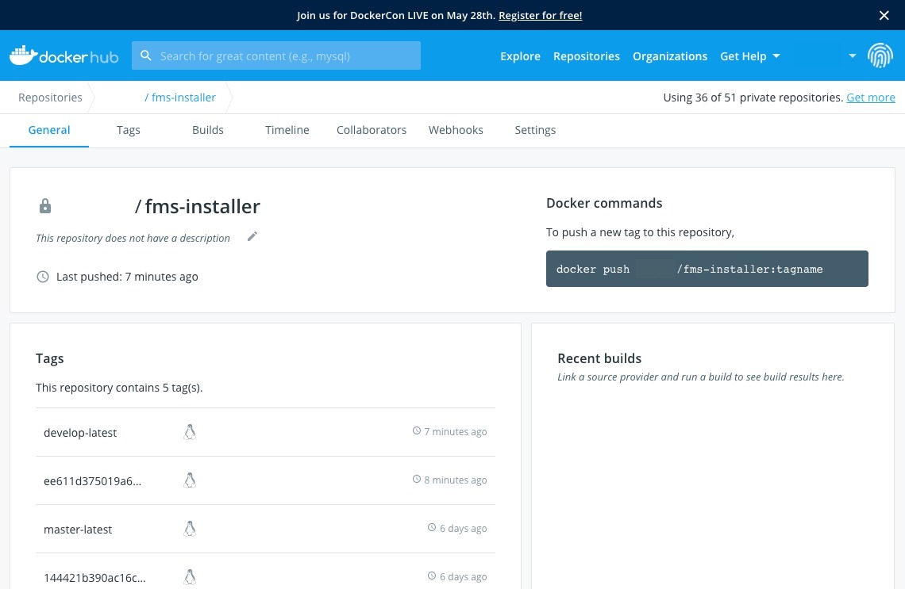

지금까지 GitHub 전용 드론 서버 배포를 마쳤습니다. 본 문서는 파드에서 도커 이미지를 적용하는 절차는 다루지 않습니다.
