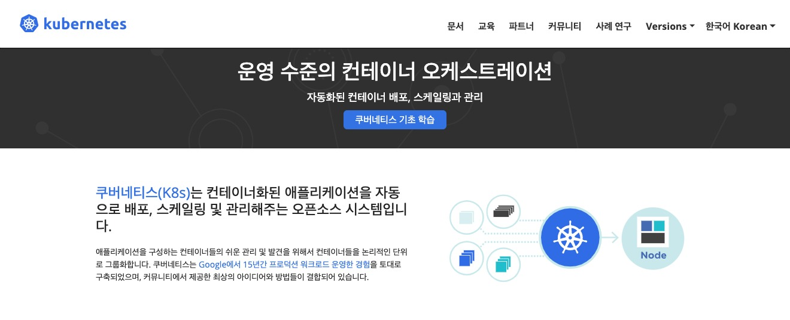

# 시작하기

> 노마드 코더의 [쿠버네티스가 대세가 된 이유 3가지](https://youtu.be/S3FVcdZcZnA) 영상의 내용을 재구성한 글입니다. 자세한 정보는 [쿠버네티스 공식 문서](https://kubernetes.io/ko/docs/concepts/overview/what-is-kubernetes/) 내용을 참조해 주세요.

**Kubernetes**(쿠버네티스)는 구글이 만든 컨테이너화된 애플리케이션을 자동으로 배포, 스케일링 및 관리하는 **오픈 소스 컨테이너 관리 플랫폼**입니다. 줄여서 K8s(케이츠, 케이에이츠) 또는 Kube(큐브)로 부릅니다. 구글이 설립한 [CNCF](https://www.cncf.io/)<small>(Cloud Native Computing Foundation, 클라우드 네이티브 컴퓨팅 재단)</small>의 졸업 단계 프로젝트에 속한다고 하네요.

시작하기 전 **Docker**(도커)와 **Container**(컨테이너)에 대한 사전 학습이 필요합니다. 도커와 컨테이너를 잘 모른다면 [여기](/docker/introduction)부터 시작해 주세요.

**운영 수준의 컨테이너 오케스트레이션** 제목부터 진입 장벽이 느껴지는 건 기분 탓이겠죠? 마치 쿠버네티스가 입구에서부터 '이 정의를 이해하는 분만 들어오세요.' 경고하는 것처럼 보입니다. 하지만 당황하지 마세요! 쿠버네티스는 결국 **컨테이너를 관리하기 위한 툴**입니다. 다음 몇 가지 **예시**를 살펴보면 이해할 수 있습니다.

### 예시 1

> 만약 당신이 개발한 웹 사이트를 도커 컨테이너 안에 넣고 AWS(아마존 웹 서비스)에 배포하는 작업만 수행한다면 쿠버네티스를 알아야 할 이유가 없습니다. 도커를 업로드하고 배포하는 일이 전부이기 때문입니다.

쿠버네티스는 여러 개의 컨테이너를 다룰 때 쓰입니다. **MSA*** 서비스를 개발한다고 가정해 봅시다. 어떤 컨테이너는 이용자 등록만 다루고, 어떤 컨테이너는 인증만 다루고, 어떤 컨테이너는 결제만 다룬다면 이 모든 컨테이너들은 동시에 업로드가 이루어져야 합니다.

* MSA(Microservices Architecture, 마이크로서비스 아키텍처): 하나의 큰 애플리케이션을 여러 개의 작은 애플리케이션으로 쪼개어 변경과 조합이 가능하도록 만든 소프트웨어 개발 기법

수동으로 배포하면 된다고 생각하겠지만 컨테이너 수가 많아지면 문제가 발생할 수 있습니다. 만약 서비스의 핵심 파트인 컨테이너가 죽었다면? 우리는 재빠르게 해당 컨테이너를 재시작해야 합니다.

바로 이때 쿠버네티스가 등장합니다! 쿠버네티스에게 해당 컨테이너를 작동할 수 있도록 권한을 부여해 주세요. 쿠버네티스는 그 중 하나라도 죽으면 낼름 재시작합니다. -> **자동화된 복구**

쿠버네티스는 실패한 컨테이너를 재시작하고, 컨테이너를 교체하며, '사용자 정의 상태 검사'에 응답하지 않는 컨테이너를 죽이고, 서비스 준비가 끝날 때까지 그러한 과정을 클라이언트에 보여주지 않습니다.

바로 **컨테이너 모니터링**을 실시하는 것입니다. 자동으로 재시작하기 때문에 걱정을 한시름 놓을 수 있습니다. 컨테이너가 많으면 많을수록 쿠버네티스는 더 유용하게 쓰일 것입니다.

### 예시 2

1만 명의 이용자가 접속을 시도합니다. 하지만 당신은 이러한 경우에 대한 대비를 하지 않았습니다. 이때 쿠버네티스는 해당 웹 사이트의 니즈를 수용할 수 있도록 자동으로 새로운 컨테이너를 만들 수 있습니다. -> **서비스 디스커버리와 로드 밸런싱**

쿠버네티스는 DNS 이름을 사용하거나 자체 IP 주소를 사용하여 컨테이너를 노출합니다. 컨테이너에 대한 트래픽이 많아지면 쿠버네티스는 네트워크 트래픽을 로드밸런싱하여 배포가 안정적으로 이루어질 수 있도록 합니다.

쿠버네티스는 자동으로 해당 웹 니즈에 맞춰서 컨테이너들을 준비하고 사람들이 떠나고 니즈가 줄어들면 컨테이너를 지정한 최소 숫자로 자동 조정합니다.

### 예시 3

클라우드에 5개의 컨테이너가 있습니다. 코드를 수정하여 새로운 버전이 나왔습니다. 이때 당신은 어떻게 작업하나요? *- 아마도 -*  컨테이너들을 종료하고 새로운 버전을 올리고 컨테이너들을 재시작할 것입니다. 작업을 실행하는 동안 웹 사이트가 잠시 다운된다는 의미이기도 합니다.

쿠버네티스는 컨테이너의 신규 버전을 차례대로 업데이트 처리합니다. 쿠버네티스를 자동화해서 배포용 새 컨테이너를 만들고, 기존 컨테이너를 제거하고, 모든 리소스를 새 컨테이너에 적용합니다. 물론 그러한 과정을 클라이언트에 보여주지 않습니다. -> **자동화된 롤아웃**

## 정리

컨테이너로 작업하면 자동화해야 할 것들이 은근히 많습니다. (새로운 버전을 배포한다거나, 컨테이너 사이즈를 조정한다거나, 컨테이너가 죽었을 때 재시작해야 한다거나 등) 쿠버네티스는 많은 컨테이너가 필요한 웹/앱 서비스를 운영하는 데 있어 훌륭한 솔루션입니다.
