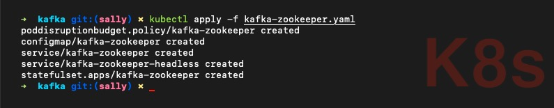
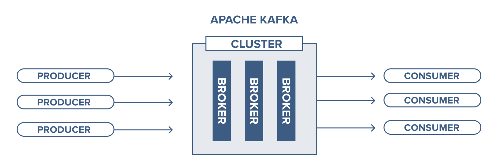
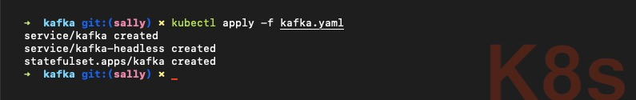
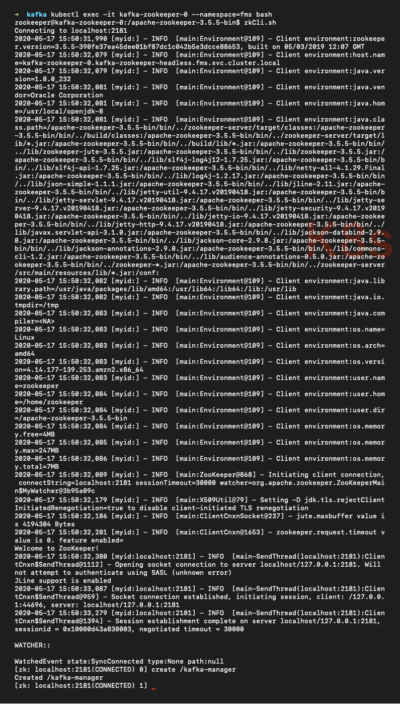
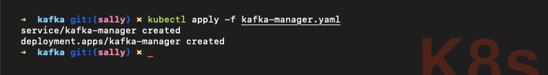
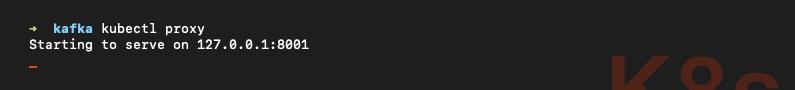
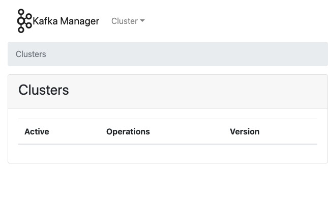
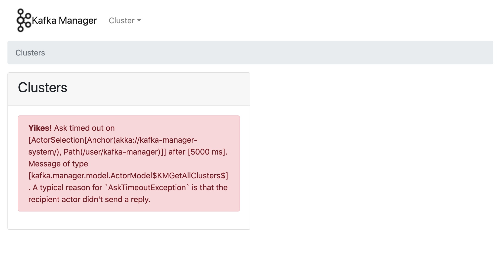
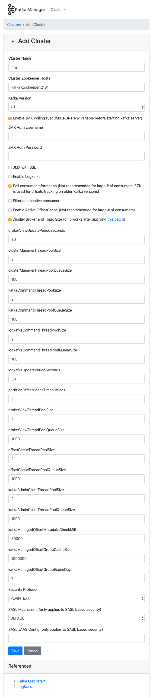

> 대규모 메시지 플랫폼 Apache Kafka(카프카)를 Amazon EKS 서비스에 배포해 봅시다. 본 문서는 카프카에 대한 기본적인 내용은 다루지 않습니다. 🙏

## 목차

1. [ZooKeeper](#ZooKeeper)
2. [Kafka](#Kafka)
3. [Kafka Manager](#Kafka-Manager)
4. [Topic](#Topic)

## ZooKeeper

Apache **ZooKeeper**(주키퍼)는 분산 애플리케이션을 위한 분산 오픈 소스 코디네이션 서비스입니다. 분산 시스템을 다루기 위해 사용하는 중요한 서비스 중 하나로 분산 시스템이 안전하게 작동할 수 있는 API를 제공합니다.

> 주키퍼를 개발할 때 아파치 개발자들은 마치 자신들이 동물원에 사는 것처럼 보인다고 말했습니다. 당시 Apache Pig(피그)를 비롯하여 동물의 이름을 프로젝트에 사용하고 있었기 때문입니다. 이 발언에 착안하여 분산 시스템(Kafka)은 다양한 동물들이 살고 있는 동물원으로, 동물원을 제대로 운영하려면 이를 통제하는 사육사(ZooKeeper)가 필요하다는 생각을 하게 되었습니다.

주키퍼는 메타 정보를 저장합니다. *- 실제 메시지는 카프카가 저장합니다. -* 현재 카프카 서버가 몇 대 작동 중인지, 카프카 컨슈머가 어디까지 메시지를 읽었는지 등의 스냅샷 정보를 저장합니다.

필자는 **Helm**(헬름)에서 제공하는 차트를 사용하였습니다. 헬름 차트에 대한 자세한 정보는 헬름 공식 문서의 [zookeeper](https://github.com/helm/charts/tree/master/incubator/zookeeper) 내용을 참조하세요.

> 헬름은 카프카를 설치할 때 주키퍼를 자동으로 설치하면서 이름을 `zookeeper`가 아닌 `kafka-zookeeper`로 정의합니다. 필자는 헬름 차트를 인용하기 때문에 헬름에서 정의한 이름을 그대로 사용하였습니다.

### PodDisruptionBudget

`PodDisruptionBudget`(파드 디스럽션 버짓) 오브젝트는 파드의 재시작 등에 의한 자발적 중단으로 일시에 중지되는 *- 복제된 -* 주키퍼 파드의 수를 제한합니다.

**poddisruptionbudget.yaml**

```yaml
apiVersion: policy/v1beta1
kind: PodDisruptionBudget
metadata:
  name: kafka-zookeeper
  namespace: <your-namespace>
  labels:
    app: zookeeper
    chart: zookeeper-2.1.0
    release: kafka
    heritage: Helm
    component: server
spec:
  selector:
    matchLabels:
      app: zookeeper
      release: kafka
      component: server
  maxUnavailable: 1
```

* `selector`: 적용할 파드의 매칭 정보
* `maxUnavailable`: 비정상 상태를 허용하는 파드의 수

### ConfigMap

`ConfigMap`(컨피그맵) 오브젝트는 주키퍼 실행에 필요한 설정 정보를 미리 정의해 쿠버네티스에 저장소 형태로 저장합니다.

**config-script.yaml**

```yaml
apiVersion: v1
kind: ConfigMap
metadata:
  name: kafka-zookeeper
  namespace: <your-namespace>
  labels:
    app: zookeeper
    chart: zookeeper-2.1.0
    release: kafka
    heritage: Helm
    component: server
data:
  ok: |
    #!/bin/sh
    echo ruok | nc 127.0.0.1 ${1:-2181}

  ready: |
    #!/bin/sh
    echo ruok | nc 127.0.0.1 ${1:-2181}

  run: |
    #!/bin/bash

    set -a
    ROOT=$(echo /apache-zookeeper-*)

    ZK_USER=${ZK_USER:-"zookeeper"}
    ZK_LOG_LEVEL=${ZK_LOG_LEVEL:-"INFO"}
    ZK_DATA_DIR=${ZK_DATA_DIR:-"/data"}
    ZK_DATA_LOG_DIR=${ZK_DATA_LOG_DIR:-"/data/log"}
    ZK_CONF_DIR=${ZK_CONF_DIR:-"/conf"}
    ZK_CLIENT_PORT=${ZK_CLIENT_PORT:-2181}
    ZK_SERVER_PORT=${ZK_SERVER_PORT:-2888}
    ZK_ELECTION_PORT=${ZK_ELECTION_PORT:-3888}
    ZK_TICK_TIME=${ZK_TICK_TIME:-2000}
    ZK_INIT_LIMIT=${ZK_INIT_LIMIT:-10}
    ZK_SYNC_LIMIT=${ZK_SYNC_LIMIT:-5}
    ZK_HEAP_SIZE=${ZK_HEAP_SIZE:-2G}
    ZK_MAX_CLIENT_CNXNS=${ZK_MAX_CLIENT_CNXNS:-60}
    ZK_MIN_SESSION_TIMEOUT=${ZK_MIN_SESSION_TIMEOUT:- $((ZK_TICK_TIME*2))}
    ZK_MAX_SESSION_TIMEOUT=${ZK_MAX_SESSION_TIMEOUT:- $((ZK_TICK_TIME*20))}
    ZK_SNAP_RETAIN_COUNT=${ZK_SNAP_RETAIN_COUNT:-3}
    ZK_PURGE_INTERVAL=${ZK_PURGE_INTERVAL:-0}
    ID_FILE="$ZK_DATA_DIR/myid"
    ZK_CONFIG_FILE="$ZK_CONF_DIR/zoo.cfg"
    LOG4J_PROPERTIES="$ZK_CONF_DIR/log4j.properties"
    HOST=$(hostname)
    DOMAIN=`hostname -d`
    ZOOCFG=zoo.cfg
    ZOOCFGDIR=$ZK_CONF_DIR
    JVMFLAGS="-Xmx$ZK_HEAP_SIZE -Xms$ZK_HEAP_SIZE"

    APPJAR=$(echo $ROOT/*jar)
    CLASSPATH="${ROOT}/lib/*:${APPJAR}:${ZK_CONF_DIR}:"

    if [[ $HOST =~ (.*)-([0-9]+)]]; then
        NAME=${BASH_REMATCH[1]}
        ORD=${BASH_REMATCH[2]}
        MY_ID=$((ORD+1))
    else
        echo "Failed to extract ordinal from hostname $HOST"
        exit 1
    fi

    mkdir -p $ZK_DATA_DIR
    mkdir -p $ZK_DATA_LOG_DIR
    echo $MY_ID >> $ID_FILE

    echo "clientPort=$ZK_CLIENT_PORT" >> $ZK_CONFIG_FILE
    echo "dataDir=$ZK_DATA_DIR" >> $ZK_CONFIG_FILE
    echo "dataLogDir=$ZK_DATA_LOG_DIR" >> $ZK_CONFIG_FILE
    echo "tickTime=$ZK_TICK_TIME" >> $ZK_CONFIG_FILE
    echo "initLimit=$ZK_INIT_LIMIT" >> $ZK_CONFIG_FILE
    echo "syncLimit=$ZK_SYNC_LIMIT" >> $ZK_CONFIG_FILE
    echo "maxClientCnxns=$ZK_MAX_CLIENT_CNXNS" >> $ZK_CONFIG_FILE
    echo "minSessionTimeout=$ZK_MIN_SESSION_TIMEOUT" >> $ZK_CONFIG_FILE
    echo "maxSessionTimeout=$ZK_MAX_SESSION_TIMEOUT" >> $ZK_CONFIG_FILE
    echo "autopurge.snapRetainCount=$ZK_SNAP_RETAIN_COUNT" >> $ZK_CONFIG_FILE
    echo "autopurge.purgeInterval=$ZK_PURGE_INTERVAL" >> $ZK_CONFIG_FILE
    echo "4lw.commands.whitelist=*" >> $ZK_CONFIG_FILE

    for (( i=1; i<=$ZK_REPLICAS; i++ ))
    do
        echo "server.$i=$NAME-$((i-1)).$DOMAIN:$ZK_SERVER_PORT:$ZK_ELECTION_PORT" >> $ZK_CONFIG_FILE
    done

    rm -f $LOG4J_PROPERTIES

    echo "zookeeper.root.logger=$ZK_LOG_LEVEL, CONSOLE" >> $LOG4J_PROPERTIES
    echo "zookeeper.console.threshold=$ZK_LOG_LEVEL" >> $LOG4J_PROPERTIES
    echo "zookeeper.log.threshold=$ZK_LOG_LEVEL" >> $LOG4J_PROPERTIES
    echo "zookeeper.log.dir=$ZK_DATA_LOG_DIR" >> $LOG4J_PROPERTIES
    echo "zookeeper.log.file=zookeeper.log" >> $LOG4J_PROPERTIES
    echo "zookeeper.log.maxfilesize=256MB" >> $LOG4J_PROPERTIES
    echo "zookeeper.log.maxbackupindex=10" >> $LOG4J_PROPERTIES
    echo "zookeeper.tracelog.dir=$ZK_DATA_LOG_DIR" >> $LOG4J_PROPERTIES
    echo "zookeeper.tracelog.file=zookeeper_trace.log" >> $LOG4J_PROPERTIES
    echo "log4j.rootLogger=\${zookeeper.root.logger}" >> $LOG4J_PROPERTIES
    echo "log4j.appender.CONSOLE=org.apache.log4j.ConsoleAppender" >> $LOG4J_PROPERTIES
    echo "log4j.appender.CONSOLE.Threshold=\${zookeeper.console.threshold}" >> $LOG4J_PROPERTIES
    echo "log4j.appender.CONSOLE.layout=org.apache.log4j.PatternLayout" >> $LOG4J_PROPERTIES
    echo "log4j.appender.CONSOLE.layout.ConversionPattern=%d{ISO8601} [myid:%X{myid}] - %-5p [%t:%C{1}@%L] - %m%n" >> $LOG4J_PROPERTIES

    if [ -n "$JMXDISABLE" ]
    then
        MAIN=org.apache.zookeeper.server.quorum.QuorumPeerMain
    else
        MAIN="-Dcom.sun.management.jmxremote -Dcom.sun.management.jmxremote.port=$JMXPORT -Dcom.sun.management.jmxremote.authenticate=$JMXAUTH -Dcom.sun.management.jmxremote.ssl=$JMXSSL -Dzookeeper.jmx.log4j.disable=$JMXLOG4J org.apache.zookeeper.server.quorum.QuorumPeerMain"
    fi

    set -x
    exec java -cp "$CLASSPATH" $JVMFLAGS $MAIN $ZK_CONFIG_FILE
```

## Service

**service.yaml**

클러스터 IP를 지정하면 쿠버네티스 클러스터 내에서 접근 가능한 내부 IP를 할당합니다.

```yaml
apiVersion: v1
kind: Service
metadata:
  name: kafka-zookeeper
  namespace: <your-namespace>
  labels:
    app: zookeeper
    chart: zookeeper-2.1.0
    release: kafka
    heritage: Helm
spec:
  type: ClusterIP
  ports:
    - name: client
      port: 2181
      protocol: TCP
      targetPort: client
  selector:
    app: zookeeper
    release: kafka
```

**service-headless.yaml**

`headless` 오브젝트는 단일 서비스 IP를 필요로 하지 않아 `None` 클러스터 IP를 명시적으로 지정하는 서비스를 의미합니다.

```yaml
apiVersion: v1
kind: Service
metadata:
  name: kafka-zookeeper-headless
  namespace: <your-namespace>
  labels:
    app: zookeeper
    chart: zookeeper-2.1.0
    release: kafka
    heritage: Helm
spec:
  clusterIP: None
  ports:
    - name: client
      port: 2181
      targetPort: client
      protocol: TCP
    - name: election
      port: 3888
      targetPort: election
      protocol: TCP
    - name: server
      port: 2888
      targetPort: server
      protocol: TCP
  selector:
    app: zookeeper
    release: kafka
```

## StatefulSet

**StatefulSet**(스테이트풀셋) 오브젝트는 상태 유지가 필요한(stateful) 애플리케이션에 사용합니다. 파드를 수시로 재시작해도 볼륨을 삭제하지 않아 내용이 유실되지 않습니다.

**statefulset.yaml**

```yaml
apiVersion: apps/v1
kind: StatefulSet
metadata:
  name: kafka-zookeeper
  namespace: <your-namespace>
  labels:
    app: zookeeper
    chart: zookeeper-2.1.0
    release: kafka
    heritage: Helm
    component: server
spec:
  serviceName: kafka-zookeeper-headless
  replicas: 3
  selector:
    matchLabels:
      app: zookeeper
      release: kafka
      component: server
  updateStrategy:
    type: RollingUpdate
  template:
    metadata:
      labels:
        app: zookeeper
        release: kafka
        component: server
    spec:
      terminationGracePeriodSeconds: 1800
      securityContext:
        fsGroup: 1000
        runAsUser: 1000
      containers:
        - name: zookeeper
          image: "zookeeper:3.5.5"
          imagePullPolicy: IfNotPresent
          resources:
            requests:
              cpu: 50m
              memory: 128Mi
            limits:
              cpu: 200m
              memory: 128Mi
          command:
            - "/bin/bash"
            - "-xec"
            - "/config-scripts/run"
          ports:
            - name: client
              containerPort: 2181
              protocol: TCP
            - name: election
              containerPort: 3888
              protocol: TCP
            - name: server
              containerPort: 2888
              protocol: TCP
          livenessProbe:
            exec:
              command:
                - sh
                - /config-scripts/ok
            initialDelaySeconds: 20
            periodSeconds: 30
            timeoutSeconds: 5
            failureThreshold: 2
            successThreshold: 1
          readinessProbe:
            exec:
              command:
                - sh
                - /config-scripts/ready
            initialDelaySeconds: 20
            periodSeconds: 30
            timeoutSeconds: 5
            failureThreshold: 2
            successThreshold: 1
          env:
            - name: ZK_REPLICAS
              value: "3"
            - name: JMXAUTH
              value: "false"
            - name: JMXDISABLE
              value: "false"
            - name: JMXPORT
              value: "1099"
            - name: JMXSSL
              value: "false"
            - name: ZK_HEAP_SIZE
              value: "96M"
            - name: ZK_SYNC_LIMIT
              value: "10"
            - name: ZK_TICK_TIME
              value: "2000"
            - name: ZOO_AUTOPURGE_PURGEINTERVAL
              value: "1"
            - name: ZOO_AUTOPURGE_SNAPRETAINCOUNT
              value: "3"
            - name: ZOO_INIT_LIMIT
              value: "5"
            - name: ZOO_MAX_CLIENT_CNXNS
              value: "60"
            - name: ZOO_PORT
              value: "2181"
            - name: ZOO_STANDALONE_ENABLED
              value: "false"
            - name: ZOO_TICK_TIME
              value: "2000"
          volumeMounts:
            - name: data
              mountPath: /data
            - name: config
              mountPath: /config-scripts
      volumes:
        - name: config
          configMap:
            name: kafka-zookeeper
            defaultMode: 0555
        - name: data
          emptyDir: {}
  volumeClaimTemplates:
    - metadata:
        name: data
      spec:
        accessModes: ["ReadWriteOnce"]
        storageClassName: "ebs-default"
        resources:
          requests:
            storage: 10Gi
```

`replicas` 필드 값에 따라 노드(서버)를 총 3개 생성하는데 이렇게 생성한 각각의 주키퍼 노드를 ZNode(지노드)라고 합니다. ZNode 중 1개는 Leader(리더) 노드, 나머지는 리더의 명령을 따르는 Follower(팔로워) 노드로 나뉩니다. 리더는 팔로워 노드가 중단됐을 때 자동 복구를 수행하는 중심 노드로 서버 구동과 동시에 선출됩니다.

> 주키퍼 노드는 다음과 같은 알고리즘에 의하여 반드시 **홀수**로 생성해야 합니다.
> * 과반수 이상의 노드가 다운됐을 때 서비스를 중지합니다. 예를 들어, 3대 중 2대가 다운됐을 때 과반수 이상에 성립하여 서비스를 중지합니다.
> * 리더 노드가 트랜잭션 생성 후 팔로워 노드에 전파할 때 과반수 이상이 트랜잭션에 성공해야 클라이언트에 성공 결과를 반환합니다.

`PersistentVolumeClaim` 오브젝트로 정의하면 파드 이름을 불규칙적으로 지정하지만, `StatefulSet` 오브젝트는 `PersistentVolume` 리소스를 생성할 때 파드 이름을 규칙적으로 지정합니다.

```bash
zookeeper-0
zookeeper-1
zookeeper-2
```

파드를 생성할 때 동시에 모든 파드를 생성하지 않고 0부터 오름차순으로 하나씩 생성할 수 있는 순차 기동이 가능합니다. 반대로 삭제할 때는 내림차순으로 하나씩 삭제합니다.

> 순차 기동에 의해 데이터를 유지하는 자세한 정보는 조대협의 [StatefulSet](https://bcho.tistory.com/1306) 내용을 참조하세요. 볼륨은 한 번 생성하면 삭제할 수 없기 때문에 `replicas` 필드 값을 늘릴 수는 있어도 줄일 수는 없습니다. 유의하세요.

**kafka-zookeeper.yaml**

배포해야 할 파일이 많은 경우 서비스를 배포하거나 추후 서비스를 삭제할 때 실수할 수 있기 때문에 하나의 파일에 모아서 `---` 구분선을 주는 방식으로 작업하세요.

```yaml
<insert poddisruptionbudget.yaml>
---
<insert config-script.yaml>
---
<insert service.yaml>
---
<insert service-headless.yaml>
---
<insert statefulset.yaml>
```

```bash
kubectl apply -f kafka-zookeeper.yaml
```



## Kafka

필자는 **Helm**(헬름)에서 제공하는 차트를 사용하였습니다. 헬름 차트에 대한 자세한 정보는 헬름 공식 문서의 [Kafka](https://github.com/helm/charts/tree/master/incubator/kafka) 내용을 참조하세요.

### Service

**service-brokers.yaml**

`kafka-broker`(카프카 브로커)는 카프카 서버를 의미합니다. 카프카 브로커는 기본 9092 포트를 사용합니다.

Kafka **Cluster**(클러스터)는 카프카를 실행하는 하나 이상의 서버(브로커)로 구성됩니다. 클러스터의 브로커 관리는 주키퍼가 수행합니다.



```yaml
apiVersion: v1
kind: Service
metadata:
  name: kafka
  namespace: <your-namespace>
  labels:
    helm.sh/chart: kafka-0.20.5
    app.kubernetes.io/managed-by: Helm
    app.kubernetes.io/component: kafka-broker
    app.kubernetes.io/name: kafka
    app.kubernetes.io/instance: kafka
spec:
  ports:
    - name: broker
      port: 9092
      targetPort: kafka
  selector:
    app.kubernetes.io/component: kafka-broker
    app.kubernetes.io/name: kafka
    app.kubernetes.io/instance: kafka
```

**service-headless.yaml**

```yaml
apiVersion: v1
kind: Service
metadata:
  name: kafka-headless
  namespace: <your-namespace>
  labels:
    helm.sh/chart: kafka-0.20.5
    app.kubernetes.io/managed-by: Helm
    app.kubernetes.io/component: kafka-broker
    app.kubernetes.io/name: kafka
    app.kubernetes.io/instance: kafka
  annotations:
    service.alpha.kubernetes.io/tolerate-unready-endpoints: "true"
spec:
  ports:
    - name: broker
      port: 9092
  clusterIP: None
  selector:
    app.kubernetes.io/component: kafka-broker
    app.kubernetes.io/name: kafka
    app.kubernetes.io/instance: kafka
```

### StatefulSet

**statefulset.yaml**

```yaml
apiVersion: apps/v1
kind: StatefulSet
metadata:
  name: kafka
  namespace: <your-namespace>
  labels:
    helm.sh/chart: kafka-0.20.5
    app.kubernetes.io/managed-by: Helm
    app.kubernetes.io/component: kafka-broker
    app.kubernetes.io/name: kafka
    app.kubernetes.io/instance: kafka
spec:
  selector:
    matchLabels:
      app.kubernetes.io/component: kafka-broker
      app.kubernetes.io/name: kafka
      app.kubernetes.io/instance: kafka
  serviceName: kafka-headless
  podManagementPolicy: OrderedReady
  updateStrategy:
    type: OnDelete
  replicas: 3
  template:
    metadata:
      labels:
        helm.sh/chart: kafka-0.20.5
        app.kubernetes.io/managed-by: Helm
        app.kubernetes.io/component: kafka-broker
        app.kubernetes.io/name: kafka
        app.kubernetes.io/instance: kafka
    spec:
      containers:
        - name: kafka-broker
          image: "confluentinc/cp-kafka:5.0.1"
          imagePullPolicy: "IfNotPresent"
          resources:
            requests:
              cpu: 200m
              memory: 1Gi
            limits:
              cpu: 1000m
              memory: 1Gi
          livenessProbe:
            exec:
              command:
                - sh
                - -ec
                - /usr/bin/jps | /bin/grep -q SupportedKafka
            initialDelaySeconds: 30
            timeoutSeconds: 5
          readinessProbe:
            tcpaSocket:
              port: kafka
            initialDelaySeconds: 30
            periodSeconds: 10
            timeoutSeconds: 5
            successThreshold: 1
            failureThreshold: 3
          ports:
            - containerPort: 9092
              name: kafka
          env:
            - name: POD_IP
              valueFrom:
                fieldRef:
                  fieldPath: status.podIP
            - name: POD_NAME
              valueFrom:
                fieldRef:
                  fieldPath: metadata.name
            - name: POD_NAMESPACE
              valueFrom:
                fieldRef:
                  fieldPath: metadata.namespace
            - name: KAFKA_HEAP_OPTS
              value: -Xmx512m -Xms512m
            - name: KAFKA_OFFSETS_TOPIC_REPLICATION_FACTOR
              value: "2"
            - name: KAFKA_ZOOKEEPER_CONNECT
              value: "kafka-zookeeper:2181"
            - name: KAFKA_LOG_DIRS
              value: "/opt/kafka/data/logs"
            - name: "KAFKA_CONFLUENT_SUPPORT_METRICS_ENABLE"
              value: "false"
            - name: KAFKA_JMX_PORT
              value: "5555"
          # This is required because the Downward API does not yet support identification of
          # pod numbering in statefulsets. Thus, we are required to specify a command which
          # allows us to extract the pod ID for usage as the Kafka Broker ID.
          # See: https://github.com/kubernetes/kubernetes/issues/31218
          command:
            - sh
            - -exc
            - |
              unset KAFKA_PORT && \
              export KAFKA_BROKER_ID=${POD_NAME##*-} && \
              export KAFKA_ADVERTISED_LISTENERS=PLAINTEXT://${POD_IP}:9092 && \
              exec /etc/confluent/docker/run
          volumeMounts:
            - name: datadir
              mountPath: "/opt/kafka/data"
      terminationGracePeriodSeconds: 60
  volumeClaimTemplates:
    - metadata:
        name: datadir
      spec:
        accessModes: ["ReadWriteOnce"]
        storageClassName: "ebs-default"
        resources:
          requests:
            storage: 20Gi
```

**kafka.yaml**

```yaml
<insert service-brokers.yaml>
---
<insert service-headless.yaml>
---
<insert statefulset.yaml>
```

```bash
kubectl apply -f kafka.yaml
```



## Kafka Manager

**Kafka Manager**(카프카 매니저)는 GUI 기반 카프카 관리 도구입니다. 대다수 카프카 작업을 CLI로 관리하는 것은 가독성이 낮아 비효율적이기 때문에 편의적인 측면에서 필수적으로 설치하는 것을 권장합니다.

주키퍼 파드에 접속하여 **zkCli**(주키퍼 클라이언트)를 실행해 봅시다. 파드 3개 중 아무 파드에 접속해도 무방합니다. 필자는 `kafka-zookeeper-0` 파드에 접속하였습니다.

```bash
kubectl exec -it kafka-zookeeper-0 --namesapce=<your-namespace> bash
zkCli.sh
```

`kafka-manager` 노드를 생성합니다.

```bash
[zk: localhost:2181(CONNECTED) 0] create /kafka-manager
```



**kafka-manager.yaml**

```yaml
apiVersion: v1
kind: Service
metadata:
  name: kafka-manager
  namespace: <your-namespace>
spec:
  selector:
    app: kafka-manager
  ports:
    - protocol: TCP
      port: 80
      targetPort: 80
---
apiVersion: apps/v1
kind: Deployment
metadata:
  name: kafka-manager
  namespace: <your-namespace>
spec:
  replicas: 1
  selector:
    matchLabels:
      app: kafka-manager
  template:
    metadata:
      labels:
        app: kafka-manager
    spec:
      containers:
        - name: kafka-manager
          image: solsson/kafka-manager@sha256:9da595ecbb733074a1d3c6091a1e0c384da4f4e1f19f4e16276062278da8e592
          ports:
            - containerPort: 80
          env:
            - name: ZK_HOSTS
              value: "kafka-zookeeper:2181/kafka-manager"
          command:
            - ./bin/kafka-manager
            - -Dhttp.port=80
          resources:
            limits:
              cpu: 500m
              memory: 512Mi
            requests:
              cpu: 100m
              memory: 384Mi
```

> `image` 필드의 경우 [Kafka Docker Builds](https://hub.docker.com/r/solsson/kafka-manager) 컨테이너 이미지를 사용하였습니다. Docker Hub 사이트에서 [Explore](https://hub.docker.com/search?q=kafka-manager&type=image) 검색을 통해 다른 이미지를 사용해도 무방합니다.

```bash
kubectl apply -f kafka-manager.yaml
```



쿠버네티스의 API 서버로 프록시하는 명령어를 입력해서 카프카 매니저 웹 서비스에 접속해 봅시다.

```bash
kubectl proxy
```



브라우저에서 [http://127.0.0.1:8001/api/v1/namespaces/`<your-namespace>`/services/http:kafka-manager:80/proxy/]() 접속 후 다음과 같은 화면이 보인다면 카프카 매니저가 잘 구동된 것입니다.



`kafka-manager` 노드를 생성하지 않으면 다음과 같은 오류 문구를 화면에 표시합니다.



오류 문구에 당황하지 마시고 주키퍼 클라이언트에서 해당 노드를 생성한 후 다음 명령어를 입력해 파드를 삭제하세요. 쿠버네티스의 `delete` 명령어로 파드를 삭제하면 새로운 파드를 다시 생성하기 때문에 `restart` 개념과 유사합니다.

```bash
kubectl delete pod/<kafka-manager-pod> --namespace=<your-namespace>
```

Kafka Manager - Cluster - Add Cluster 버튼을 클릭하여 새 클러스터를 추가해 봅시다. 클러스터를 생성하는 목적은 카프카 매니저에서 토픽을 관리하기 위한 것으로 카프카, 주키퍼 클러스터와는 무관합니다.



* **JMX**(Java Management eXtensions): 실행 중인 애플리케이션의 정상 동작 여부 및 상태를 관리하는 API
* **Polling**(폴링): 동기화 처리 등을 목적으로 다른 애플리케이션의 상태를 주기적으로 검사하여 일정한 조건을 만족할 때 송수신 등의 자료 처리를 하는 방식

카프카 매니저 클러스터 생성을 완료하였습니다. 이제 카프카 매니저로 토픽을 관리해 봅시다.

## Topic

Kafka **Topic**(토픽)은 메시지를 저장하는 곳입니다. 카프카의 브로커는 토픽을 기준으로 메시지를 관리합니다. 카프카 파드에 접속해 봅시다. 실제 토픽은 주키퍼에 저장하고 카프카는 참조만 하기 때문에 파드 3개 중 아무 파드에 접속해도 무방합니다. 필자는 `kafka-0` 파드에 접속하였습니다.

```bash
kubectl exec -it kafka-0 --namespace=<your-namespace> bash
```

토픽을 생성합니다.

```bash
kafka-topics --zookeeper kafka-zookeeper:2181 --create --topic <insert-your-topic-name> --partitions 3 --replication-factor 2
```

* `--partitions`: 토픽을 몇 개의 파티션으로 나눌 것인지 정의합니다. 메시지 병목 현상을 방지하기 위해 하나의 토픽을 여러 개의 파티션으로 나누어 병렬 형태로 작업하는 것이 좋습니다.
* `--replication-factor`: 메시지를 몇 개로 복제할 것인지 정의합니다. 안정성을 위하여 2로 설정하는 것을 권장합니다.

토픽을 여러 개 생성할 때는 명령문 마지막에 `;`(세미콜론)을 추가합니다. `\`(백슬래시)를 활용하면 줄 바꿈을 적용하여 즉시 실행을 방지합니다.

```bash
kafka-topics --zookeeper kafka-zookeeper:2181 --create --topic <insert-your-topic-name> --partitions 3 --replication-factor 2; \
kafka-topics --zookeeper kafka-zookeeper:2181 --create --topic <insert-your-topic-name> --partitions 3 --replication-factor 2;
```

토픽을 확인합니다.

```bash
kafka-topics --zookeeper kafka-zookeeper:2181 --list
```

토픽을 삭제합니다.

```bash
kafka-topics --zookeeper kafka-zookeeper:2181 --delete --topic <insert-your-topic-name>
```

토픽에 저장된 메시지를 확인합니다.

```bash
kafka-console-consumer --bootstrap-server kafka:9092 --topic <your-topic-name>
```
