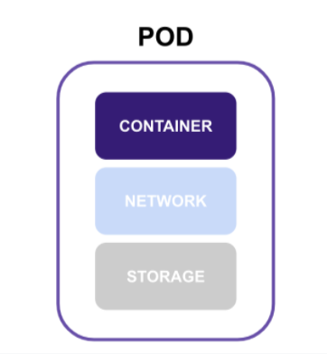

> 쿠버네티스 공식 문서의 [파드](https://kubernetes.io/ko/docs/concepts/workloads/pods/) 내용을 참조해서 작성한 글입니다. 자세한 내용은 해당 문서를 참조해 주세요. 😉

**Pod**(파드)는 쿠버네티스에서 생성하고 관리할 수 있는 **배포 가능한 가장 작은 컴퓨팅 단위**의 단순한 쿠버네티스 오브젝트입니다. 파드의 어원은 고래 떼(pod of whales), 콩 꼬투리(pea pod) 의미에서 유래하였습니다.

### Container

**파드 당 하나의 컨테이너** 모델은 가장 일반적은 쿠버네티스 배포 방식입니다. 그래서 파드를 컨테이너로 퉁쳐서 생각하는 분들이 있는데 정확하게 파드는 단일 컨테이너를 둘러싼 래퍼(wrapper) 개념으로 생각하면 좋습니다.

**파드 당 여러 개의 컨테이너** 모델을 사용할 수도 있습니다. 여러 컨테이너가 밀접하게 결합되어 있고 리소스를 공유해야 하는 경우 다중 컨테이너로 파드를 구성하는 것이 좋습니다. 다중 컨테이너로 구성한 파드는 하나의 결합된 서비스 단위를 형성합니다.

> 단일 파드에서 여러 컨테이너를 그룹화하는 것은 컨테이너가 밀접하게 결합된 특정 인스턴스에서만 사용해 주세요.

### Network

각 파드에는 고유한 IP 주소가 할당됩니다. 파드 내부의 모든 컨테이너는 IP 주소와 네트워크 포트를 포함하여 네트워크 네임스페이스를 공유합니다. 파드 내부에서 파드에 속한 컨테이너는 `localhost`를 사용하여 서로를 찾을 수 있습니다. 네트워킹에 대한 자세한 정보는 쿠버네티스 공식 문서의 [클러스터 네트워킹](https://kubernetes.io/ko/docs/concepts/cluster-administration/networking/) 내용을 확인해 주세요.

### Storage

파드는 공유 스토리지 볼륨의 집합을 지정할 수 있습니다. 파드의 모든 컨테이너는 공유 볼륨에 접근하여 데이터를 공유할 수 있습니다. 스토리지에 대한 자세한 정보는 쿠버네티스 공식 문서의 [스토리지](https://kubernetes.io/ko/docs/concepts/storage/) 내용을 확인해 주세요.
