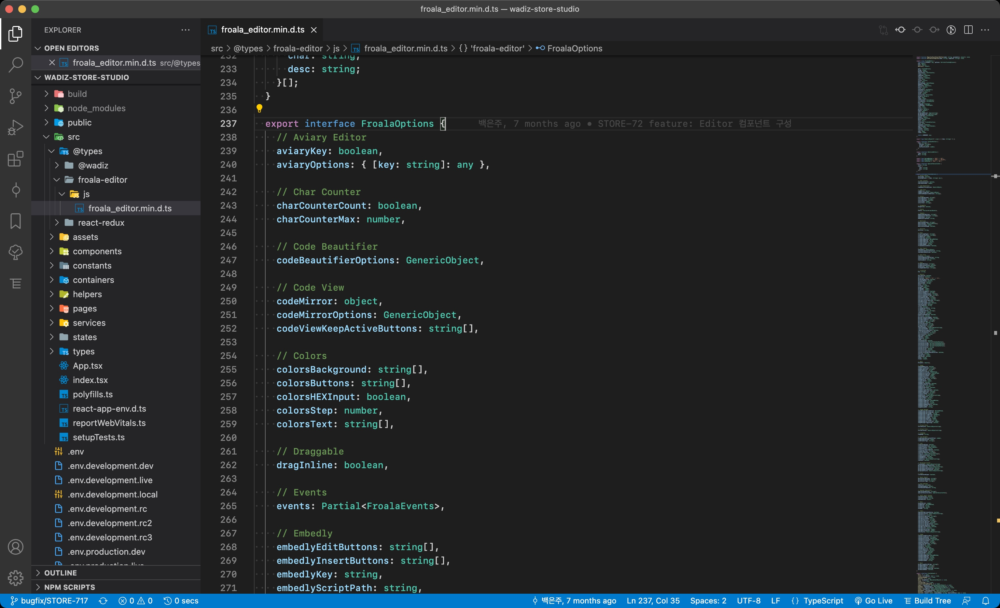
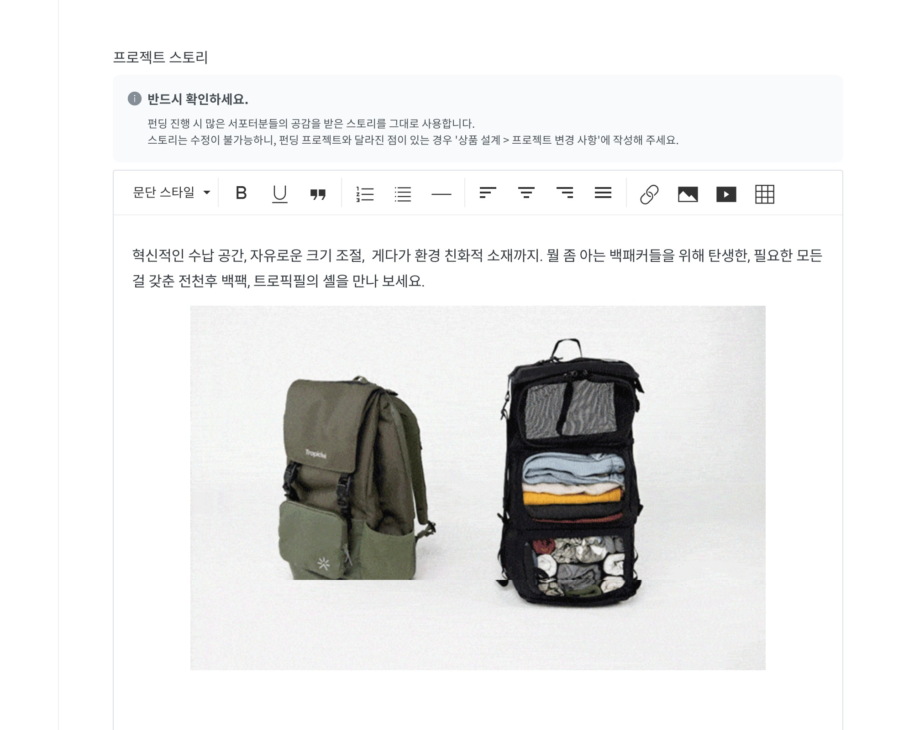

# 🤩📈 자기 성장 보고서

## 결정 능력 🧐

### Eunju makes <u>**decisions**</u> #better

제자리에 머무르는 결정보다 더 나은 결정을 빠르게 내리는 일을 중요하게 생각합니다. 빠르게 변화하는 IT 트렌드에 맞춰 다양한 기술을 시도해 보면서 어떤 기술이 우리에게 좋은지 결정하고 학습하는 능력을 길렀습니다.

덕분에 새로운 기술을 거의 다 적용해 놓았는데 뒤늦게 기술적으로 구현이 어려운 부분을 발견하거나, 도입한 기술보다 더 좋은 기술을 발견하는 아쉬움 등의 상황도 만들지 않게 됐습니다.

### Scoped CSS

팀 주간 회의 때 동료가 이전 회사에서 사용한 Vue의 [Scoped CSS](https://vue-loader.vuejs.org/guide/scoped-css.html) 방법론을 제안한 적이 있습니다. 하지만 우리는 모든 프로젝트에 [CSS Modules](https://github.com/css-modules/css-modules) 방법론을 도입한 상황이라 기존 프로젝트에 적용하는 데는 한계가 있었습니다. Scoped CSS가 React에서 대중적으로 사용하는 CSS 방법론도 아니었고요.

당시에는 회의적으로 생각했지만 며칠 동안 곰곰히 생각해 본 결과 새로운 React 프로젝트에는 도입해도 좋겠다는 판단이 들었습니다. 마침 와디즈 스토어 메이커 스튜디오 프로젝트를 새 React 프로젝트에서 구성하려던 참이었고 동료들과 논의 끝에 먼저 도입해 보기로 했습니다.

기술 서칭 기간 동안 Scoped CSS 방법론이 무엇인지 React에서 어떻게 사용해야 하는지 적용 사례를 살펴보고, CRA 대신 [CRACO](https://github.com/gsoft-inc/craco) 라이브러리를 사용할 필요가 있어 CRACO를 공부하고, CSS Modules를 완벽하게 대체할 수 있을 때까지 계속 적용하는 과정을 통해 마침내 무사히 도입에 성공할 수 있었습니다.

촉박한 일정 안에서 기존에 사용하는 CSS Modules 방법론을 사용해도 됐지만 *- 특히 최근에 입사한 -* 팀 동료들이 CSS Modules로 스타일을 작성하는 데 어려움을 느끼는 부분에서 학습의 의지를 불태우지 않았나 싶습니다.

### React Hook Form

와디즈 스토어 메이커 스튜디오에서 제가 맡은 **프로젝트 관리 메뉴**는 프로젝트 제출을 위한 폼 데이터를 다루는 화면입니다. 우리는 폼 데이터를 다루기 위한 다양한 방법 중 React Hook Form, Formik 2개 라이브러리를 고민했고, [React Hook Form](https://react-hook-form.com/kr) 라이브러리를 사용하기로 했습니다.

React Hook Form의 경험이 없었던 저는 다른 프로젝트에서 사용한 코드를 살펴보고 우리가 v5 버전을 사용하고 있음을 알았습니다. 하지만 2년 전 버전이었기 때문에 이 버전을 유지하고 동일한 코드로 작성할지, 최신 v7 버전을 적용하고 버전에 맞게 새로운 코드로 작성할지 고민에 빠졌습니다.

동료들과 논의 끝에 (혹시 모르니까) IE 브라우저를 지원하는 v6 버전을 사용하기로 했고, 효율적인 유효성 검사를 위한 Yup 라이브러리를 함께 공부하면서 프로젝트가 끝나는 순간까지 React Hook Form과 긴 싸움을 했습니다. 지금은 화해하고 React Hook Form과 잘 지내고 있습니다. 🤝

### TypeScript ⭐️⭐️⭐️

우리가 작업하는 대부분의 프로젝트는 아직까지 JavaScript 기반입니다. 그래서 2021년에 가장 잘한 결정이 바로 와디즈 스토어 메이커 스튜디오를 TypeScript로 작성한 일이라고 생각합니다.

이때는 도입해야 할 기술이 1~2개가 아니었습니다. <small>(Scoped CSS, CRACO, React Hook Form, Yup, React Toolkit 등 😱)</small> 저조차도 '과연 잘할 수 있을까?' 의문이 들었습니다. 다른 프로젝트에서 함께 TypeScript로 작성하기로 했던 동료도 이번에는 일정이 여의치 않아 JavaScript로 작성한다고 했으니까요.

하지만 제자리에 머무는 결정보다 *- TypeScript 너란 녀석에 적응하는 -* 더 나은 결정을 하기로 했습니다. 그리고 여러 가지 문제가 터졌는데 그 중 하나는 [Froala Editor](https://github.com/froala/wysiwyg-editor-release)가 TypeScript를 지원하지 않는다는 사실이었습니다.

구글링을 통해 어느 개발자가 업로드한 froala-editor.d.ts 파일을 기반으로 API 문서와 비교하면서 타입 정의를 검증하고 수정했던 일이 기억에 남습니다. 아마도 이 시점에 TypeScript 실력이 많이 성장하지 않았나 싶습니다.

## 개발 능력 💻

여러 명의 프론트엔드 개발자와 같이 코드를 작성한 경험이 없었던 저는 협업을 하는 동안 어떻게 하면 도메인의 복잡도를 줄이고 응집성 있는 코드를 작성할 수 있을지 고민이 많았습니다.

TypeScirpt 인터페이스 구분자는 ,(콤마)로 할지 ;(세미콜론)으로 할지 등의 소소한 기준부터 프로젝트 폴더 구조, 네이밍, 상태 관리, API 등의 커다란 규약까지 논의하고 정하면서 코드의 질이 많이 향상됨을 느꼈습니다.

기획 문서에 나온 요구 사항을 코드로 작성할 때도 이전에는 나무의 관점에서 작성했다면 지금은 숲의 관점에서 작성하게 됐습니다. 예를 들면, 콤비네이션 함수를 만들 때 2개 목록에 대해서만 만들지 앞으로 목록이 3개, 4개 또는 그 이상이 될 가능성을 고려해서 만들지 고민을 했습니다.

### 맞춤법

브랜드 이미지의 전문성과 신뢰성에 +@ 효과를 낼 수 있도록 맞춤법의 중요성을 강조하며 코드를 작성하였습니다. 지금은 더 나아가 웹 접근성 측면에서 스크린 리더가 정확한 발음을 구사할 수 있고, 사용자가 콘텐츠를 안정적으로 접할 수 있는 또 하나의 기술이라는 생각을 가지고 있습니다.

### 상품 옵션 콤비네이션 알고리즘

와디즈 스토어 메이커 스튜디오에서 개발하기 어려웠던 부분 중 하나가 상품 옵션에 대한 콤비네이션 목록 알고리즘을 만드는 일이었습니다. 알고리즘은 코딩 테스트에만 사용할 줄 알았는데 이렇게 업무에도 적용하게 될 줄은 몰랐거든요.

처음에는 알고리즘 없이 나무의 관점에서 작성하려고 했습니다. 그렇게 작성해도 작동은 할 테니 말입니다. 하지만 이번 기회에 이 알고리즘 만큼은 뽀개고 싶었고, 며칠간 씨름을 거듭한 끝에 알고리즘을 만드는 데 성공하였습니다. <small>(만약에 이 문제가 코딩 테스트로 나왔다면 떨어졌겠죠?)</small> 덕분에 알고리즘 실력이 상승해서 뿌듯합니다.

## 의사소통 능력 💬

개발자의 1차 고객은 협업하는 동료들이라고 생각합니다. 동료들이 설계한 내용을 덜 이해한 상태로 개발하는 일이 없도록 요구 사항에 대한 의미를 빠르게 파악해서 일을 안심하고 맡길 수 있는 개발자가 되기 위한 노력을 했습니다.

### 유효성 검사

와디즈 스토어 메이커 스튜디오의 프로젝트 관리 메뉴는 프로젝트 상태별로 필드의 활성화 처리가 다르고, 권한에 따라 특정 필드만 저장해야 하고, 특정 조건에서만 노출이 필요한 문구가 있는 등 비즈니스적 요구 사항이 복잡한 화면이었습니다. 문제는 이 프로젝트를 설계하는 기획자도 입사한지 3개월밖에 되지 않았다는 겁니다.

어쩌면 기획자보다 개발자인 우리가 더 서비스 플로우를 잘 알지도 모르는 상황에서 기획자가 지치지 않고 더 나은 설계를 할 수 있도록 기획안을 꼼꼼하게 점검하고 보강할 필요가 있었습니다.

특히 유효성 검사는 기획자도 고려하기 어려운 부분이었습니다. 디자이너도 모든 유효성 검사에 대비하는 UI를 만들 수가 없었고요. 그래서 기획에서 미처 생각하지 못한, 하지만 반드시 고려해야 하는 수많은 유효성 검사를 파악하고 시안이 없으면 만들어서 제안을 했습니다. 지금도 유효성 검사로 열심히 소통한 일은 다행이라고 생각합니다.
