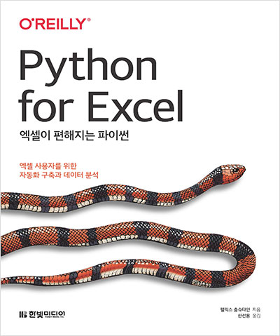
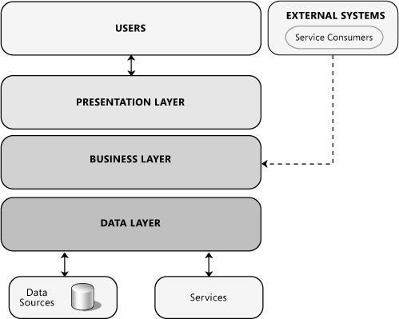
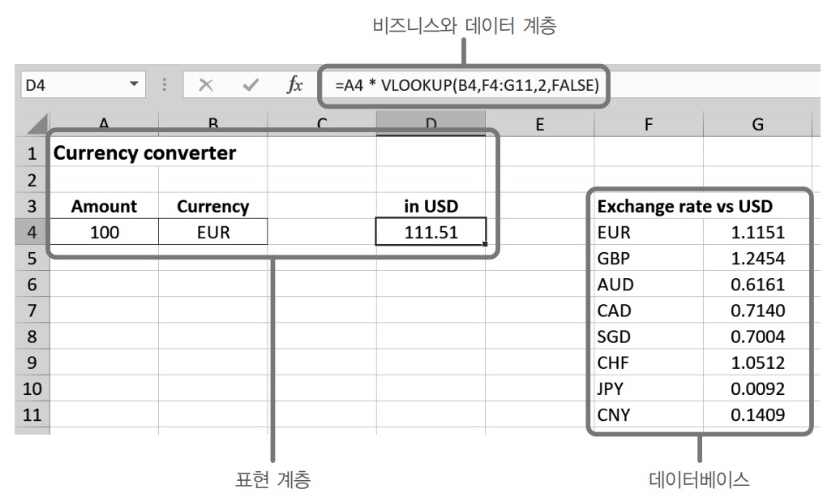
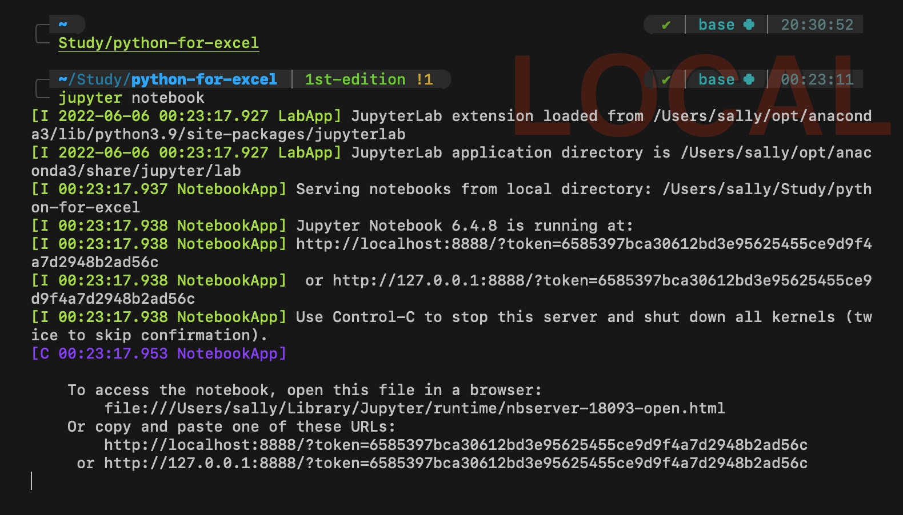
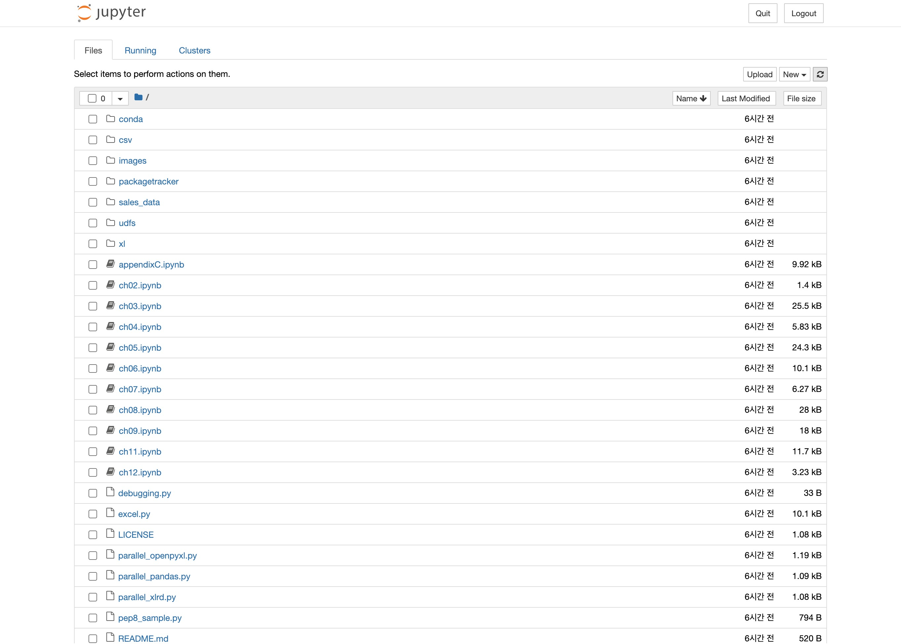
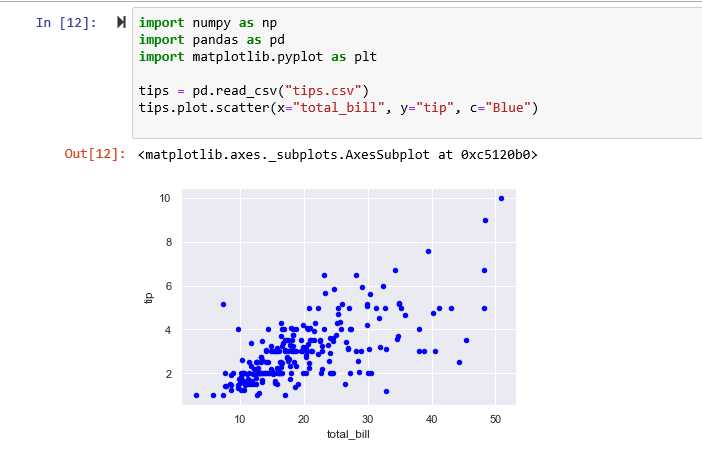
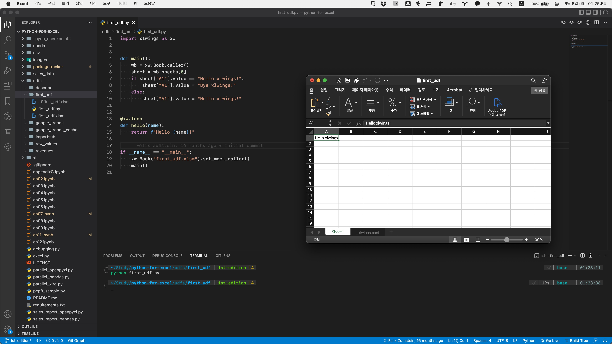

📚 한빛미디어 <나는 리뷰어다> 활동을 위해서 책을 제공받아 작성된 서평입니다.

---

레트로의 유니티 게임 프로그래밍 에센스 책 서평 이후로 2달이 훌쩍 지나가버렸네요. 아니 왜 2주에 한 번씩 블로그 작성하기가 이렇게 어려운 걸까요?

# [엑셀이 편해지는 파이썬](https://www.hanbit.co.kr/store/books/look.php?p_code=B2831223974)

엑셀은 오랫동안 많은 이들에게 사랑받은 대표적인 오피스 프로그램입니다. 쉽고 직관적인 인터페이스, 수식을 계산하는 자체 함수, VBA<small>(Visual Basic for Applications, 마이크로소프트 오피스에 포함되어 있는 프로그래밍 언어)</small>로 꽤 강력한 유사 프로그래밍을 지원해서 크지 않은 규모의 비즈니스에서는 엑셀 하나만으로 모든 일을 처리할 수 있습니다.



하지만 엑셀의 사용자 친화적인 인터페이스와 작업 방식은 대부분의 작업을 손으로 하게끔 구성되어 있습니다. 이러한 특징은 거의 모든 데이터가 인터넷에 존재하는 시대로 바뀌면서 치명적인 단점이 됐습니다.

이 책은 로컬 파일 시스템의 버전 지옥을 벗어나기 위해 [마이크로소프트의 애플리케이션 아키텍처 가이드](https://docs.microsoft.com/en-us/previous-versions/msp-n-p/ee658109(v=pandp.10)#presentation-business-and-data-layers)에서 사용하는 [**관심의 분리**](#관심의-분리)를 제안합니다.



## 관심의 분리

마이크로소프트 애플리케이션 아키텍처와 동일하게 엑셀 애플리케이션 또한 다음과 같이 세 가지 계층으로 나눌 수 있습니다.



소프트웨어 공학에서 **관심의 분리**(Seperation of Concerns, SoC)는 컴퓨터 프로그램을 구별된 부분으로 분리시키는 디자인 원칙을 의미합니다. [**SOLID 원칙**](https://ko.wikipedia.org/wiki/SOLID_(객체_지향_설계)) 5개 중 2개(단일 책임 원칙, 인터페이스 분리 원칙)가 이 개념에서 파생될 정도로 매우 중요한 원칙이기도 합니다.

관심의 분리는 **모듈성**(modularity)이라고도 하는데, 연관된 기능을 독립시켜서 프로그램의 나머지 부분에 영향을 끼치는 일 없이 쉽게 교체할 수 있게 합니다.

엑셀에 [**파이썬**](#파이썬)을 도입해서 애플리케이션의 역할을 분리하는 과정 또한 일종의 SoC라고 볼 수 있습니다. 엑셀은 사무 업무에 최적화된 프로그램이지만 대용량 데이터를 처리하거나 반복 업무를 자동화하는 데는 한계가 있기 때문입니다.

엑셀에서 다루기 어려운 부분을 파이썬으로 처리하면 다음과 같이 계층별로 역할을 나눌 수 있습니다. 다음과 같이 파이썬을 도입하면 엑셀의 역할이 크게 줄어들게 됩니다.

|계층|설명|처리|
|---|---|---|
|표현 계층|사용자가 보고 상호작용하는 사용자 인터페이스입니다.|엑셀|
|비즈니스 계층|애플리케이션에서 사용하는 로직을 담당합니다.|파이썬|
|데이터 계층|데이터 접근을 담당합니다.|파이썬|

## 파이썬

파이썬의 가장 중요한 구성 요소인 데이터 구조, 함수, 모듈에 관한 내용을 배울 수 있습니다. **PEP 8**이라 불리는 코드 스타일 가이드도 잠깐 소개하고 있는데 PEP 8 기반을 따르면 일관성 있는 코드로 개발할 수 있어 협업할 때 좋습니다. 궁금하신 분들은 책에서 소개하는 [구글의 파이썬 스타일 가이드](https://google.github.io/styleguide/pyguide.html) 내용을 참조해 주세요.

### [아나콘다](https://www.anaconda.com/)

아나콘다는 데이터 과학 분야에서 가장 널리 쓰이는 파이썬 배포본이며 수백 가지 서드 파티 패키지가 함께 설치됩니다. 주피터 노트북을 비롯해 판다스, OpenPyXL, 엑셀윙스 등 이 책에서 주력으로 사용할 패키지들이 포함되어 있습니다.


콘다 환경은 특정 버전의 파이썬과 특정 버전으로 설치된 패키지로 구성된 별도의 **파이썬 세상**으로, [NVM<small>(Node Version Manager, 노드 버전 관리자)</small>](https://github.com/nvm-sh/nvm)과 유사합니다. 책에서는 기본값인 base 환경만 사용하지만 프로젝트별로 다른 개발 환경을 생성해서 관리하고 싶다면 다음 명령어를 숙지하면 됩니다.

```shell{promptUser: user}{promptHost: (base)}
conda create -n <your-env-name> python=<python-version> // 가상 환경 생성
conda env list // 가상 환경 목록 조회
conda activate <your-env-name> // 가상 환경 활성화
conda install <package> // 가상 환경에 패키지 설치
conda deactivate // 가상 환경 비활성화
conda remove -n <your-env-name> --all // 가상 환경 삭제
```

### 주피터 노트북

주피터 노트북은 파이썬 코드와 서식 있는 텍스트, 그림, 그래프 등을 브라우저에서 동작하는 대화형 노트북에서 실행합니다. 데이터를 준비하고 분석하고 시각화하여 교육, 초안 잡기, 연구 등의 영역에서 주로 사용합니다.

```shell{promptUser: user}{promptHost: (base)}
gh repo clone fzumstein/python-for-excel // GitHub CLI
cd python-for-excel
jupyter notebook
```








### 넘파이 (NumPy)

넘파이는 행렬이나 일반적으로 대규모 다차원 배열을 쉽게 처리할 수 있도록 지원하는 **파이썬의 라이브러리**입니다. 스칼라, 벡터화, 브로드캐스팅 등의 어려운 용어가 나오기도 합니다. 넘파이 배열은 전체가 같은 데이터 타입이어야 합니다. 예를 들어, 배열에 텍스트와 숫자가 섞여 있을 경우 산술 계산을 할 수 없습니다.

### 판다스 (Pandas)

판다스는 균질한 데이터가 아니더라도 넘파이 배열을 기초로 더 스마트한 데이터 구조를 제공할 수 있는 **파이썬 데이터 분석 라이브러리**입니다. 판다스는 엑셀에서 다루기 힘든 작업을 더 쉽고 빠르게 수행하면서도 오류는 더 적습니다.

지금까지의 내용이 머리에 잘 들어오지 않는다면 **파이썬 < 넘파이 < 판다스** 순서로 기억해 보세요. 데이터 분석의 끝판왕 판다스가 하는 일은 다음과 같습니다.

* 거대한 데이터 집합 가져오기
* 통계와 시계열
* 대화형 차트 조작
* 벡터화
* 데이터 정렬

## 엑셀 자동화

VBA는 외부 시스템과의 통신이 어렵다는 단점이 있습니다. 하지만 Requests, SQLAlchemy 등의 파이썬 패키지를 사용하면 외부 데이터 소스를 효율적으로 연동할 수 있습니다.

이 책은 디스크에 저장된 엑셀 파일을 읽고 쓰는 것이 아닌, 파이썬과 엑셀윙스 패키지를 사용해 엑셀 스프레드시트를 일종의 사용자 인터페이스로 사용하는 대화형 애플리케이션으로 만드는 방법을 소개합니다.

엑셀윙스는 형식을 가리지 않고 엑셀 파일을 실제로 편집할 수 있으며, 그 과정에서 어떤 콘텐츠나 서식도 바뀌거나 사라지지 않습니다. **이 책의 저자가 엑셀윙스의 개발자이자 관리자**여서 엑셀윙스에 대한 설명이 알차고 유익합니다.



엑셀윙스는 아나콘다에 포함되어 있어서 바로 `xlwings` 명령어를 실행할 수 있습니다. 다만, 엑셀에서 파이썬 스크립트를 호출하려면 엑셀 애드인이 필요합니다. 엑셀 애드인을 설치하려면 다음 명령어를 실행해 주세요.

```shell{promptUser: user}{promptHost: (base)}
conda update xlwings
xlwings addin install
```

# 마치며

물론 여러분이 이 책 한 권만 읽어서 엑셀의 모든 일을 자동화할 수는 없습니다. 하지만 방향성은 잡을 수 있습니다. 또한 파이썬을 공부하고 싶으신 분들은 파이썬 기초와 엑셀 자동화까지 일석이조로 배울 수 있습니다.

저는 이 책을 읽고 이번에 구글 시트 데이터 최신화 작업을 도전해 보려고 합니다. 여러분도 도전해 보세요!
