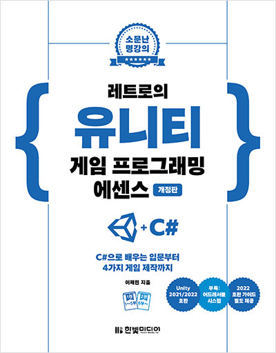
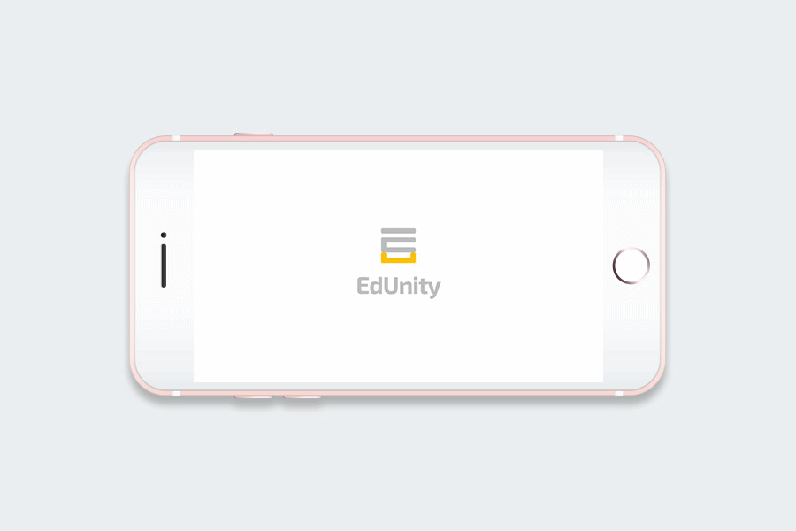
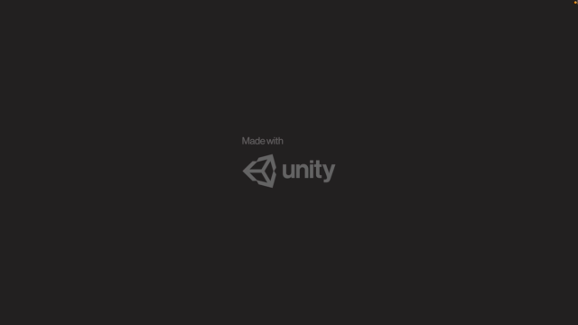
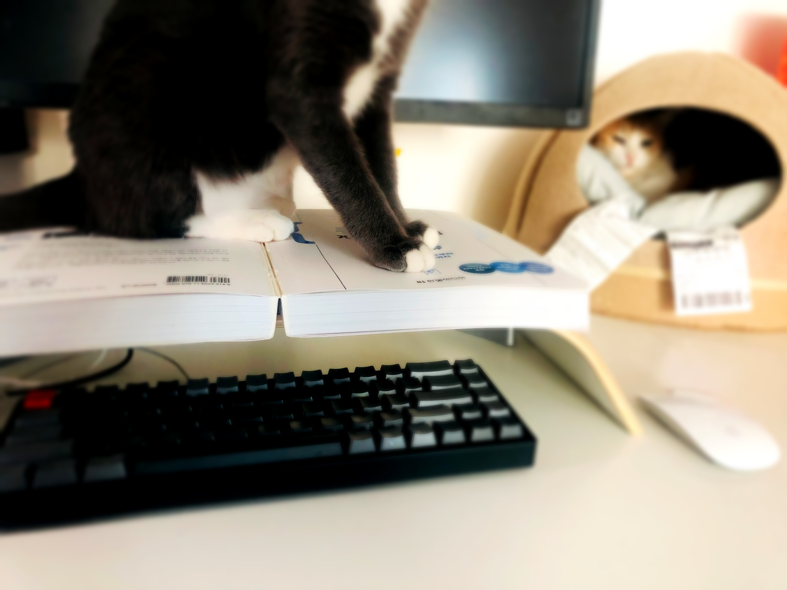
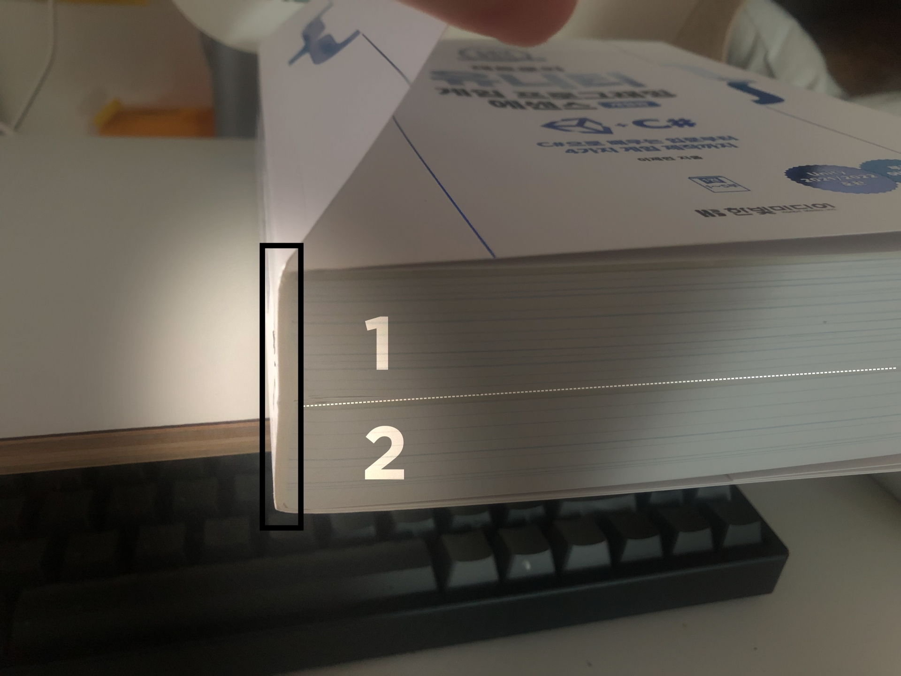
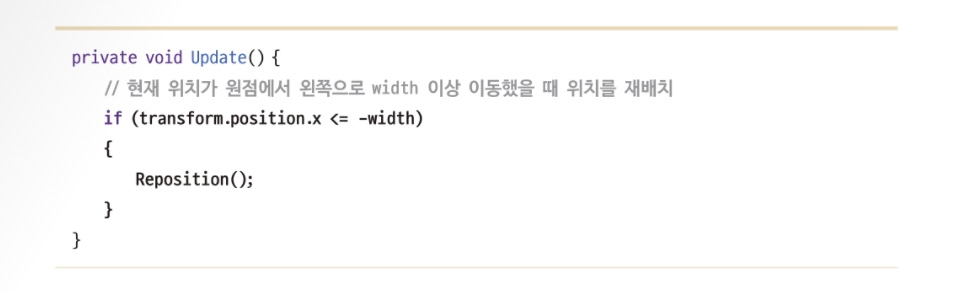

📚 한빛미디어 <나는 리뷰어다> 활동을 위해서 책을 제공받아 작성된 서평입니다.

---

# [레트로의 유니티 게임 프로그래밍 에센스](https://www.hanbit.co.kr/store/books/look.php?p_code=B9351446616)

## 그때는 그랬었던 첫 경험

현실 세계의 영어 문장을 스캔해서 번역하는 앱 만들기 토이 프로젝트에 UI/UX 디자인 역할로 참여한 적이 있습니다.

<figure>
  
  <figcaption>포트폴리오 용도로 만든 추억의 산출물</figcaption>
</figure>

혹시 [Exo 2.0](https://fonts.google.com/specimen/Exo+2) 폰트를 아시나요? 저는 옛날 옛적에 이 폰트를 너무나 좋아해서 산출물마다 가져다 썼는데요, 하도 죽어라 써서 그런지 지금은 절대 사용하지 않고 있습니다. <small>(좋을수록 아껴서 써야 하나 봐요 👉👈)</small>

이 앱은 **Unity**(유니티)라는 게임 엔진으로 만들었습니다. 게임 엔진으로 일반 애플리케이션을 만드는 일이 다소 어색할 수도 있겠지만 iOS/Android 개발자가 없다면 유니티는 앱 개발에 있어 또 하나의 선택지가 될 수 있습니다. 그때는 주변에 앱 개발자가 없어서 유니티로 개발하고 그랬었죠.

그렇게 유니티의 첫 경험이 끝나고, 유니티 책을 한 권 제대로 읽어 보기로 했습니다. 유니티를 잘 모르지만 알아 두면 엄청나게 재밌는 도구가 될 것 같았어요. <small>(책 표지 디자인도 한몫한 건 비밀 ☺️)</small>

이 책은 총 7부로 구성되어 있고, 1부와 2부에서 유니티와 코딩을 이해하는 데 가장 필수적인 핵심을 배울 수 있습니다. 3부부터 본격적인 게임 만들기 실습을 진행하는데 빨리 게임을 만들고 싶은 분들이라면 1~2부가 물 흐르듯이 술술 읽혀서 3부까지 금방 오기 때문에 걱정하지 않으셔도 됩니다.

## 개념이 술술 들어간다

개발자라면 꼭 알아야 할 클래스, 상속과 재사용, 컴포넌트(컴포지션) 패턴 등의 개념을 이해하기 쉽게 설명해 줍니다. 상속에만 의존하다 코드 재사용에 어려움이 있다는 내용은 지금도 개발하면서 고민이 많은 부분입니다. 최대한 의존성 없이 개발하려고 하지만 막상 스토리북으로 표현했을 때 다양한 의존성 오류를 만나면서 현타가 오지요. 그래서 유니티가 사용하는 컴포넌트 패턴 방식이 마음에 들었습니다.

### 객체지향 프로그래밍

이 책은 **객체지향 프로그래밍**을 <u>사람이 현실 세상을 보는 방식에 가깝게 프로그램을 완성하는 것</u>이라고 설명합니다. 우리가 자동차를 볼 때 차체, 엔진, 프레임 등으로 '분해하여' 생각하지 않듯이 일반적으로 사람은 현실의 사물을 '하나의 온전한 독립체'로 여깁니다. 객체지향은 프로그램을 이러한 오브젝트의 집합으로 구성하는 방식입니다.

### 컴포넌트

유니티 동작의 핵심은 **컴포넌트**(Component)입니다. 게임 엔진은 이미 완성된 코드를 제공하고 있고, 우리는 그 코드를 '재사용'하면 됩니다. 컴포넌트가 미리 만들어진 부품이라면 우리는 이 부품들을 조립해서 실제로 존재하는 물건 즉, 오브젝트를 만들 수 있습니다.

## 야 너두 게임 만들 수 있어

<figure>
  
  <figcaption>탄막 슈팅 게임 '닷지' <small>(혹시 10초 이상 버티신 분 계신가요? 👀)</small></figcaption>
</figure>

이 게임을 만들면 유니티에 대한 자신감이 한 스푼 추가됩니다. '내가 이걸 만들 수 있다고?' 의문이 들겠지만 진짜 만들 수 있습니다. 무엇보다 **유니티의 필수 기능**을 다룰 수 있다는 장점이 있으니 꼭 책을 읽고 만들어 보세요.

## 2% 부족한 부분

### 분책은 하지만 분리는 하지 않는다

이 책은 두께 4.5cm, 무게 2kg, 총 1,102 페이지의 분량으로 독자의 편의를 고려해 분책할 수 있도록 1권과 2권으로 구성되어 있습니다. 그렇다면 당연히 '1권, 2권 나누어서 들고 다닐 수 있겠구나!'라는 생각을 하게 되지요.

하지만 분리해서 들고 다닐 수가 없습니다. 책갈피 커버에도 접착제를 발라 놓아서 두 권과 딱 붙어 있기 때문입니다! 결국 분책의 의미가 없어져서 다음 번 출판 때는 꼭 개선했으면 좋겠네요. 🙏 <small>(실제 판매될 책은 분리가 될 수도?)</small>

### 들여쓰기 컨벤션을 혼용해서 사용한다

이 책의 코드 예제를 보면 들여쓰기 부분이 신기합니다. 보통 Allman, K&R 방식 중 하나를 선택하는데 이 책은 조건문은 Allman 방식, 메서드는 K&R 방식을 혼용해서 사용하더군요. 🤦🏻‍♀️ 저는 작성할 때 유니티 템플릿에서 사용하는 Allman 방식으로 통일해 봤는데 책에서도 유니티에서 사용하는 방식으로 통일하면 좋겠다 싶었어요.

# 마치며

[레트로의 유니티 게임 프로그래밍 에센스](https://www.hanbit.co.kr/store/books/look.php?p_code=B9351446616)는 초심자를 기준으로 만든 아주 친절한 책입니다. 유니티에 매력을 느끼고, 게임 프로그래밍을 이해하고 자신만의 게임을 개발하고 싶다면 이 책을 길잡이로 선택하세요.
